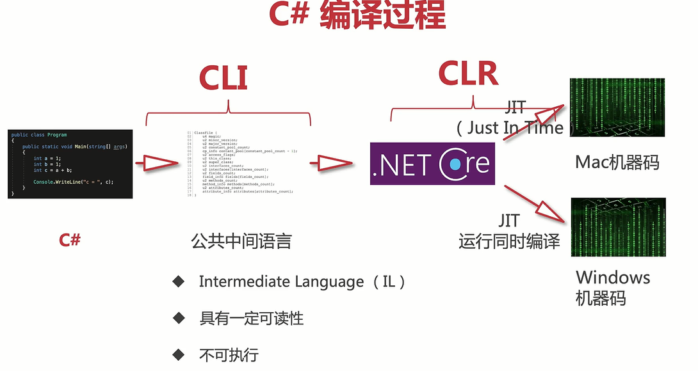
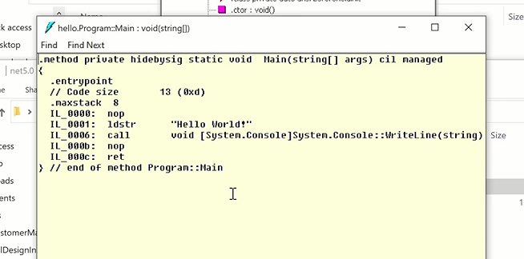
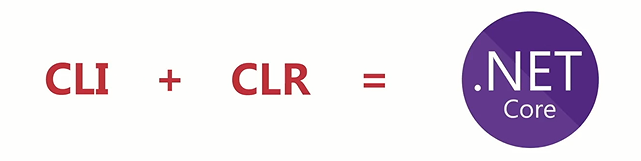
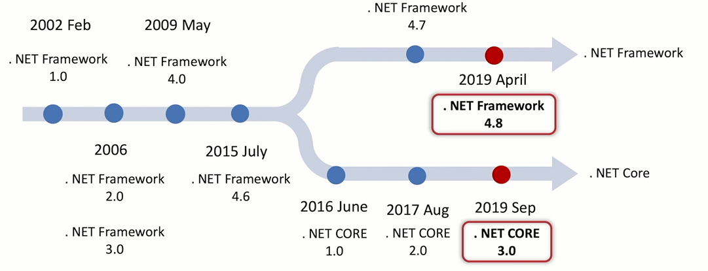

# C#历史

为了对标JAVA,完全是模仿的JAVA;

JAVA是Oracle,.Net是开源;二者是双胞胎;但是有些不一样;

## C#的CLI和CLR

- CLI:处理代码编译过程--->生成一个中间公共语言的程序
- CLR:服务环境---->相当于JAVA的JVM

为了跨平台,出现了虚拟机,比如C#,他放弃了直接编译机器语言;

编程成了IL(Intermediate Language),类似于汇编,有可读性;但是必须现在系统安装.NET Core,他来解释IL,但是他是**JIT（即时编译）**,这样Win Linux 就会跨平台了;

过程就是如上述;而这个IL,MS可以兼容C++ VB F#;但是目前没用过;

C#使用的编译器是CSC,然后最后打包(Windows)变成exe文件,这个是可以用spy反汇编的,这样是C#的一大特点;

在Windows平台下的EXE你可以理解为里面有IL,也就是中间公共语言,还有能打开Core的代码,而这个能打开Core的代码肯定是不同架构不一样,这就是为什么C#需要对不同平台进行打包,如果Win上面,就打包成exe;但是主要的IL是不变的;

通过IL Dsm可以查看这个IL公共语言

有一定可读性,但是他必须运行在CLR中;C#所有语言都必须在CLR中运行;

 

## MS的.NET产品线的历程

微软名字起的很垃圾;一会Framework,一会叫.NET core

.NET Framework 4.8是最后一个绝唱了;

==所以.NET Framework是已经废了==;.NET 5==.NET Core;这是因为MS的.NET产品线太混乱了;

