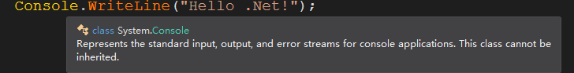
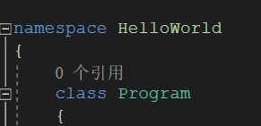
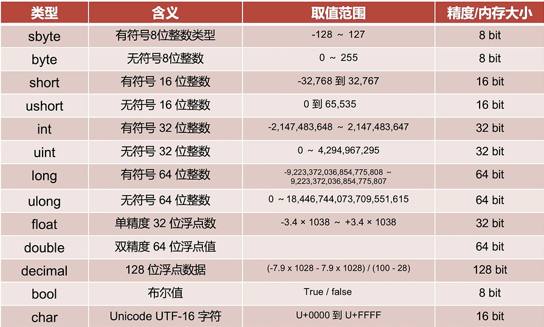
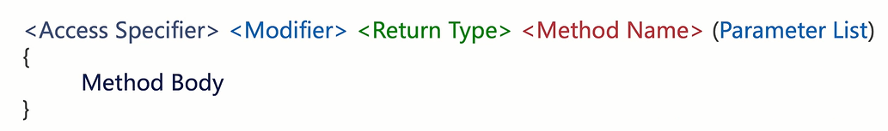
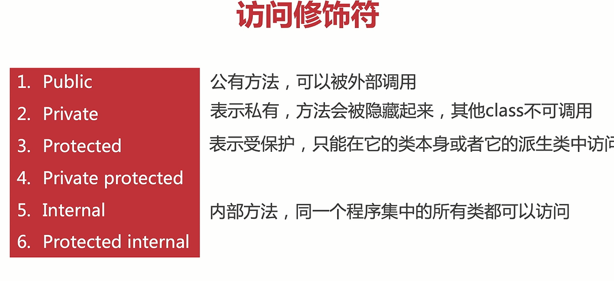
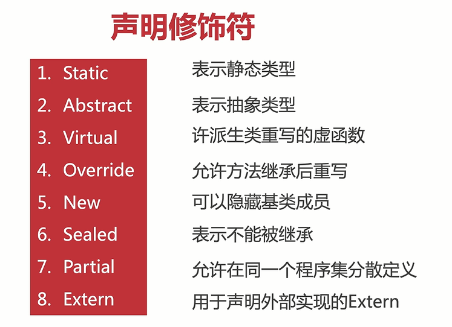
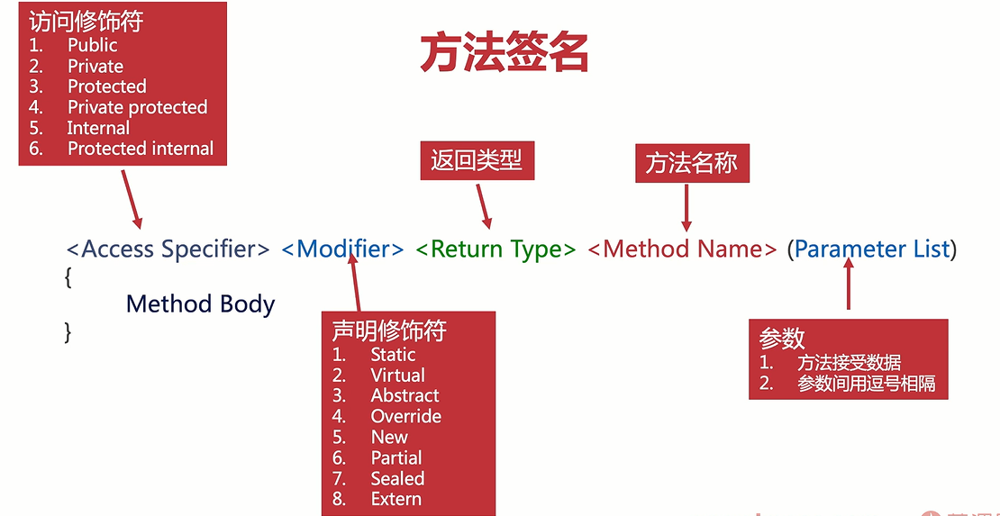

## Hello World项目刨析

using System;是C#的最基本的模块

比如标准输出,就来源于System这个模块;

而System这种模块,叫做命名空间;

而我们的hello world这个程序,实际上也是在一个命名空间的,别人直接using 就可以使用我们这个函数了;






## System.Console

 在Console中,通常有以下函数

- **Write**

  STD OUT,

- **WriteLine**

​	这个会光标是下一行,相当于是会换行;这就是和Console.Write()的区别;

- **Read**

​	他会读取第一个键盘按下的ASCII代码;

- **ReadKey**

​	这个可以读取回车,和Read类似,但是返回值是ConsoleKeyInfo;

- **ReadLine**

​	这个可以回车之前的所有数据;

- **Clear**

​	一敲击键盘,所有输入输出都消失了;

## C#的变量

总体上和c/cpp一样,但是所有的类型都相当于是个类,都有很多成员函数

C#一共有13种定义好的基本类型



- 整数 int
- 浮点数 float
- 布尔 bool

- String(和Cpp封装的哪个类似)
- double
- char

C#和java和C++一样,还是需要定义类型的;也算一种强类型的变成语言；

需要注意的是,long就有点像c++的long long,还有char 是两个字节,其他都是和C++很像了;

还有属于内建类型,但是不属于基本类型,比如string,object,dynamic;

## string类型的操作

C#有string和大写String,这两是有区别的;

事实上小写string就是大写String的别名,是完全一样;

### 字符串拼接

```c#
    string hello = "hello world\r\n";
    string hello1 = "aloha world";
    string merge = hello + hello1;
```

### 字符串格式化操作

有三种,一种是{X},还有一种是format函数,第三章就是前面加$符号

```c#
            //字符串格式化操作
            string name = "lee jack",age="21";
            Console.WriteLine("My name {0}.My years old is{1}",name, age);

            //string.format格式化
            string format_string = "My name is{0}.";
            string format=string.Format(format_string, name);

            //另一种 这种更方便 这个叫做字符串内嵌
            string format_2 = $"My name is {name}";
```

### 字符串换行

可以用原意字符串,前面加@,也可以用\r\n

```c#
            //字符串换行 可以\r\n 
            //当然,如果想显示\r\n这种转义字符,也可以用原意字符串 这个时候换行			用"物理换行"
            string new_line = @"hhahah\r\n
            DAADAD\r\n
            adasfad";
```

### 字符串函数操作

这个需要自己去探索,C#肯定是封装了很多有用的函数的;比C++的string要多;

## C#的方法(函数)

其实就是C++的函数,但是声明比较麻烦.

方法签名---->就是C/CPP的函数声明

**值得一提的是,所有的方法必须放在类里面;**



首先Access Specifier叫做访问修饰符



第二个是Modify,声明修饰符

 



 其他的和C++完全一样,一个访问修饰符,一个声明修饰符不太一样;