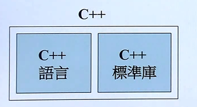
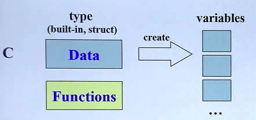
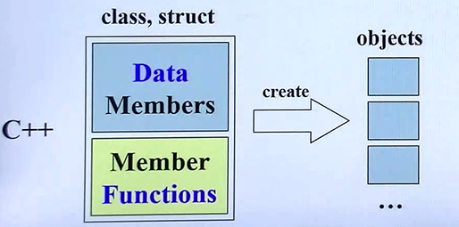
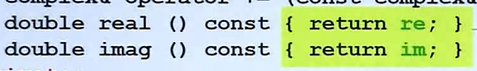
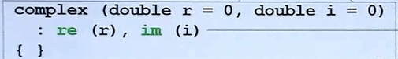
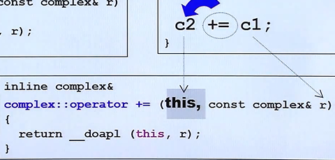
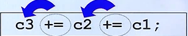
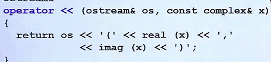

# C++面向对象编程

## C++的两种面向对象

- Object Based(基于对象)

就是这个对象和其他对象没有啥相关联的;

class有两种分类,一种是不带指针的,一种是带指针的;

- Object Oriented(面向对象)

对象之间继承,复合,委托

## C++演化

一定要摒弃98 03,C++ 11被称为C++2.0;



C++语言分为标准库和语言;本章课程只专注C++语言的设计

## C++和C的区别

在C语言中,数据和函数是没有边界的,如上图



大家是都可以去处理这些数据的;

C++把数据和处理这些处理的函数包括起来;我们就把他叫做class;

这样创建,就会变成object;



最经典的C++ Class可以分为带指针的,和不带指针的;

而带指针的就是比如string;

## C++头文件和类的声明

一般是C++的.h文件用于声明,而.cpp则是函数的实现;

事实上,我们在#include <xxx.h>就是引入别的标准库;

再有的平台上,可能出现.hpp的延申;甚至没有后面.h;

所以#include<xxx>有时候也可以;

而对于那种直接返回成员的成员函数,我们可以使用==const {return xx;}==

这样来定义Inline的函数,直接在class body完成;



 

## C++模板

首先C++模板是C++成员的某些类型不直接写死;

使用`template<typename T>`,知道你使用`complex<double> c`这个才会被绑定

# 构造函数

C++想要创建一个对象,构造函数就会自动被调用;

构造函数一定要和类的名词相同,而且没有返回值;可以有多个,参数不一样;



事实上,C++11 不必在{}中这样写,可以用构造函数的特殊语法初值列,这样就可以赋值;

## 构造函数可以有很多个

也就是可以使用C++的重载;但是不要两个构造函数出现歧义;

## 构造函数private

即外界不可以调用我的构造函数;事实上,这种就是==单例设计模式==;

也就是必须先GetInstance()获取唯一的一份,必须ClassName::getinstance().xx

## 常量成员函数

就是`double func_name() const {return mem1;}`这种写法,如果你只是要取出一个数据,成员,而不改变这个数据,一定加==const==;

## Always Reference

也就是参数传递到底是传递值(Pass by vaule)还是(Pass by reference);

到底是type arg还是type& arg?事实上,这是C++在摈弃指针;因为我们在数据的时候,为了不要过度使用堆栈,一般是传指针,而引用底层也算使用了指针;而你想传值,其实最好也传引用,加个==const==就好了,不要传值,

## 返回值传递

返回值可以是vaule,也可以是返回reference,当然,也算Alwyas Refence;

因为引用更快,同样的,如果你只是想传值,也可以在前面加const;

额外注意的是,返回值传递引用在返回的引用本体是一个==局部变量==的时候,一定不要传递!因为那一块空间已经没了;

## 友元函数

也就是前面加friend ret_type func_name(type arg);这种函数，哪怕并不是类中的成员函数,如果外界函数想要取私有的成员函数,可以让他使用;

==相同class的各个objects互为友元==,也就是我这个类可以直接拿另外类的私有成员,这样可以,因为他们是==友元==;

# 操作符重载

C++的操作符是可以定义的,这也是C++提供的特殊的功能;

## 操作符重载的成员函数重载

比如一个+=这个操作符,编译器就把他看出一个函数,而如果是成员函数的重载,当然,肯定会有this指针的,而且是谁调用这个重载符号,谁就是这个this;



所有的两元操作符都是这种形似。

而大家可以看到,如果return by reference,传递着是无需知道ref接受;

而返回引用,可以适合以下的多重相加;



## 操作符重载的非成员函数

可以使用非成员函数来定义,比如重载+

```c++
complex operator +(const complex& x,const complex& y){
	return complex(real(x)+real(y),imga(x)+imga(y));
}
```

这里需要额外注意的是,为什么不返回引用?毫无疑问,是因为引用是指针,这个时候这个类是局部变量,不能返回ret引用;这相当于是临时对象;

值得注意的是,如果你的参数有一个,那么就是==+正号==,如果想重载==-负号==,也就是一个参数;

## 位移运算的函数重载

一般把>><<位移运算,在使用cout的时候，而值得一提的是,移位这种特殊的重载函数,必须写出全局的;因为<<这种操作符第一个参数一定不是对象的this指针

他的第一个参数应该是ostream& os,第二个才是我们这个类;

然后return os<<想要重载打印的标准输出的地方;



返回的类型要是ostream& 也就是out流

# 总结

其实学下来,最收到震撼的就是,Always ref,尽量除了临时对象时候不用返回ref,其他一律用ref;如果改变就不用const;改变这个传入的值就用const即可;

还有就是重载,有成员函数承载和非成员函数重载;

非成员函数重载有点有两个

- 可以重载特殊的(==第一个参数不是this,比如<<流运算符==)

- 可以多个，比如+这个,可以重载多个;
