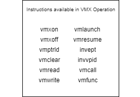
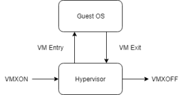
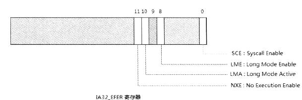

# 0x1 VT概论


所谓VT,就是虚拟化技术。

简而言之,VT就是一个硬件固件,位于CPU之上,**很多指令需要先经过VT**，像一个**Hook**。

日常使用中,vmware,virtual-box都是需要基于VT的。使用VT托管程序让他们具有真实的特权指令使用权限。

模拟器Qemu也属于VT范畴。但是是半虚拟化,Qemu硬件模拟是VT,软件是软件模拟。

## 0x1-1 虚拟化发展过程

1. 在VT出现之前,仿真技术是二进制转换,是软件扫描,如果软件使用了特权指令。软件是无法执行的,只能用软件模拟。

2. 后来出现了修改OS源码,剔除掉或修改特权指令的方法。但是不支持Windows

3. 最后,出现了硬件虚拟化,利用硬件模拟特权指令。同样的,出现了VT的三种技术。

- VMX(虚拟化硬件特权指令),如内存,中断,IO(in out指令),延伸出VMX操作
- VMD 设备虚拟化,硬件虚拟出一个IO设备
- VMI 虚拟化因特尔

对于VT,最重要的是VTX,是VT框架的基础。

## 0x1-2 VT相关概念

在VT中,有host和guest端,开启VT之后,-1权限是host,非高权限端就是guest。

### 0x1-2-1 虚拟机监控器VMM

- **host一般指虚拟机监视器VMM 或管理程序hyperviosr**

他控制处理器和其他硬件平台,他是guest或者是guest-Os和**逻辑处理器**(虚拟CPU)之间的抽象。

它本质上是一个软件,用于给guest们创造一个正在真实物理硬件上的

如guest就是应用程序,OS。

通常,对于host类型有两种情况。

1. **VT管理程序**

- 这种是在裸机上运行的
- 独立于OS,如Xen
- 可以不基于驱动
- 可以监控运行于VMM之上的OS

2. **VT托管程序**

- 安装在OS之上,通常运行在R0
- 基于Os提供的驱动来提升权限

- 如VMware virtual-box Kvm

- 如下图


一台虚拟机可以虚拟化多个guest。对于现在所学,学习的是现在OS架构上的。而非逻辑。

**因此VT在Windows上是基于驱动**的,因为需要先具备R0特权。而对于基于裸机的VT,则不需要是基于Windows驱动。

### 0x1-2-2 Guest


如Guest-Os,即运行在VT上的OS,一个VMM之上可以运行多个来宾OS

每个来宾Os都是一个虚拟机。

实际上,来宾Os是通过降低特权级执行执行,因此VMM可以控制系统资源,将某些特权指令陷入VMM,即前面所说的类似Hook

### 0x1-2-3 虚拟化形式

- **半虚拟化**

提供Hyper-call,每当虚拟机需要特权指令,调用Hyper-call,这是VT提供的接口。

- **完全虚拟化**

它**试图欺骗来宾相信它正在物理硬件上运行**,**客户操作系统不知道管理程序**的存在。没有公开的虚拟机 API，也没有一组与管理程序通信的**HyperCall**。它是独立的，不需要对来宾环境进行任何修改。这种形式的虚拟化允许 VMM 完全控制客户环境的行为。

例如，如果有人想写入控制寄存器(**前提是写入VMCS的执行控制字段的MSR位图才会拦截**)，它会导致 VM(虚拟机) 退出并陷入管理程序以验证和完成操作。这也允许 VMM 丢弃它认为恶意或破坏 VMM 操作的修改。

**这里所学的虚拟化,即全虚拟化。**

### 0x1-2-4 VMX操作

即三种VT技术形式之一,对于虚拟化支持一般都是VMX操作的处理器操作支持的。

对于VMX操作,分为root操作和非root操作状态。**VMM都执行root操作,Guest都指向non-root操作。**

- Root模式：在root模式下，VMM具有最高的权限。它可以控制虚拟机的所有资源，完全控制虚拟机的执行状态和环境，并可以随时中断虚拟机的执行。

- Non-Root模式：在non-root模式下，VMM的权限有限，它只能跟踪虚拟机的执行状态和环境，但不能控制它们。虚拟机在non-root模式下可以完全控制自己的资源，执行和执行环境。

VMX操作中的状态转换被称为**VMX转换**(对比syscall这条指令)

如果VMX操作想要进入Non-root状态,需要执行Vm-entry,退出则执行Vm-exit

值得一提的是,VM-Entry/Exit操作只能在VMX操作之间使用,如果在非VMX操作期间使用这些指令,会触发==#UD==异常。

下面是一些**VMX操作的指令**(VM Entry和VM Exit),只有开启了VMX操作才可以使用。



本质上,这些指令都是很类似系统调用,或者说半虚拟化的hyper-call.

用于链接Guest-Os和VMM(Hypervisor)直接的桥梁。

**下图是VMX操作执行流程**



VMXON代表VMX操作开启,VMXOFF代表VMX操作退出。

即VMXON指令就是VMX操作的开启,将处理器置于VMX操作状态,此时可以调用一系列VM-Entry指令。

在进入VMX操作之后,执行相关VM Entry指令,便可以进行non-root操作。此时来宾Os主动或被动地触发VM exit,陷入VMM,由VMM决定是否退出VMX操作,同时模拟流程,管理资源,响应Guest,从而使Guest认为他处于真实的硬件上。

- VM-Entry是虚拟机进入运行状态时所要执行的操作，它会把宿主机的寄存器和状态保存到VMCS（虚拟机控制结构）中，并从VMCS中读取虚拟机的寄存器和状态。 

- VM-Exit是虚拟机从运行状态退出时所要执行的操作，它会把虚拟机的寄存器和状态保存到VMCS中，并将宿主机的寄存器和状态从VMCS中读取出来。

有很多方法VM-Entry。也有无数种方法VM-Exit,VM-Exit主要是受VM Execution寄存器控制。

**总的来说**,在开启VMX操作,选择进入VM-Entry之后,此时处于non-root状态,VMM对GuestOs的控制是有限的,而Guest完全控制自己的资源。

一旦Guest触发了敏感指令,此时就会被动地执行VM-Exit,退出VM,控制器交给VMM,此时进入root状态,VMM真正处于-1权限,对VM完全控制。

## 0x1-3 结构定义

所谓结构定义,即各种寄存器,CPUID,RFLAGS等位域的定义。这些都是和开启VMX操作相关的。

- 特定于模型的寄存器（与 VMX 相关，以及一些架构）
- 控制寄存器（cr0、cr2、cr3、cr4、cr8）
- RFLAGS
- CPUID（特别是功能标志）
- 调试寄存器（dr0-4、dr6 和 dr7）
- 虚拟机执行控制

- VMM上下文
- VCPU Context（Virtual CPU，代表当前逻辑处理器）
- VMX 字段
- 特殊寄存器（GDTR、LDTR、IDTR）
- 分部资料

### 0x1-3-1 MSR寄存器

MSR是VT中最重要的寄存器

**IA32_EFER_MSR (0xC0000080)**

此 MSR 可用于确定处理器操作模式以及分页结构的执行禁用位是否可用。

```C++
union __ia32_efer_t
{
  unsigned __int64 control;
  struct
  {
    unsigned __int64 syscall_enable : 1;
    unsigned __int64 reserved_0 : 7;
    unsigned __int64 long_mode_enable : 1;
    unsigned __int64 reserved_1 : 1;
    unsigned __int64 long_mode_active : 1;
    unsigned __int64 execute_disable : 1;
    unsigned __int64 reserved_2 : 52;
  } bits;
};
```



**IA32_FEATURE_CONTROL_MSR (0x3A)**

```C++
union __ia32_feature_control_msr_t
{
  unsigned __int64 control;
  struct
  {
    unsigned __int64 lock : 1;
    unsigned __int64 vmxon_inside_smx : 1;
    unsigned __int64 vmxon_outside_smx : 1;
    unsigned __int64 reserved_0 : 5;
    unsigned __int64 senter_local : 6;
    unsigned __int64 senter_global : 1;
    unsigned __int64 reserved_1 : 1;
    unsigned __int64 sgx_launch_control_enable : 1;
    unsigned __int64 sgx_global_enable : 1;
    unsigned __int64 reserved_2 : 1;
    unsigned __int64 lmce : 1;
    unsigned __int64 system_reserved : 42;
  } bits;
};
```

这是在进入 VMX 操作之前使用的，如果没有位字段，启用 VMX 操作的函数将被预处理器定义弄得乱七八糟。重要的三个字段是`lock`、`vmxon_inside_smx`和`vmxon_outside_smx`

他关系我们是否真的能够进入VMX操作中。

**IA32_VMX_MISC_MSR (0x485)**

```C++
union __vmx_misc_msr_t
{
  unsigned __int64 control;
  struct
  {
    unsigned __int64 vmx_preemption_tsc_rate : 5;
    unsigned __int64 store_lma_in_vmentry_control : 1;
    unsigned __int64 activate_state_bitmap : 3;
    unsigned __int64 reserved_0 : 5;
    unsigned __int64 pt_in_vmx : 1;
    unsigned __int64 rdmsr_in_smm : 1;
    unsigned __int64 cr3_target_value_count : 9;
    unsigned __int64 max_msr_vmexit : 3;
    unsigned __int64 allow_smi_blocking : 1;
    unsigned __int64 vmwrite_to_any : 1;
    unsigned __int64 interrupt_mod : 1; 
    unsigned __int64 reserved_1 : 1;
    unsigned __int64 mseg_revision_identifier : 32;
  } bits;
};
```

**IA32_VMX_BASIC_MSR (0x480)**

```C++
union __vmx_basic_msr_t
{
  unsigned __int64 control;
  struct
  {
    unsigned __int64 vmcs_revision_identifier : 31;
    unsigned __int64 always_0 : 1;
    unsigned __int64 vmxon_region_size : 13;
    unsigned __int64 reserved_1 : 3;
    unsigned __int64 vmxon_physical_address_width : 1;
    unsigned __int64 dual_monitor_smi : 1;
    unsigned __int64 memory_type : 4;
    unsigned __int64 io_instruction_reporting : 1;
    unsigned __int64 true_controls : 1;
  } bits;
};
```

开始初始化 VMXON 和 VMCS 区域时，将使用此 MSR。

其实MISC这个MSR用于填充VMXON和VMCS前面的4字节,即mseg_revision_identifier

下面这些寄存器是VM执行控制字段依赖的MSR寄存器

**IA32_VMX_PINBASED_CTL_MSR (0x481)**

```C++
union __vmx_pinbased_control_msr_t
{
  unsigned __int64 control;
  struct
  {
    unsigned __int64 external_interrupt_exiting : 1;
    unsigned __int64 reserved_0 : 2;
    unsigned __int64 nmi_exiting : 1;
    unsigned __int64 reserved_1 : 1;
    unsigned __int64 virtual_nmis : 1;
    unsigned __int64 vmx_preemption_timer : 1;
    unsigned __int64 process_posted_interrupts : 1;
  } bits;
};
```

**IA32_VMX_PRIMARY_PROCESSOR_BASED_CTL_MSR (0x482)**

```C++
union __vmx_primary_processor_based_control_t
{
  unsigned __int64 control;
  struct
  {
    unsigned __int64 reserved_0 : 2;
    unsigned __int64 interrupt_window_exiting : 1;
    unsigned __int64 use_tsc_offsetting : 1;
    unsigned __int64 reserved_1 : 3;
    unsigned __int64 hlt_exiting : 1;
    unsigned __int64 reserved_2 : 1;
    unsigned __int64 invldpg_exiting : 1;
    unsigned __int64 mwait_exiting : 1;
    unsigned __int64 rdpmc_exiting : 1;
    unsigned __int64 rdtsc_exiting : 1;
    unsigned __int64 reserved_3 : 2;
    unsigned __int64 cr3_load_exiting : 1;
    unsigned __int64 cr3_store_exiting : 1;
    unsigned __int64 reserved_4 : 2;
    unsigned __int64 cr8_load_exiting : 1;
    unsigned __int64 cr8_store_exiting : 1;
    unsigned __int64 use_tpr_shadow : 1;
    unsigned __int64 nmi_window_exiting : 1;
    unsigned __int64 mov_dr_exiting : 1;
    unsigned __int64 unconditional_io_exiting : 1;
    unsigned __int64 use_io_bitmaps : 1;
    unsigned __int64 reserved_5 : 1;
    unsigned __int64 monitor_trap_flag : 1;
    unsigned __int64 use_msr_bitmaps : 1;
    unsigned __int64 monitor_exiting : 1;
    unsigned __int64 pause_exiting : 1;
    unsigned __int64 active_secondary_controls : 1;
  } bits;
};
```

**IA32_VMX_SECONDARY_PROCESSOR_BASED_CTL_MSR (0x48B)**

```C++
union __vmx_secondary_processor_based_control_t
{
  unsigned __int64 control;
  struct
  {
    unsigned __int64 virtualize_apic_accesses : 1;
    unsigned __int64 enable_ept : 1;
    unsigned __int64 descriptor_table_exiting : 1;
    unsigned __int64 enable_rdtscp : 1;
    unsigned __int64 virtualize_x2apic : 1;
    unsigned __int64 enable_vpid : 1;
    unsigned __int64 wbinvd_exiting : 1;
    unsigned __int64 unrestricted_guest : 1;
    unsigned __int64 apic_register_virtualization : 1;
    unsigned __int64 virtual_interrupt_delivery : 1;
    unsigned __int64 pause_loop_exiting : 1;
    unsigned __int64 rdrand_exiting : 1;
    unsigned __int64 enable_invpcid : 1;
    unsigned __int64 enable_vmfunc : 1;
    unsigned __int64 vmcs_shadowing : 1;
    unsigned __int64 enable_encls_exiting : 1;
    unsigned __int64 rdseed_exiting : 1;
    unsigned __int64 enable_pml : 1;
    unsigned __int64 use_virtualization_exception : 1;
    unsigned __int64 conceal_vmx_from_pt : 1;
    unsigned __int64 enable_xsave_xrstor : 1;
    unsigned __int64 reserved_0 : 1;
    unsigned __int64 mode_based_execute_control_ept : 1;
    unsigned __int64 reserved_1 : 2;
    unsigned __int64 use_tsc_scaling : 1;
  } bits;
};
```

**IA32_VMX_EXIT_CTL_MSR (0x483)**

```C++
union __vmx_exit_control_t
{
  unsigned __int64 control;
  struct
  {
    unsigned __int64 reserved_0 : 2;
    unsigned __int64 save_dbg_controls : 1;
    unsigned __int64 reserved_1 : 6;
    unsigned __int64 host_address_space_size : 1;
    unsigned __int64 reserved_2 : 2;
    unsigned __int64 load_ia32_perf_global_control : 1;
    unsigned __int64 reserved_3 : 2;
    unsigned __int64 ack_interrupt_on_exit : 1;
    unsigned __int64 reserved_4 : 2;
    unsigned __int64 save_ia32_pat : 1;
    unsigned __int64 load_ia32_pat : 1;
    unsigned __int64 save_ia32_efer : 1;
    unsigned __int64 load_ia32_efer : 1;
    unsigned __int64 save_vmx_preemption_timer_value : 1;
    unsigned __int64 clear_ia32_bndcfgs : 1;
    unsigned __int64 conceal_vmx_from_pt : 1;
  } bits;
};
```

**IA32_VMX_ENTRY_CTL_MSR (0x484)**

```C++
union __vmx_entry_control_t
{
  unsigned __int64 control;
  struct
  {
    unsigned __int64 reserved_0 : 2;
    unsigned __int64 load_dbg_controls : 1;
    unsigned __int64 reserved_1 : 6;
    unsigned __int64 ia32e_mode_guest : 1;
    unsigned __int64 entry_to_smm : 1;
    unsigned __int64 deactivate_dual_monitor_treament : 1;
    unsigned __int64 reserved_3 : 1;
    unsigned __int64 load_ia32_perf_global_control : 1;
    unsigned __int64 load_ia32_pat : 1;
    unsigned __int64 load_ia32_efer : 1;
    unsigned __int64 load_ia32_bndcfgs : 1;
    unsigned __int64 conceal_vmx_from_pt : 1;
  } bits;
};
```

**从IA32_VMX_PINBASED_CTL_MSR** 开始的所有上述定义用于控制哪些条件控制陷入 VMM，控制某些处理器组件，例如执行 TSC 缩放和偏移的能力，以及在进入 root 或非 root 操作时执行的操作。所有这些都将在整个系列中使用时进行详细说明，现在重要的是要注意这些被称为**[VM 执行控制](https://xem.github.io/minix86/manual/intel-x86-and-64-manual-vol3/o_fe12b1e2a880e0ce-1944.html)**。

### 0x1-3-2控制寄存器

**CR0寄存器**

```c++
union __cr0_t
{
	unsigned __int64 control;
	struct
	{
		unsigned __int64 protection_enable : 1;
		unsigned __int64 monitor_coprocessor : 1;
		unsigned __int64 emulate_fpu : 1;
		unsigned __int64 task_switched : 1;
		unsigned __int64 extension_type : 1;
		unsigned __int64 numeric_error : 1;
		unsigned __int64 reserved_0 : 10;
		unsigned __int64 write_protection : 1;
		unsigned __int64 reserved_1 : 1;
		unsigned __int64 alignment_mask : 1;
		unsigned __int64 reserved_2 : 10;
		unsigned __int64 not_write_through : 1;
		unsigned __int64 cache_disable : 1;
		unsigned __int64 paging_disable : 1;
	} bits;
};
```

主要用于禁用缓存或分页，以及为处理器启用保护模式。对于VT框架,不会涉及到这个寄存器。

**CR4寄存器**,开启vmx_enable`位并将新的控制值写回CR4vmxon才能正常工作。

```C++
union __cr4_t
{
	unsigned __int64 control;
	struct
	{
		unsigned __int64 vme : 1;									 // bit 0
		unsigned __int64 pvi : 1;									 // bit 1
		unsigned __int64 time_stamp_disable : 1;					 // bit 2
		unsigned __int64 debug_extensions : 1;						 // bit 3
		unsigned __int64 page_size_extension : 1;					 // bit 4
		unsigned __int64 physical_address_extension : 1;			 // bit 5
		unsigned __int64 machine_check_enable : 1;					 // bit 6
		unsigned __int64 page_global_enable : 1;					 // bit 7
		unsigned __int64 perf_counter_enable : 1;					 // bit 8
		unsigned __int64 os_fxsave_support : 1;						 // bit 9
		unsigned __int64 os_xmm_exception_support : 1;				 // bit 10
		unsigned __int64 usermode_execution_prevention : 1;			 // bit 11
		unsigned __int64 reserved_0 : 1;							 // bit 12
		unsigned __int64 vmx_enable : 1;							 // bit 13
		unsigned __int64 smx_enable : 1;							 // bit 14
		unsigned __int64 reserved_1 : 1;							 // bit 15
		unsigned __int64 fs_gs_enable : 1;							 // bit 16
		unsigned __int64 pcide : 1;									 // bit 17
		unsigned __int64 os_xsave : 1;								 // bit 18
		unsigned __int64 reserved_2 : 1;							 // bit 19
		unsigned __int64 smep : 1;									 // bit 20
		unsigned __int64 smap : 1;									 // bit 21
		unsigned __int64 protection_key_enable : 1;					 // bit 22
	} bits;
};
```

## 0x1-4 VT支持检测

### 0x1-4-1 cpuid指令

使用CPUID获取指令,需要提供leaf(主功能号),某些主功能号还有很多sub-leaf(子功能号)

CPUID查询信息的返回值被保存在eax ebx ecx edx。x64下依然如此,因为rxx高32位被清除。

```assembly
mov rax,0 ;leaf==0
cpuid
```

通过主功能号1,ecx的定义

```C
struct _ECX
{
	unsigned SSE3 : 1;        //SSE3指令集
	unsigned PCLMULQDQ : 1;   //Carry-Less Multiplication
	unsigned DTES64 : 1;      //64 位浮点指令集
	unsigned MONITOR : 1;     //MONITOR 和 MWAIT 指令
	unsigned DS_CPL : 1;      //CPL 时钟控制
	unsigned VMX : 1;         //虚拟化技术
	unsigned SMX : 1;         //安全虚拟化
	unsigned EST : 1;         //频率估计
	unsigned TM2 : 1;         //温度传感器
	unsigned SSSE3 : 1;       //Supplemental SSE3
	unsigned CID : 1;         //L1 地址容错
	unsigned SDBG : 1;        //调试指令
	unsigned FMA : 1;         //FMA 指令
	unsigned CX16 : 1;        //CMPXCHG16B 指令
	unsigned XTPR : 1;        //可扩展的中断定时器
	unsigned PDCM : 1;        //监控指令
	unsigned PCID : 1;        //PCID 指令
	unsigned DCA : 1;         //直接缓存访问
	unsigned SSE4_1 : 1;      //SSE4.1 指令
	unsigned SSE4_2 : 1;      //SSE4.2 指令
	unsigned X2APIC : 1;      //X2APIC 指令
	unsigned MOVBE : 1;       //MOVBE 指令
	unsigned POPCNT : 1;      //POPCNT 指令
	unsigned TSC_DEADLINE : 1;//TSC 在线指令
	unsigned AES : 1;         //AES 指令
	unsigned XSAVE : 1;       //XSAVE/XRSTOR 指令
	unsigned OSXSAVE : 1;     //XSAVE 支持
	unsigned AVX : 1;         //AVX 指令
	unsigned F16C : 1;        //16 位浮点指令集
	unsigned RDRAND : 1;      //RDRAND 指令
	unsigned Reserved : 16;   //保留
};
```

VMX可以判断是否支持VMX

调用如下代码测试

```C
int VmHasCpuidSupport(void) {

	_cpuinfo cpuinfo{ 0 };
	
	__cpuid((int*)&cpuinfo, 1);//leaf==1测试

	return cpuinfo.Ecx.VMX;

}
```