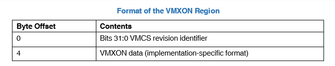
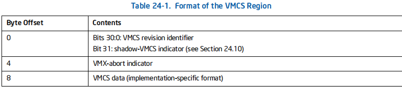
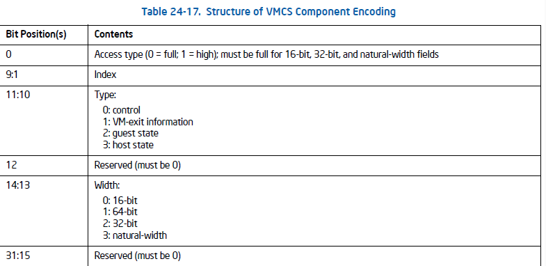
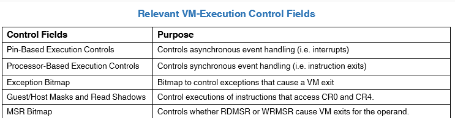
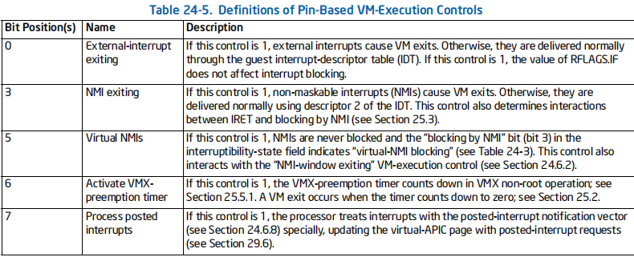
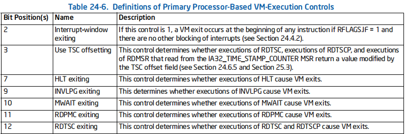
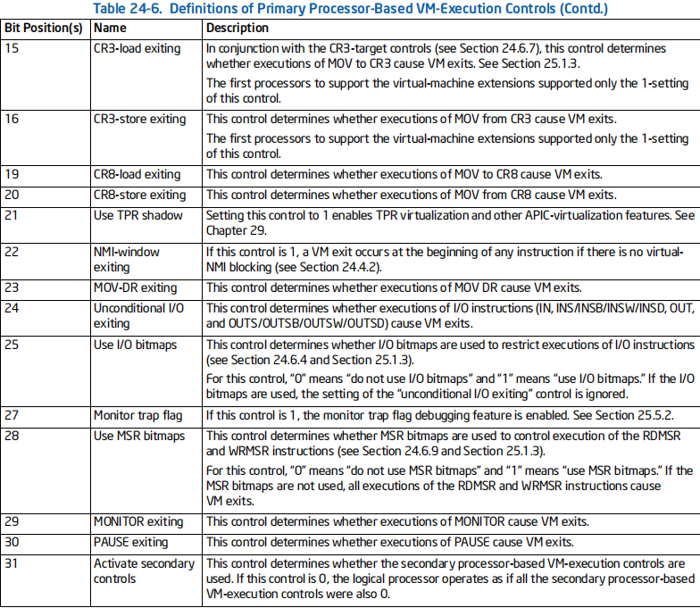
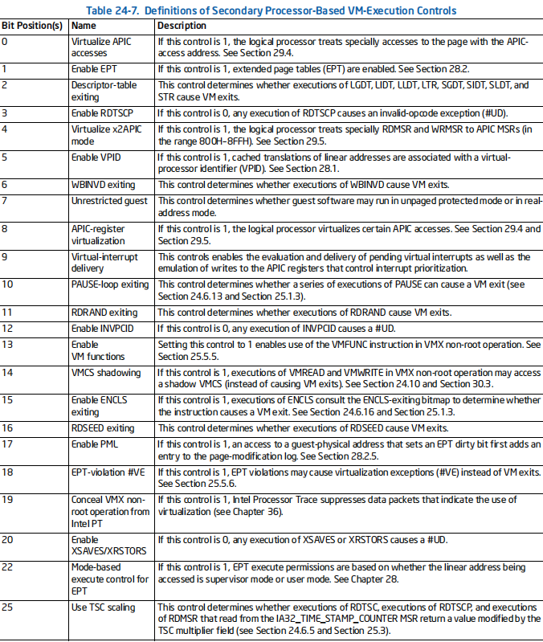
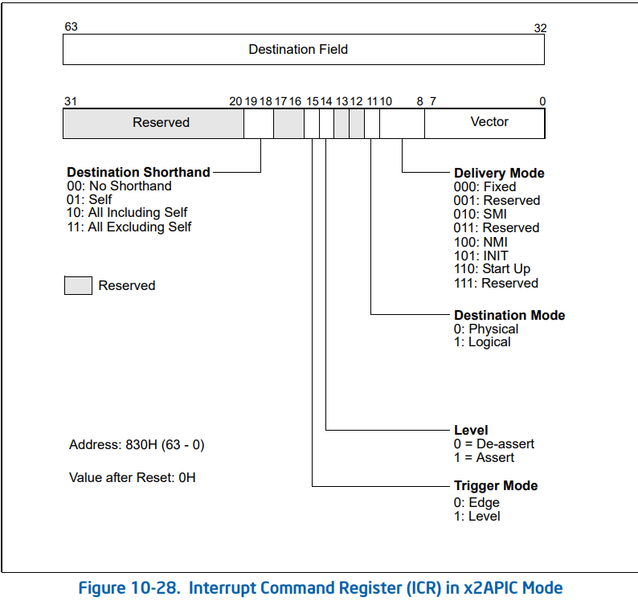

# 0x1 VMX Operation进入

## 0x1-1 相关术语

- 处理器

这里指物理硬件的处理器。

- 核心

一个物理硬件处理器可以有多个核心，多核代表一个处理器可以并行的获取执行指令。

- 逻辑处理器

处理器抽象,等于处理器个数*核心

- 虚拟处理器

这是指在开启VMX之后,虚拟机所拥有的处理器。一般来说,逻辑处理器==虚拟处理器(VM-Entry进入虚拟机之后);

## 0x1-2 上下文

对于处理器和VMM，都有上下文。当然,这不是硬件要求的,是自己根据OOP思想定义的结构。

硬件固定的只有4KB的VMXON和4KB的VMCS区域

### 0x1-2-1 VMM虚拟机管理程序上下文

在开启VT之后,虚拟机有了自己的虚拟处理器,下文称vCPU;

对于VMM上下文,他应该是管理程序,用于管理vCPU。VMM上下文通常包含

再次注意,VMM和vCPU全都不是硬件要求的,仅仅是为了方便。

- ~~VMM堆栈~~
- vCPU上下文表

因为虚拟机的虚拟处理器可能不止一个。vCPU是一个vCPU上下文的二级指针。

- 处理器个数

这个可以用KeQueryProcessorNumberEx进行获取当前虚拟机处理器个数。


### 0x1-2-2 vCPU上下文

通常,vCPU应包含

- **处理器上下文**

这是任何一个处理器都需要有的,比如调试寄存器,通用寄存器,特殊寄存器(GDTR...)

- **[VMXON区域](#0x2-1 VMXON Region)**
- **[VMCS区域](#0x2-2 VMCS Region)**

# 0x2 VMXON区域和VMCS区域

## 0x2-1 VMXON Region

VMXON区域是逻辑处理器规定的数据结构,他和VMX操作有关。通常是4KB对齐,定义在白皮书中，格式固定。它主要用于VMXON指令进入的时候。

VMXON区域应当在VMXON执行前清0。以便于VMXON进入Vmentry,执行non-root。

总的来说,VMXON区域就是一块用于VMXON指令初始化的区域。

值得一提,VMXON指令需要的VMXON区域是一块**物理内存**,而非线性地址。

VMXON区域大小通常是4KB,但是也不一定,需要查询**IA32_VMX_BASIC_MSR**这个寄存器的vmxon_region_size。

VMXON区域的数据结构如下



### 白皮书对于VMXON region描述

>Before executing VMXON, software allocates a region of memory (called the VMXON region) that the logical processor **uses to support VMX operation**. **The physical address of this region (the VMXON pointer) is provided in an operand to VMXON.**
>
>Before executing VMXON, software should write the VMCS revision identifier to the VMXON region.

即VMXON region是VMXON指令执行的必须区域,结构定义固定,该区域的物理地址作为参数提供给VMXON,VMXON区域的前4字节的0-31位是VMCS的**修正标识符**。该标识符去MISC MSR寄存器查找。

## 0x2-2 VMCS Region

VMCS结构叫做虚拟机控制结构,是VMM对虚拟机的控制,修改这块区域就能修改虚拟机的关键信息。这个就是在调用VMXON指令之后,VMCS就是VM-Entry VM-Exit操作的东西。

它负责管理 VMX 操作进出的转换（VM 进入和 VM 退出）以及 VMX 非根操作中的处理器行为。

如果有多个逻辑处理器(vCpu),那么一般需要绑定多个VMCS;另外,一个处理器可以有多个VMCS区但是只能指定一个**active**和**current**。

active即代表当前VMCS是否有效,而current则是当前逻辑处理器使用的VMCS,能使用则必须有效。


### VMCS Region结构



同样的,前四字节是修正标识符(即结构标识,兼容修正),和VMXON Region不一样的是,最高位是shadow-VMCS indicator

这个也是去MSR寄存器查找。

4-8字节是VMX abort指示器,这是和VMXON Region不一样的。

总的来说,VMCS region和VMXON region结构是相似的。细微差别。

VMCS区域也是每个逻辑处理器的数据结构,同样的,他也和VMX操作有关,它还包含 VMM 用来控制来宾操作的设置。

VMCS区域的填充是在VMXON 指令之后。也就是进入VMX操作之后。

**总的来说**,VMCS区域就是每个vCpu保存的虚拟上下文.

它保存主机和来宾的完整 CPU 状态。这包括段寄存器，**[GDT](https://en.wikipedia.org/wiki/Global_Descriptor_Table)**，**[IDT](https://en.wikipedia.org/wiki/Interrupt_descriptor_table)**，**[TR](https://en.wikipedia.org/wiki/Load_task_register)**、各种 MSR，以及用于处理退出和进入操作的控制字段结构。

### VMX操作指令

并且各种VMX操作,本质上就是操作**VMCS**。

• **VMPTRLD —** This instruction takes a single 64-bit source operand that is in memory. It makes the referenced  VMCS active and current, loading the current-VMCS pointer with this operand and establishes the current VMCS based on the contents of VMCS-data area in the referenced VMCS region. Because this makes the referenced VMCS active, a logical processor may start maintaining on the processor some of the VMCS data for the VMCS.

**简单来说,提供给此指令一个物理地址,设置这个物理地址指向的VMCS区域为active和current**

• **VMPTRST —** This instruction takes a single 64-bit destination operand that is in memory. The current-VMCS pointer is stored into the destination operand.

**提供物理地址,保存当前的VMCS到这个物理地址**

• **VMCLEAR —** This instruction takes a single 64-bit operand that is in memory. The instruction sets the launch state of the VMCS referenced by the operand to “clear”, renders that VMCS inactive, and ensures that data for the VMCS have been written to the VMCS-data area in the referenced VMCS region. If the operand is the same as the current-VMCS pointer, that pointer is made invalid.

**即提供一个物理地址,这个地址如果指向VMCS数据区域,设置为VMCS的属性为非active,如果这个物理地址是当前VMCS,无效。而且会顺便把VMCS内存刷新**

• **VMREAD —** This instruction reads a component from a VMCS (the encoding of that field is given in a register operand) and stores it into a destination operand that may be a register or in memory.

**提供一个物理地址或者寄存器,以及一个VMCS的字段编码,会把VMCS响应的字段对应的内容读到提供的寄存器或者内存中。**

• **VMWRITE —** This instruction writes a component to a VMCS (the encoding of that field is given in a register operand) from a source operand that may be a register or in memory.The behavior of the VMX management instructions is summarized below:

**相反,VMCS字段是一个编码,对应着VMCS里面的数据,比如MSR寄存器,控制寄存器等。**

• **VMLAUNCH —** This instruction launches a virtual machine managed by the VMCS. A VM entry occurs, transferring control to the VM.

**设置过VMCS之后,VMLANCH启动虚拟机,进入non-root操作。**

• **VMRESUME —** This instruction resumes a virtual machine managed by the VMCS. A VM entry occurs, transferring control to the VM.

• **VMXOFF —** This instruction causes the processor to leave VMX operation.

• **VMXON —** This instruction takes a single 64-bit source operand that is in memory. It causes a logical processor to enter VMX root operation and to use the memory referenced by the operand to support VMX operation.The behavior of the VMX-specific TLB-management instructions is summarized below:

**进入VMX操作,提供给一个物理内存,指向VMXON区域**

• **INVEPT —** This instruction invalidates entries in the TLBs and paging-structure caches that were derived from extended page tables (EPT).

• **INVVPID —** This instruction invalidates entries in the TLBs and paging-structure caches based on a VirtualProcessor Identifier (VPID).None of the instructions above can be executed in compatibility mode; they generate invalid-opcode exceptions if executed in compatibility mode.

The behavior of the guest-available instructions is summarized below:

• **VMCALL —** This instruction allows software in VMX non-root operation to call the VMM for service. A VM exit occurs, transferring control to the VMM.

Non-root操作的软件调用VmCall,退出VM,陷入VMM;

### VMCS字段编码

VMCS字段编码即用于VMREAD/VMWRITE读写的标识。需要提供给这些指令。

编码结构如下



这些指都是预定义的,如

```c++
VIRTUAL_PROCESSOR_ID = 0x00000000;
POSTED_INTR_NV = 0x00000002;
GUEST_ES_SELECTOR = 0x00000800;
GUEST_CS_SELECTOR = 0x00000802;
```

# 0x3 进入VMX操作之前的预处理

## 0x3-1 控制寄存器和MSR

- 首先需要设置cr4的vmx_enable位为1,这是总开关。

```c++
int enable_vmx_operation( void )
{
  union __cr4_t cr4 = { 0 };
  union __ia32_feature_control_msr_t feature_msr = { 0 };

  cr4.control = __readcr4();
  cr4.bits.vmx_enable = 1;
  __writecr4( cr4.control );

}
```

然后需要修改IA32_FEATURE_CONTROL这个MSR寄存器中的一些位置

其中0位必须置位,位1和位2一般置位位2;即vmxon_outside_smx

位1是vmxon_insize_smx

即SMX 内部和外部,SMX是**[更安全的模式扩展](http://linasm.sourceforge.net/docs/instructions/smx.php)**

```c++
int enable_vmx_operation( void )
{
  union __cr4_t cr4 = { 0 };
  union __ia32_feature_control_msr_t feature_msr = { 0 };

  cr4.control = __readcr4();
  cr4.bits.vmx_enable = 1;
  __writecr4( cr4.control );

  feature_msr.control = __readmsr( IA32_FEATURE_CONTROL );
    
  if ( feature_msr.bits.lock == 0 ) {
    feature_msr.bits.vmxon_outside_smx = 1;
    feature_msr.bits.lock = 1;
    
    __writemsr( IA32_FEATURE_CONTROL, feature_msr.control );

    return TRUE;
  }

  return FALSE;
}
```

此外,还需要进行修改CR0 和CR4的一些保留位,确保能够进入VMX操作

这些保留位在MSR寄存器中,分别是

IA32_VMX_CR0_FIXED0

IA32_VMX_CR0_FIXED1

IA32_VMX_CR4_FIXED0

IA32_VMX_CR4_FIXED1

统一操作是如下,对于FIXED0 crx寄存器进行或运算

对于FIXED1 crx寄存器进行与运算

这样确保可以进入VMX操作

## 0x3-2 进入VMX操作


总的来说,步骤如下:

- 检查支持
- 分配VMM_CONTEXT
- 如果多个vCPU,需要分配多个vCpu上下文,放到VMM_CONTEXT中
- 初始化每个vCpu上下文(进入VMX之前操作VMXON区域)
- 调整控制寄存器(CR4.vmx_enable CR0.Fix CR4.Fix)
- 调用VMXON 把物理地址作为操作数

由此进入VMX操作,注意,只是当前CPU进入VMX操作。

# 0x4 多核进入VMX操作

多核进入VMX就是多次执行初始化vCpu等操作，值得一提的是有多种多核进入的方法。

## 0x4-1 VM Execution控制字段

所谓VM执行控制,即VM进行non-root操作,是否会陷入VMM的控制。

他是否陷入以及那些指令陷入,受一些MSR寄存器的影响。



这些寄存器在概论中有定义。

### Pin-Base



这个MSR寄存器主要用于控制VM的中断是否会VM-Exit陷入VMM;对于APIC虚拟化十分重要;

### Processor-Based

ProcessorBase的执行控制寄存器有主/从控制

**主控制如下**





**从控制如下**



### Exception Bitmap

异常位图是一个32位的字段，它为每个异常包含一个位。当发生异常时，其向量用于选择此字段中的一个位。如果位为1，则异常会导致VM退出。如果位为0，则异常通常通过IDT正常传递。

如E号异常,缺页,如果想要正常执行,需要异常位图14位必须为0;

### Guest/Host Masks and Read Shadows for CR0 and CR4

分为影子位和掩码位。

如果掩码位设置位0,VMM不管修改,如果设置为1,如果修改CR0 CR4相应的掩码位和影子位不同,陷入VMM;VM-exit；

### MSR Bitmap

MSR Bitmap大小为1Kb,通常申请为4kb,如果某一个位是1,代表rdmsr wrmsr会VM Exit;

## 0x4-2 VM Entry Exit控制字段

结构如下

### VM Exit控制字段

```C++
union __vmx_exit_control_t
{
    unsigned __int64 control;
    struct
    {
        unsigned __int64 reserved_0 : 2;
        unsigned __int64 save_dbg_controls : 1;
        unsigned __int64 reserved_1 : 6;
        unsigned __int64 host_address_space_size : 1;
        unsigned __int64 reserved_2 : 2;
        unsigned __int64 load_ia32_perf_global_control : 1;
        unsigned __int64 reserved_3 : 2;
        unsigned __int64 ack_interrupt_on_exit : 1;
        unsigned __int64 reserved_4 : 2;
        unsigned __int64 save_ia32_pat : 1;
        unsigned __int64 load_ia32_pat : 1;
        unsigned __int64 save_ia32_efer : 1;
        unsigned __int64 load_ia32_efer : 1;
        unsigned __int64 save_vmx_preemption_timer_value : 1;
        unsigned __int64 clear_ia32_bndcfgs : 1;
        unsigned __int64 conceal_vmx_from_pt : 1;
    } bits;
};
```

host_address_space_size这个决定VMExit之后是否处于IA-32E模式

### VM-Entry控制字段

```C++
union __vmx_entry_control_t
{
    unsigned __int64 control;
    struct
    {
        unsigned __int64 reserved_0 : 2;
        unsigned __int64 load_dbg_controls : 1;
        unsigned __int64 reserved_1 : 6;
        unsigned __int64 ia32e_mode_guest : 1;
        unsigned __int64 entry_to_smm : 1;
        unsigned __int64 deactivate_dual_monitor_treament : 1;
        unsigned __int64 reserved_3 : 1;
        unsigned __int64 load_ia32_perf_global_control : 1;
        unsigned __int64 load_ia32_pat : 1;
        unsigned __int64 load_ia32_efer : 1;
        unsigned __int64 load_ia32_bndcfgs : 1;
        unsigned __int64 conceal_vmx_from_pt : 1;
    } bits;
};
```

ia32e_mode_guest决定VM-Entry是否处于IA-32E模式

## 0x4-3 多核VMX的方法

通常,对于多核初始化VMX操作,有3种方法

### IPI处理器间中断

IPI即一个处理器通过某种方式中断另一个处理器。

具体方法是通过APIC的ICR(中断命令寄存器)实现的。

ICR寄存器是APIC的一个寄存器,他的主要功能是

- 发送 IPI。
- 将接收到的中断转发给另一个处理器进行服务。
- 执行自中断。
- 交付特殊的 IPI



### DPC

DPC是基于处理器而不是基于线程的,因此可以使用些代码向其他处理器插入DPC;

可以通过**KeGenericCallDpc** 向除本处理器之外的所有处理器插入DPC.

调用**[KeInsertQueueDpc ](https://docs.microsoft.com/en-us/windows-hardware/drivers/ddi/content/wdm/nf-wdm-keinsertqueuedpc)**,插入当前处理器。

### 线程亲和性

使用Windows 内核API,改变当前线程运行的CPU即可。这是最简单有效的方法。

但是有一些细节值得注意；

- KeQueryActiveProcessorEx

```c++
NTKERNELAPI
ULONG
KeQueryActiveProcessorCountEx (
    _In_ USHORT GroupNumber
    );
```

通过这个,参数填ALL_PROCESSOR_GROUPS,获取的是逻辑CPU的索引。

因为一个物理CPU叫做一个CPU组。

需要把Index转换成CPU号,通过

```c++
KeGetProcessorNumberFromIndex(index, &processor_number);
```

来获取CPU号，CPU号是一个如下的结构

```c++
typedef struct _PROCESSOR_NUMBER {
    USHORT Group;
    UCHAR Number;
    UCHAR Reserved;
} PROCESSOR_NUMBER, *PPROCESSOR_NUMBER;
```

里面包含了逻辑CPU Number以及物理CPU组;

- 处理器亲和掩码

处理器亲和掩码是标识该线程亲和哪个逻辑处理器,计算方式为

1<<processor_number.Number;

因此最多64个逻辑CPU;

设置线程的CPU亲和性如下

```C++
for (int i = 0; i < vmm_context->processor_count; i++) {
		//填充vcpu上下文
		vmm_context->vcpu_table[i] = init_vcpu();
		vmm_context->vcpu_table[i]->vmm_context = vmm_context;


		//获取processor_number index->number;
		KeGetProcessorNumberFromIndex(i, &processor_number);
		

		affinity.Group = processor_number.Group;

		//用这个来表示处理器的亲和性掩码 可以唯一标识一个处理器 因此x64最多64个逻辑处理器
		affinity.Mask = (KAFFINITY)1 << processor_number.Number;

		KeSetSystemGroupAffinityThread(&affinity, &old_affinity);

		init_logical_processor(vmm_context, 0);

		//恢复亲和处理器
		KeRevertToUserGroupAffinityThread(&old_affinity);
	}

```

