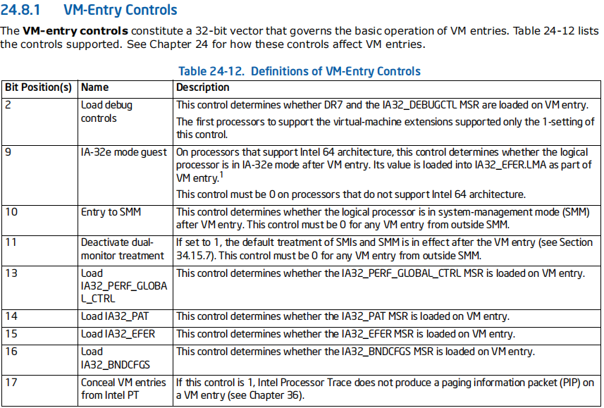
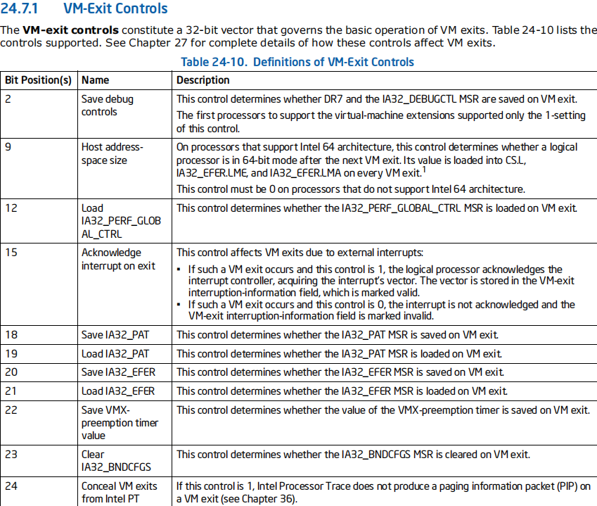
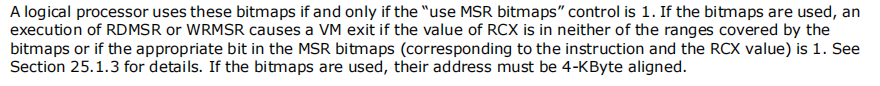
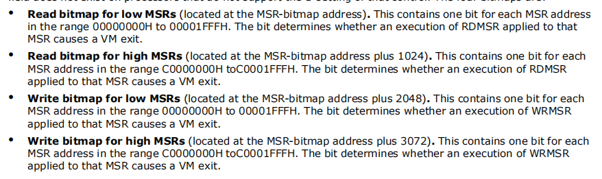

# 0x1 VMCS填充区域简介

VMCS是vmlanuch最关键的指令。只有完整填充他,才可以使虚拟CPU真正地进入VT.

也就是vm Entry，此时才能进入non root操作,敏感指令才能够被陷入或者是监控。

总的来说,VMCS区域需要填充如下内容

- **VMCS的Entry控制字段**

这个字段用于控制VM Entry

- **VMCS的Exit控制字段**

控制VM Exit之后的状态,如VM exit VMM是否是x64模式等

- **VMCS的VM执行控制字段**

前面提到,VM中的非根操作收到VM执行控制字段的影响。这些影响决定了是否某些指令会VM Exit,以及某些非根操作能不能执行,比如rdtsc等..异常位图,MSR位图,IO位图等

- **VMCS的host区域**

即VMM的相关区域,这个里面通常要填各种段寄存器,以及最重要的**HOST_RSP**和**HOST_RIP**

HOST_RIP的意义就是当发送VM-Exit之后,VMM第一个执行的指令在哪。

一般把HOST_RIP称为VM_Exit_Handler;

- **VMCS的guest区域**

这是用于填充VM的字段,可以理解为虚拟机的**CONTEXT**,需要填充各种重要的字段,比如一些重要的MSR,CR0 3 4,DR7,各种段寄存器,段描述符属性,总的来说,这个区域是需要填充最多的。

值得一提的是,VMCS的guest区域也是有guest_rip和guest_rsp的,这两个值通常填初始化VMCS的函数被调用之前的堆栈以及返回地址。可以理解为vmlaunch之后,虚拟机的执行IP SP不受影响。

## 0x1-1 填充过程

填充过程如下:

```c++
int init_vmcs(struct __vcpu_t* vcpu, void* guest_rsp, void (*guest_rip)()) {

	//获取host_rip;
	unsigned long long vm_exit_handler = vcpu->vmm_context->vm_exit_handler;

	struct __vmcs_t* vmcs;
	union __vmx_basic_msr_t vmx_basic = { 0 };
	PHYSICAL_ADDRESS physical_max;


	//确定硬件VMCS的大小
	vmx_basic.control = __readmsr(IA32_VMX_BASIC_MSR);

	physical_max.QuadPart = ~0ULL;
	vcpu->vmcs = (__vmcs_t*)MmAllocateContiguousMemory(PAGE_SIZE, physical_max);
	vcpu->vmcs_physical = MmGetPhysicalAddress(vcpu->vmcs).QuadPart;

	RtlSecureZeroMemory(vcpu->vmcs, PAGE_SIZE);

	//填充VMCS
	vmcs = vcpu->vmcs;
	vmcs->header.all = vmx_basic.bits.vmcs_revision_identifier;
	vmcs->header.bits.shadow_vmcs_indicator = 0;
	
	//ULONG64 vmxBasic = __readmsr(IA32_VMX_BASIC);
	//*(PULONG)vmcs = (ULONG)vmxBasic;

	//设置当前VMCS
	if (__vmx_vmclear(&vcpu->vmcs_physical) != 0 || __vmx_vmptrld(&vcpu->vmcs_physical) != 0) {

		DbgPrintEx(77, 0, "[+]_vmx clear or vmx ptrld err\r\n");

		//执行相关清理操作
		
		return false;


	}

	//初始化vmcs的guest字段
	init_vmcs_guest(guest_rsp, guest_rip);
	//初始化vmcs的host字段
	init_vmcs_host(vcpu,vm_exit_handler);


	//初始化vm entry 控制
	init_vmcs_entry_controls();

	//初始化vm exit控制
	init_vmcs_exit_controls();

	//初始化vm executation 控制
	init_vmcs_vmexecute_controls(vcpu);


	return TRUE;


}
```

而guest_rip和guest_rsp通常是上个函数的调用函数IP SP;

值得一提的是,我们不能直接修改VMCS区域,结构是不知道的。

Intel提供了VMWRITE和WMREAD(上一篇中有)以及提供字段编码来写,同样的,初始化VMCS区域并不是像VMCS里面写值,而是在调用vmptrldr之后,即设置了VMCS为current以及active之后,调用vmwrite和vmread进行填充VMCS区域。

因此,在想要填充VMCS之前,需要进行如下必要的步骤

```c++
	//设置当前VMCS
	if (__vmx_vmclear(&vcpu->vmcs_physical) != 0 || __vmx_vmptrld(&vcpu->vmcs_physical) != 0) {

		DbgPrintEx(77, 0, "[+]_vmx clear or vmx ptrld err\r\n");

		//执行相关清理操作
		
		return false;

	}
```

**本质上,基本上所有的控制字段填充方式都是**

> 读取原有的硬件的MSR、段寄存器、特殊寄存器等。
>
> 如果想要修改一些属性,只需要在vmwrite的时候加上即可。

# 0x2 VMCS的guest区域

VMCS中的guest区域就像是虚拟机的CONTEXT,几乎能想到的所有Cpu相关的都保存了。

- **填充各种段描述符的界限,选择子,属性等。**

所有的段寄存器以及他里面的选择子对应的属性界限等,都需要填。

**ldtr tr**这两个特殊段寄存器也需要填写。

```c++
	__vmx_vmwrite(GUEST_ES_BASE + index * 2, item_base.QuadPart);
	__vmx_vmwrite(GUEST_ES_LIMIT + index * 2, limit);
	__vmx_vmwrite(GUEST_ES_AR_BYTES + index * 2, attribute);
	__vmx_vmwrite(GUEST_ES_SELECTOR+index*2, selector);
```

- **填充重要控制寄存器**

```C++
__vmx_vmwrite(GUEST_CR0, __readcr0());
__vmx_vmwrite(GUEST_CR3, __readcr3());
__vmx_vmwrite(GUEST_CR4, __readcr4());
__vmx_vmwrite(GUEST_DR7, __readdr(7));
__vmx_vmwrite(GUEST_RFLAGS, __readeflags());
__vmx_vmwrite(GUEST_RIP, (size_t)guest_rip);
__vmx_vmwrite(GUEST_RSP, (size_t)guest_rsp);
```

- **填充一些MSR寄存器**

```C++
__vmx_vmwrite(GUEST_IA32_DEBUGCTL, __readmsr(IA32_MSR_DEBUGCTL));
__vmx_vmwrite(GUEST_IA32_PAT, __readmsr(IA32_MSR_PAT));
__vmx_vmwrite(GUEST_IA32_EFER, __readmsr(IA32_MSR_EFER));

__vmx_vmwrite(GUEST_FS_BASE, __readmsr(IA32_FS_BASE));
__vmx_vmwrite(GUEST_GS_BASE, __readmsr(IA32_GS_BASE));

__vmx_vmwrite(GUEST_SYSENTER_CS, __readmsr(IA32_SYSENTER_CS));
__vmx_vmwrite(GUEST_SYSENTER_EIP, __readmsr(IA32_SYSENTER_EIP));
__vmx_vmwrite(GUEST_SYSENTER_ESP, __readmsr(IA32_SYSENTER_ESP));
```

- **填充IDT GDT表的相关信息**

其实就是GDT/IDT的界限和基质

```C++
GdtTable idtTable{ 0 };
__sidt(&idtTable);

__vmx_vmwrite(GUEST_IDTR_BASE, idtTable.Base);
__vmx_vmwrite(GUEST_IDTR_LIMIT, idtTable.limit);

__vmx_vmwrite(GUEST_GDTR_BASE, gdtTable.Base);
__vmx_vmwrite(GUEST_GDTR_LIMIT, gdtTable.limit);
```

- 杂项

因为VMCS被初始化全0,这个不能默认是0

```C++
//VMCS链接指针 仅当在 VM 执行控制字段中启用 VMCS 阴影时才有用
__vmx_vmwrite(VMCS_LINK_POINTER, (unsigned long long)-1);
```

# 0x3 VMCS的host区域

VM Host区域即VM Exit之后的环境,通常包括各种段寄存器,FS_BASE,GS_BASE,GDT.Base等

```c++
	//填充VMCS的Host区域
	GdtTable gdtTable{ 0 };
	asm_get_gdt_table(&gdtTable);

	unsigned short tr_register = asm_get_tr();

	unsigned short tr_seletor = tr_register & 0xfff8;


	unsigned long* tr_descriptor = (unsigned long*)(gdtTable.Base + tr_seletor);

	LARGE_INTEGER tr_base{ 0 };

	//IA-32E的TSS描述符是128位的 和LDT是一样的
	//取低32base
	//tr_base.LowPart = (((tr_descriptor[0] & 0xffff0000) >> 16) | ((tr_descriptor[1] & 0xff) << 16) | ((tr_descriptor[1]) & 0xff000000));
	//tr_base.HighPart = tr_descriptor[2];
	tr_base.LowPart = ((tr_descriptor[0] >> 16) & 0xFFFF) | ((tr_descriptor[1] & 0xFF) << 16) | ((tr_descriptor[1] & 0xFF000000));
	tr_base.HighPart = tr_descriptor[2];
	//fetch high 32 bits


	//属性
	__vmx_vmwrite(HOST_TR_BASE, tr_base.QuadPart);
	__vmx_vmwrite(HOST_TR_SELECTOR, tr_seletor);

	//取得当前虚拟cpu的host栈
	__vmx_vmwrite(HOST_RSP, (size_t)vcpu->stack_base);
	__vmx_vmwrite(HOST_RIP, host_rip);

	__vmx_vmwrite(HOST_CR0, __readcr0());
	__vmx_vmwrite(HOST_CR4, __readcr4());
	__vmx_vmwrite(HOST_CR3, __readcr3());

	__vmx_vmwrite(HOST_IA32_EFER, __readmsr(IA32_MSR_EFER));
	__vmx_vmwrite(HOST_IA32_PAT, __readmsr(IA32_MSR_PAT));

	__vmx_vmwrite(HOST_FS_BASE, __readmsr(IA32_FS_BASE));
	__vmx_vmwrite(HOST_GS_BASE, __readmsr(IA32_GS_BASE));

	__vmx_vmwrite(HOST_IA32_SYSENTER_CS, __readmsr(IA32_SYSENTER_CS));
	__vmx_vmwrite(HOST_IA32_SYSENTER_EIP, __readmsr(IA32_SYSENTER_EIP));
	__vmx_vmwrite(HOST_IA32_SYSENTER_ESP, __readmsr(IA32_SYSENTER_ESP));

	//Gdt idt
	GdtTable idtTable{ 0 };

	__sidt(&idtTable);

	__vmx_vmwrite(HOST_GDTR_BASE, gdtTable.Base);
	__vmx_vmwrite(HOST_IDTR_BASE, idtTable.Base);


	//host区域填充段寄存器
	__vmx_vmwrite(HOST_ES_SELECTOR, asm_get_es() & 0xfff8);
	__vmx_vmwrite(HOST_CS_SELECTOR, asm_get_cs() & 0xfff8);
	__vmx_vmwrite(HOST_SS_SELECTOR, asm_get_ss() & 0xfff8);
	__vmx_vmwrite(HOST_DS_SELECTOR, asm_get_ds() & 0xfff8);
	__vmx_vmwrite(HOST_FS_SELECTOR, asm_get_fs() & 0xfff8);
	__vmx_vmwrite(HOST_GS_SELECTOR, asm_get_gs() & 0xfff8);
}
```

总的来说,和VMCS的Guest区域差不多,但是少了很多东西,而且值得一提的是,段寄存器的权限以及G/L位必须都是0;即`__vmx_vmwrite(HOST_ES_SELECTOR, asm_get_es() & 0xfff8);`

最重要的,便是

```c++
	//取得当前虚拟cpu的host栈
	__vmx_vmwrite(HOST_RSP, (size_t)vcpu->stack_base);
	__vmx_vmwrite(HOST_RIP, host_rip);
```

这个决定了VM Exit的堆栈和第一条执行的指令,普遍称作VM-Exit-Handler;

而host_rsp,理论上也是最合理应该是每个cpu都有一个,但是也可以多个CPU公用同一个栈。

## 0x3-1 VM Exit Handler

一般来说,VmExitHandler分为asm_vm_exit_handler和vm_exit_handler;

asm_vm_exit_handler其实就是建立一个汇编文件,用于push各种寄存器,然后调用vm_exit_handler;

真正的逻辑执行是在vm_exit_handler中的。

```assembly

asm_vmx_exit_handler proc
	push r15;
	push r14;
	push r13;
	push r12;
	push r11;
	push r10;
	push r9;
	push r8;
	push rdi;
	push rsi;
	push rbp;
	push rsp;
	push rbx;
	push rdx;
	push rcx;
	push rax;
	
	mov rcx,rsp;
	sub rsp,0100h
	call vmx_exit_handler
	add rsp,0100h;

	pop rax;
	pop rcx;
	pop rdx;
	pop rbx;
	pop rsp;
	pop rbp;
	pop rsi;
	pop rdi;
	pop r8;
	pop r9;
	pop r10;
	pop r11;
	pop r12;
	pop r13;
	pop r14;
	pop r15;
	vmresume
	ret
asm_vmx_exit_handler endp
end
```

由于`mov rcx,rsp`这条指令,vm_exit_handler可以认为有一个参数,即各种寄存器;

# 0x4 VMCS的控制字段

VMCS的控制字段的填充方法是类似的,无论是entry,exit,还是execute control

都是遵循下面的步骤

- 根据IA32_VMC_BASIC_MSR确定用哪个MSR索引
- 确定之后,根据自己需要加上信息
- 调整MSR寄存器
- vmwrite写入相应的控制字段

## 0x4-1 VMCS的entry控制字段



**对于VMCS Entry控制区域,一般只需要修改ia32e_mode=true即可。**

VMCS的entry控制字段是绝对着VM Entry时的一些属性,他的属性是在MSR寄存器中保存着,因此需要先读相应的寄存器。

前面说过,控制字段的步骤。首先

读BAISC MSR确定到底使用哪个MSR

```c++
basic_msr.control = __readmsr(IA32_VMX_BASIC_MSR);
	//VM Entry时保持IA32E模式
	entry.bits.ia32e_mode_guest = true;

	//根据baisc位决定用哪个entry控制寄存器
	entry_control_msr = (basic_msr.bits.true_controls) ?IA32_MSR_VMX_TRUE_ENTRY_CTLS : IA32_VMX_ENTRY_CTLS;
```

值得一提的是**调整MSR寄存器**,VMCS的控制MSR寄存器分为两个32位,其中高32位1是底32位的开关。意思是如下。

```c++
cap.control = __readmsr(msr);

actual = vaule;

actual |= cap.allowed_0_settings;
actual &= cap.allowed_1_settings;
```

即低32位在接受调整之后,还需要和高32位或运算,**因为有些位硬件可能不支持**。

调整之后(加上想要的值),直接进行vmwrite即可。


```c++
__vmx_vmwrite(VM_ENTRY_CONTROLS, entry.control);
__vmx_vmwrite(VM_ENTRY_MSR_LOAD_COUNT, 0);
__vmx_vmwrite(VM_ENTRY_INTR_INFO_FIELD, 0);
```

## 0x4-2 VMCS的exit控制字段



VMExit控制字段

初始化如下,所有控制字段初始化相仿

```c++
	__vmx_exit_control_t exit_control{0};
	unsigned exit_control_msr = 0;
	__vmx_basic_msr_t basic_msr{0};
	//vm exit确保是x64模式
	exit_control.bits.host_address_space_size = true;

	//这个代表vm exit是否中断 1代表中断
	exit_control.bits.ack_interrupt_on_exit=true;

	basic_msr.control = __readmsr(IA32_VMX_BASIC_MSR);

	exit_control_msr = (basic_msr.bits.true_controls) ? IA32_MSR_VMX_TRUE_EXIT_CTLS : IA32_MSR_VMX_EXIT_CTLS;;

	exit_control.control = vmx_adjust_entry_control(exit_control.control, exit_control_msr);

	//写入VM Exit
	__vmx_vmwrite(VM_EXIT_CONTROLS, exit_control.control);
	__vmx_vmwrite(VM_EXIT_MSR_LOAD_COUNT, 0);
	__vmx_vmwrite(VM_EXIT_INTR_INFO, 0);
```

对于VM Exit,需要host_address_space_size为true;

## 0x4-3 VMCS的VM 执行控制字段

> 非根操作受VM执行控制字段影响

这句话十分重要,他对于非根操作影响有很多方面,包括但不限于

- 什么非根操作会导致VM Exit
- 什么非根操作可以执行

总的来说,VMCS VM执行控制字段要初始化如下控制字段

- PinBase
- MSR bitmap
- primary cpu control
- second cpu control

PinBase控制不需要加任何操作,只需要调整即可

```c++
basic_msr.control = __readmsr(IA32_VMX_BASIC_MSR);

	//确定pinbase的msr
	pinbase_msr = (basic_msr.bits.true_controls) ? IA32_MSR_VMX_TRUE_PINBASED_CTLS : IA32_MSR_VMX_PINBASED_CTLS;

	//pinbase和中断有关,这里不涉及,不修改此MSR
	pinbased_control.control = vmx_adjust_entry_control(0, pinbase_msr);
```

而Primary cpu control则需要开启msr bitmap以及second cpu control来支持后两者

```c++
//确定primary control的msr
	primary_processor_msr = (basic_msr.bits.true_controls) ? IA32_MSR_VMX_TRUE_PROCBASED_CTLS : IA32_MSR_VMX_PROCBASED_CTLS;;

	//使用msr位图以及使用副cpu控制
	primary_processor_based_control.bits.active_secondary_controls = true;
	primary_processor_based_control.bits.use_msr_bitmaps = true;

	//不修改
	primary_processor_based_control.control = vmx_adjust_entry_control(primary_processor_based_control.control, primary_processor_msr);
```

开启了之后,对于Second cpu control,针对win10,需要开启rdscsp xsave_xrstor enable invpcid这种指令的支持。win10需要这些指令


```C++
//复CPU控制 需要修改
second_processor_msr = IA32_MSR_VMX_PROCBASED_CTLS2;
//这些win10需要用到
second_processor_based_control.bits.enable_rdtscp = true;
second_processor_based_control.bits.enable_xsave_xrstor = true;
second_processor_based_control.bits.enable_invpcid = true;

second_processor_based_control.control = vmx_adjust_entry_control(second_processor_based_control.control, second_processor_msr);
```

### 0x4-3-1 MSR Bitmap



MSR Bitmap的意思是如果某个位图置1,那么调用rdmsr wrmsr就会导致vm exit;

MSR位图共分为4KB

结构如下



因为MSR分为低MSR和高MSR;

底MSR总共0x2000个,高MSR从C0000000开始。

这4Kb区域被分为4个区域。分别管控底MSR读 高MSR读..

```c++
	if (msrAddrIndex >= 0xC0000000)
	{
		msrBitMap += 1024;
		msrAddrIndex -= 0xC0000000;
	}

	ULONG64 moveByte = 0;
	ULONG64 setBit = 0;

	if (msrAddrIndex != 0)
	{
		moveByte = msrAddrIndex / 8;

		setBit = msrAddrIndex % 8;

		msrBitMap += moveByte;
	}

	if (isEnable)
	{
		*msrBitMap |= 1 << setBit;
	}
	else
	{
		*msrBitMap &= ~(1 << setBit);
	}

	return TRUE;
```

