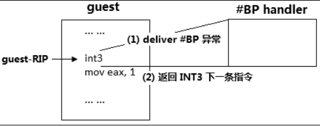

# 0x1 VM-Exit

逻辑处理器在 VMX non-root operation 模式的执行过程中，由于尝试执行某些指令或

遇到某些事件后**被迫**切换回 VMX root-operation 模式，这一行为称为“VM-exit”。

出于保护及虚拟化物理资源的目的，在 non-root 环境里尝试执行某些涉及物理资源

访问的指令或者接收到某些事件时会产生 VM-exit。

部分指令能无条件地产生 VM-exit，

部分指令由于 VMM（virtual machine monitor）设置了**触发条件**而引发 VM-exit。

简而言之,VM-Exit退出可以分为

- 无条件引发的VM-Exit指令

- 有条件引发的VM-Exit指令
- VM Exit事件(NMI 三重错误)

因此,对于==VM 执行控制影响非根操作,其中一个影响便是可以控制有条件引发VM-exit指令的范畴==。

## 0x1-1无条件VM Exit指令

- CPUID，INVD，GETSEC 以及 XSETBV 指令。

- VMX 系列指令，包括： INVEPT ， INVVPID ， VMCALL ， VMCLEAR ，

VMLAUNCH ， VMPTRLD ， VMPTRST ， VMREAD ， VMRESUME ，

VMWRITE，VMXOFF 以及 VMXON。

其中,GETSEC在所有主流操作系统均不使用。

## 0x1-2 有条件VM Exit指令

取决于pinBase...等各种控制字段。包含

- **HLT**，当“HLT exiting”为 1 时，尝试执行 HLT 指令将导致 VM-exit。

- **INVLPG**，当“INVLPG exiting”为 1 时，尝试执行 INVLPG 指令将导致 VM

exit。

-  **INVPCID**，当“enable INVPCID”和“INVLPG exiting”为 1 时，尝试执行

INVPCID 指令将导致 VM-exit。

-  **RDPMC**，当“RDPMC exiting”为 1 时，尝试执行 RDPMC 指令将导致 VM

exit。

- **RDTSC**，当“RDTSC exiting”为 1 时，尝试执行 RDTSC 指令将导致 VM-exit。

- **RDTSCP**，当“enable RDTSCP”和“RDTSC exiting”为 1 时，尝试执行

RDTSCP 指令将导致 VM-exit。

- **RSM**，当在 SMM 双重监控机制下的 SMM 模式内，尝试执行 RSM 指令将导致

VM-exit。

- **MOV to CR3**，当“CR3-load exiting”为 1，并且写入的值不等于其中一个 CR3-

target 值或者 CR3-count 值为 0 时，尝试执行 MOV to CR3 指令将导致 VM-exit

（参见 3.5.8 节）。

- **MOV from CR3**，当“CR3-store exiting”为 1 时，尝试执行 MOV from CR3 指令

将导致 VM-exit。

- **MOV to CR8**，当“CR8-load exiting”为 1 时，尝试执行 MOV to CR8 指令将导致

VM-exit。

- **MOV from CR8**，当“CR8-store exiting”为 1 时，尝试执行 MOV from CR8 指令

将导致 VM-exit。

- **MOV to CR0**，当 CR0 的 guest/host mask 字段的某位为 1 时，尝试执行 MOV to 

CR0 指令，而写入该位的值不等于 CR0 的 read shadows 字段对应位的值时，将导

致 VM-exit（见 3.5.7 节）。

- **MOV to CR4**，当 CR4 的 guest/host mask 字段的某位为 1 时，尝试执行 MOV to 

CR4 指令，而写入该位的值不等于 CR4 的 read shadows 字段对应位的值时，将导

致 VM-exit（见 3.5.7 节）。

- **CLTS**，当 CR0 的 guest/host mask 与 read shadows 字段的 bit 3（对应 TS 位）都为

1 时，尝试执行 CLTS 指令将导致 VM-exit

## 0x1-3 VM Exit Reason

对于每个VMExit,都会有一个VM Exit的原因,毫无疑问,这个退出原因是保存在VMCS中的。

在VMCS的`VM_EXIT_REASON;`字段中,可以使用vmx_vmwread();进行读取;

VM Exit Reason的结构如下:


而如果对于只处理由于指令引起的VM Exit,只需要`uVmExitReason &= 0xffff;`得到原因即可

VM Exit Reason定义如下:


## 0x1-4 VM Exit Handler的一般流程

一般,在进入VM Exit Handler之前,都会调用asm exit handler;此时参数可以视为一个Context,保存了所有的通用寄存器;

对于一般的VM Exit Handler执行流程是如下

```c++
	ULONG64 uVmExitReason = 0;
	ULONG64 uRip = 0;
	ULONG64 uRsp = 0;
	ULONG64 uInstLen = 0;//Vm exit的长度
	ULONG64 uInstInfo = 0;//指令的详细信息
	__vmx_vmread(VM_EXIT_REASON, &uVmExitReason);
	__vmx_vmread(VM_EXIT_INSTRUCTION_LEN, &uInstLen);
	__vmx_vmread(VMX_INSTRUCTION_INFO,&uInstInfo);
	__vmx_vmread(GUEST_RSP,&uRsp);
	__vmx_vmread(GUEST_RIP,&uRip);

	/*switch case 业务处理*/

	__vmx_vmwrite(GUEST_RIP, uRip + uInstLen);
	__vmx_vmwrite(GUEST_RSP, uRsp);

```

即获得GUEST_RSP和GUEST_RIP,以及指令长度,指令信息。

在进行处理完业务之后,调用vmwrite,写入GUEST_RIP和GUEST_RSP;完成处理。

这便是一般的逻辑处理。

# 0x2 VmOff退出VMX

对于VMXOFF,这条指令是用于退出VMX操作的指令。

当然,这应该是在VMM中执行的,所以,一般退出VMX操作的思路是通过VmCall陷入Vmm;

验证参数是否正确,从而VMOFF,但是此时是不可以执行VMX_VMWrite去修改RIP RSP

因此此时已没有GUEST和HOST之分。

因此返回思路是

		__vmx_off();
		//这个时候我们不能这样返回了
		//需要Jmp来返回
		asm_jmup_target(uRip + uInstLen, uRsp);

直接Jump并恢复之前的Rsp;

在调用这个指令之后,来进行其他清理操作,主要即

- 清理分配vCpu的各种内存
- 关闭Cr4.VmxEnable

总体逻辑是

```c++
GROUP_AFFINITY Affinity, OldAffinity;
	PROCESSOR_NUMBER ProcessorNumber{0};
	__vmm_context_t* vmm_context = gVmmContext;

	for (int i = 0; i < vmm_context->processor_count; i++) {

		//遍历每个vCpuIndex

		KeGetProcessorNumberFromIndex(i, &ProcessorNumber);

		//切换线程执行销毁处理

		Affinity.Mask = (KAFFINITY)1 << ProcessorNumber.Number;
		Affinity.Group = ProcessorNumber.Group;
		KeSetSystemGroupAffinityThread(&Affinity, &OldAffinity);

		asm_vm_call('exit');

		exit_logical_processor(vmm_context->vcpu_table[i]);

		KeRevertToUserGroupAffinityThread(&OldAffinity);


	}
```

asm_vm_call如下(**因为MS无vmcall定义**)

```c++
asm_vm_call proc
	mov rax,rcx ;flags
	vmcall
	ret
asm_vm_call endp
```

在执行jmup之后,会返回到ret这一句,继续执行。

# 0X3 基于VMM的syscallHook

## 0x3-1 Hook思路

拦截C0000082的读写调用

读则返回原先的值,写则禁止写入,实际上通过修改MSR的LSTAR,来进行syscallHook;

从而达到,外部读MSR的SyscallRip没有问题,但是实际syscall调用是直接调用到的修改过的MSR上的。

因为涉及到修改IA32_LSTAR,所以自己需要重写一份KiSyscall64(Shadow)，在逻辑中进行判断是否是需要Hook的SSDT Index;

## 0x3-2 PG的检测

值得一提的是,PG会检测IA32_LSTAR的修改。检测手段如下:

```assembly
KiErrata704Present proc near           

mov     ecx, 0C0000084h
rdmsr
push    rdx
push    rax
and     eax, 0FFFFFEFFh ; MSR_FMASK的TF位置位
wrmsr
pushfq
or      [rsp+18h+var_18], 100h ; 置位TF
popfq
syscall                 ; TF置位,FMASK不屏蔽 syscall异常
mov     r10, rcx
mov     ecx, 0C0000084h
pop     rax
pop     rdx
wrmsr
mov     rax, r10
retn
```

简而言之,通过设置IA32_FMASK,去掉TF单步位,从而导致syscall的时候产生异常,此时进入#DB(单步调试异常)异常，RIP在堆栈,PG检测RIP和原先的KiSyscall64是否一样,不一样则PG;

### 0x3-2-1 攻击方法(猜想)

- 拦截IA32_FMASK的读写
- 拦截TF异常,比较堆栈RIP是否是自己的Hook的KiSystemCall64,是则直接返回


# 0x4 异常拦截

异常拦截设置异常控制位,他并不是受PinBased,Primary,Second等这些执行控制字段的控制,而是单独的有一个位图。

这个位图是32位的,每一位1:1对应着IDT表中的中断;


## 0x4-1 异常拦截的信息

通常,VM_EXIT_REASON是0;即`EXIT_REASON_EXCEPTION_NMI`

获取信息通过

```c++
//获取中断信息
	__vmx_vmread(VM_EXIT_INTR_INFO, (SIZE_T*)&ExceptionInfo);
	//异常错误码
	__vmx_vmread(VM_EXIT_INTR_ERROR_CODE, &uErrCode);
```

来获取中断信息和异常错误码,值得一提的是,错误码并不是每个中断。

其中中断信息的结构入下


## 0x4-2 异常拦截后的处理

异常拦截后,在大多数情况下(极少数情况会直接返回,比如PG的TF位检测,此时直接返回),大部分情况需要进行执行原先的IDT的ISR处理函数。

如果要执行原先IDT的ISR处理函数,Intel提供了一种便捷方法,通过向VM_ENTRY_INTR_INFO_FIELD写入ExceptionInfo,即可下次进入VM Entry的时候直接进入对应的IDT;**这种方法其实是用到了VM Entry后的事件注入**;

> ==如果存在“**事件注入**”或者“**pending debug exception**”，它们将是 VM-entry 完成后处理器在 guest 环境里的第 1 个需要执行的任务==。
>
> 注入异常则是向量事件的注入

```c++
__vmx_vmwrite(VM_ENTRY_INTR_INFO_FIELD, *(PUINT64)&ExceptionInfo);
//VM Entry写入Len 下次进入VM Entry的时候Rip+Len
__vmx_vmwrite(VM_ENTRY_INSTRUCTION_LEN, uInstLen);

//不用写Rip+len了
__vmx_vmwrite(GUEST_RIP, uRip);
__vmx_vmwrite(GUEST_RSP, uRsp);
```

值得一提的是,还需要`__vmx_vmwrite(VM_ENTRY_INSTRUCTION_LEN, uInstLen);`向VM ENTRY写入指令长度,下次进入VM Entry则RIP自动+Len。而不能直接`__vmx_vmwrite(GUEST_RIP, uRip_Len);`

这样做的原因是

> 所有指令引起的 VM-exit 都是 fault 类型。也就是说：guest-state 区域的
>
> **guest-RIP** 字段是指向引起 VM-exit 的指令的地址。VM-exit instruction length 字段保存这
>
> 条指令的长度。
>

也就是此时指令执行到了Int3这条指令上,如果没有VT,正常指令流程是,int3执行一瞬间,堆栈压入中断门所需的RFLAGS,CS SS, RIP RSP等。

这个一瞬间的RIP计算是指令长度+int3指令地址。

而指令长度就是从GUEST的VM_ENTRY_INSTRUCTION_LEN中取得的,如果不填写长度,直接进行事件注入,压入的地址仍然是INT3的地址,会死循环,无限执行#BP的Handler;



	# 0x5 事件注入

所谓事件注入,则是发生在VMEntry之后,MSR Load之后完毕,如果存在“**事件注入**”或者“**pending debug exception**”，它们将是 VM-entry 完成后处理器在 guest 环境里的第 1 个需要执行的任务。

大多数情况下，事件注入或者pending debug exception 是虚拟化 guest 端产生事件的一种手段，但也可以是 **host 主动让guest 执行额外的工作**。

通常事件注入,向这个区域写入一个这个值。这个值就是异常的事件信息一个结构。

```c++
__vmx_vmwrite(VM_ENTRY_INTR_INFO_FIELD, *(PUINT64)&ExceptionInfo);
```

- 外部中断（类型为 0），NMI（类型为 2），硬件异常（类型为 3），软件中断

（类型为 4），特权级软件中断（类型为 5）以及软件异常（类型为 6）。

- Pending MTF VM-exit 事件：中断类型为 7，并且向量号为 0。

而所谓的Pending MTF VM Exit则是

> VMX 架构允许注入一个不执行任何代码的事件。中断类型为 7 并且向量号为 0 时，
>
> 注入一个 MTF VM-exit 事件 pending 在 guest 的第 1 条指令前，VM-entry 操作完切换到
>
> guest 环境后立即产生 VM-exit。注入的 pending MTF VM-exit 事件不受 processor-based 
>
> VM-execution control 字段的“monitor trap flag”位影响，即使“monitor trap flag”为 0。

一般被称为超级单步。
