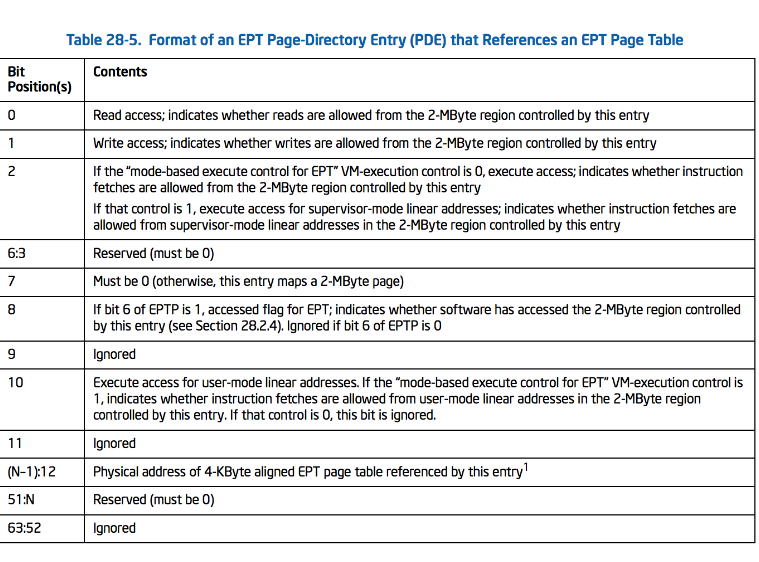

# 0x1 EPT概念

EPT即扩展页表,简而言之,即也是一个PML4-PDPT-PD-PT的表映射结构。

在保护模式下,一个地址先由逻辑地址经过段部件变成线性地址(**虚拟地址**),再由虚拟地址经过页部件变成物理地址。

在开了VMX之后,并且开启了EPT，GUEST的物理地址,在经过一次相同的转换,变成HOST的物理地址。这个时候才会真正地使用的物理地址。

## 0x1-1 EPT分页结构


在IA-32E的分页下,一般涉及到**五个物理地址**。

分别是PML4,指向PML4E的物理地址,PDPT,PD,PT,以及最后一个映射的4Kb(小页分页)的物理地址+12位的偏移。

在开启VMX之后,这些物理地址统统是GUEST的物理地址,因此它们需要经过一系列的EPT 页表的分页转换才能找到HOST物理地址。

同样地，EPTP也是和IA-32E一模一样的分页，只不过他的输入是GUEST的物理地址,输入则是真正的物理地址。


## 0x1-2 EPT 页表的结构

### EPTP

**EPTP可以看成IA-32E分页中的CR3**,他的结构如下


它的低12位是属性,12-N则是HOST物理地址,指向的4Kb大小的**EPT PML4E**数组。


### EPT PML4E


每个EPT PML4E都可以描述512G的GUEST 物理内存(后面使用EPT 身份1:1物理内存会用到)

同样的,EPT PML4E无论多少分页,其PDPTE的数组永远都是512个。指向4Kb的物理地址。

### EPT PDPTE 


### EPT PDE



### EPT PTE


# 0x2 EPT身份映射

所谓EPT身份映射,就是

> 在我们的管理程序或所有虚拟化已运行系统的管理程序（不是 VMWare、VirtualBox 等）中，我们有一个术语称为“**身份映射或 1:1 映射**”。这意味着如果您访问访客 PA（物理地址）0x4000，它将访问位于 0x4000 的主机 PA，因此，您必须将 RAM 的孔以及内存范围映射到访客。

其实本质上就是,从EPTP那个指针开始,只用到第一个PML4E(因为它可以描述512G的物理GUEST内存,完全可以覆盖所有的物理内存),按照顺序,便可以达到从GUEST物理内存映射到HOST物理内存的一比一关系，**即GUEST物理内存是多少,经过EPT 映射的HOST的内存就是多少**。

==一般来说,EPT的1:1映射,不会用到4KB的内存,即最低的是PDE,其中EPT的PDE的Size为BigPage,即2MB。==这样做的目的一是节省空间,二是更快速。当需要精细化操作的时候,只需要把原先2MB的PDE分割成512个4Kb的PTE即可。

## 0x2-1 MTRR寄存器

为了实现覆盖所有的物理内存,需要用到一个MSR寄存器,即==MTRR==，此寄存器可以标识整个物理机的所有物理内存以及其==MTRR属性==,这个很重要。

其中,物理页面的MTRR属性有以下值


这个属性非常重要,一旦初始化出错,会造成死机。本质上他就是标识了不同的物理内存属性。

在WinDbg中,使用!MTRR查看MTRR区域以及缓存策略

```c++
2: kd> !MTRR
MTRR:  Var 8, Fixed-support enabled, USWC-supported, Default: UC
WB:00000-0ffff  WB:10000-1ffff  WB:20000-2ffff  WB:30000-3ffff  
WB:40000-4ffff  WB:50000-5ffff  WB:60000-6ffff  WB:70000-7ffff  
WB:80000-83fff  WB:84000-87fff  WB:88000-8bfff  WB:8c000-8ffff  
WB:90000-93fff  WB:94000-97fff  WB:98000-9bfff  WB:9c000-9ffff  
UC:a0000-a3fff  UC:a4000-a7fff  UC:a8000-abfff  UC:ac000-affff  
UC:b0000-b3fff  UC:b4000-b7fff  UC:b8000-bbfff  UC:bc000-bffff  
WP:c0000-c0fff  WP:c1000-c1fff  WP:c2000-c2fff  WP:c3000-c3fff  
WP:c4000-c4fff  WP:c5000-c5fff  WP:c6000-c6fff  WP:c7000-c7fff  
WP:c8000-c8fff  WP:c9000-c9fff  WP:ca000-cafff  WP:cb000-cbfff  
UC:cc000-ccfff  UC:cd000-cdfff  UC:ce000-cefff  UC:cf000-cffff  
UC:d0000-d0fff  UC:d1000-d1fff  UC:d2000-d2fff  UC:d3000-d3fff  
UC:d4000-d4fff  UC:d5000-d5fff  UC:d6000-d6fff  UC:d7000-d7fff  
UC:d8000-d8fff  UC:d9000-d9fff  UC:da000-dafff  UC:db000-dbfff  
UC:dc000-dcfff  UC:dd000-ddfff  UC:de000-defff  UC:df000-dffff  
UC:e0000-e0fff  UC:e1000-e1fff  UC:e2000-e2fff  UC:e3000-e3fff  
UC:e4000-e4fff  UC:e5000-e5fff  UC:e6000-e6fff  UC:e7000-e7fff  
UC:e8000-e8fff  UC:e9000-e9fff  UC:ea000-eafff  UC:eb000-ebfff  
UC:ec000-ecfff  UC:ed000-edfff  UC:ee000-eefff  UC:ef000-effff  
WP:f0000-f0fff  WP:f1000-f1fff  WP:f2000-f2fff  WP:f3000-f3fff  
WP:f4000-f4fff  WP:f5000-f5fff  WP:f6000-f6fff  WP:f7000-f7fff  
WP:f8000-f8fff  WP:f9000-f9fff  WP:fa000-fafff  WP:fb000-fbfff  
WP:fc000-fcfff  WP:fd000-fdfff  WP:fe000-fefff  WP:ff000-fffff  
Variable:                Base               Mask               Length
  0.   UC: 00000000:c0000000  000003ff:c0000000  00000000:40000000
  1.   WB: 00000000:00000000  000003e0:00000000  00000020:00000000
  2. 
  3. 
  4. 
  5. 
  6. 
  7. 

```

## 0x2-2 遍历MTRR寄存器获取物理内存的分布

首先读取**IA32_MTRRCAP MSR (0xFE) 的**VCNT值


这个代表有多少种MmType,这是需要遍历的。

有了MmType的类型,开始循环遍历,来找到不同属性的物理内存起始结束地址。

其中,起始结束地址通过如下代码进行计算

```c++
for (CurrentRegister = 0; CurrentRegister < MTRRCap.VariableRangeCount; CurrentRegister++)
	{
		// For each dynamic register pair
		CurrentPhysBase.Flags = __readmsr(MSR_IA32_MTRR_PHYSBASE0 + (CurrentRegister * 2));
		CurrentPhysMask.Flags = __readmsr(MSR_IA32_MTRR_PHYSMASK0 + (CurrentRegister * 2));

		// Is the range enabled?
		if (CurrentPhysMask.Valid)
		{
			// We only need to read these once because the ISA dictates that MTRRs are to be synchronized between all processors
			// during BIOS initialization.
			Descriptor = &EptState->MemoryRanges[EptState->NumberOfEnabledMemoryRanges++];

			// Calculate the base address in bytes
			Descriptor->PhysicalBaseAddress = CurrentPhysBase.PageFrameNumber * PAGE_SIZE;

			// Calculate the total size of the range
			// The lowest bit of the mask that is set to 1 specifies the size of the range
			_BitScanForward64(&NumberOfBitsInMask, CurrentPhysMask.PageFrameNumber * PAGE_SIZE);

			// Size of the range in bytes + Base Address
			Descriptor->PhysicalEndAddress = Descriptor->PhysicalBaseAddress + ((1ULL << NumberOfBitsInMask) - 1ULL);

			// Memory Type (cacheability attributes)
			Descriptor->MemoryType = (UCHAR)CurrentPhysBase.Type;

			if (Descriptor->MemoryType == MEMORY_TYPE_WRITE_BACK)
			{
				/* This is already our default, so no need to store this range.
				 * Simply 'free' the range we just wrote. */
				EptState->NumberOfEnabledMemoryRanges--;
			}
			LogInfo("MTRR Range: Base=0x%llx End=0x%llx Type=0x%x", Descriptor->PhysicalBaseAddress, Descriptor->PhysicalEndAddress, Descriptor->MemoryType);
		}
	}
```

步骤如下

- 根据索引读出MTRR相关MmType的PhyBase和PhyMask;

```c++
		CurrentPhysBase.Flags = __readmsr(MSR_IA32_MTRR_PHYSBASE0 + (CurrentRegister * 2));
		CurrentPhysMask.Flags = __readmsr(MSR_IA32_MTRR_PHYSMASK0 + (CurrentRegister * 2));
```


- 判断此内存区域有效
- 计算出此MmType的起始结束地址

下图表示根据PhyBase和PhyMask计算出起始和结束地址的方法


结束地址计算是Mark去掉属性位*PAGE_SIZE之后,找到最低为1的位.然后<<这些位

即是这个区域的Length,可以看到和WIndbg对应正确。

根据这种方法进行遍历出物理地址的属性和大小,起始结束地址。

值得一提的是,物理地址可能不是连续的,中间的空洞被称为MMIO。

所有未定义的物理地址默认是WB,即写回内存,这是最保险的。

## 0x2-3设置EPT 页表

在遍历找到物理内存分布属性后，进行设置身份映射的EPT页表。

前面提到,只需要一个PML4E即可描述整个GUEST的物理内存。而为了节省内存,通常页表直到PML2E(PDE)，并将其设置为大页来描述2MB的HOST物理内存。

因此涉及EPT页表思路如下

EPTP执行的PMLE们,只有第一个有效,

用如下结构来描述整个EPT页表的所有结构

```C
typedef struct _VMM_EPT_PAGE_TABLE
{

	DECLSPEC_ALIGN(PAGE_SIZE) EPT_PML4_POINTER PML4[VMM_EPT_PML4E_COUNT];


	DECLSPEC_ALIGN(PAGE_SIZE) EPT_PML3_POINTER PML3[VMM_EPT_PML3E_COUNT];


	DECLSPEC_ALIGN(PAGE_SIZE) EPT_PML2_ENTRY PML2[VMM_EPT_PML3E_COUNT][VMM_EPT_PML2E_COUNT];

	LIST_ENTRY DynamicSplitList;

} VMM_EPT_PAGE_TABLE, * PVMM_EPT_PAGE_TABLE;
```

PML4E虽然有512个,但是只有第一个有效,第一个中PDPTE数组物理地址指向PML3这个数组,512个,每一个可以描述1G物理内存。

PML2数组则是512*512大小的,而==DynamicSplitList==对于后面进行2MB分割512 4Kb物理内存精细化操作链表连起来方便管理。

根据1:1身份EPT映射的特性,可以推断出,PDE(PML2数组)里面的物理地址就是从0-MAX PHYSICAL开始的了。

因此初始化EPT页表如下

- 首先分配VMM_EPT_PAGE_TABLE描述整个EPT页表结构

```c++
PageTable = MmAllocateContiguousMemory((sizeof(VMM_EPT_PAGE_TABLE) / PAGE_SIZE) * PAGE_SIZE, MaxSize);
```

- 设置PML4数组的第一个指向的地址

```C
	PageTable->PML4[0].PageFrameNumber = (SIZE_T)VirtualAddressToPhysicalAddress(&PageTable->PML3[0]) / PAGE_SIZE;
	PageTable->PML4[0].ReadAccess = 1;
	PageTable->PML4[0].WriteAccess = 1;
	PageTable->PML4[0].ExecuteAccess = 1;
```

- 设置每一个EPT PDPTE属性 即把RWX属性弄好

```c++
RWXTemplate.Flags = 0;

	RWXTemplate.ReadAccess = 1;
	RWXTemplate.WriteAccess = 1;
	RWXTemplate.ExecuteAccess = 1;

	// 使用stosq更方便 
	__stosq((SIZE_T*)&PageTable->PML3[0], RWXTemplate.Flags, VMM_EPT_PML3E_COUNT);
```

- 初始化每个PDPTE的指向PDE的数组

  ```c++
  	for (EntryIndex = 0; EntryIndex < VMM_EPT_PML3E_COUNT; EntryIndex++)
  	{
  		// Map the 1GB PML3 entry to 512 PML2 (2MB) entries to describe each large page.
  		// NOTE: We do *not* manage any PML1 (4096 byte) entries and do not allocate them.
  		PageTable->PML3[EntryIndex].PageFrameNumber = (SIZE_T)VirtualAddressToPhysicalAddress(&PageTable->PML2[EntryIndex][0]) / PAGE_SIZE;
  	}
  ```

  - 最后初始化每个PDE的属性

  由于是EPT 2MB分页,因此不必填每个PDE指向PTE数组(可以想象全部精细成4Kb的工作量)

  二重循环即可

```c++
for (EntryGroupIndex = 0; EntryGroupIndex < VMM_EPT_PML3E_COUNT; EntryGroupIndex++)
{
	// For each 2MB PML2 entry in the collection 
	for (EntryIndex = 0; EntryIndex < VMM_EPT_PML2E_COUNT; EntryIndex++)
	{
		// Setup the memory type and frame number of the PML2 entry. 
		EptSetupPML2Entry(&PageTable->PML2[EntryGroupIndex][EntryIndex], (EntryGroupIndex * VMM_EPT_PML2E_COUNT) + EntryIndex);
	}
}

```

EptSetupPML2Entry是初始化每个PML2E属性的关键

函数的第一个参数是PML2E,第二个参数是PFN(是以2MB为单位)

作为最后一级EPT 页表,他的初始化不仅需要填充从0开始的物理地址来满足EPT 身份映射。

而且还需要前面遍历[MTRR寄存器](# 0x2-1 MTRR寄存器)的来的MmType。

逻辑入下

```c++
//默认WB
TargetMemoryType = MEMORY_TYPE_WRITE_BACK;


	for (CurrentMtrrRange = 0; CurrentMtrrRange < EptState->NumberOfEnabledMemoryRanges; CurrentMtrrRange++)
	{

		if (AddressOfPage <= EptState->MemoryRanges[CurrentMtrrRange].PhysicalEndAddress)
		{

			if ((AddressOfPage + SIZE_2_MB - 1) >= EptState->MemoryRanges[CurrentMtrrRange].PhysicalBaseAddress)
			{
				/* If we're here, this page fell within one of the ranges specified by the variable MTRRs
				   Therefore, we must mark this page as the same cache type exposed by the MTRR
				 */
		TargetMemoryType = EptState>MemoryRanges[CurrentMtrrRange].MemoryType;

				
				if (TargetMemoryType == MEMORY_TYPE_UNCACHEABLE)
				{
					//如果是UC,占主导地位,不管这块2MB是否有其他MmType
					break;
				}
			}
		}
	}

	// Finally, commit the memory type to the entry. 
	NewEntry->MemoryType = TargetMemoryType;
```

这里,3:5位即NewEntry->MemoryType来填写MmType(==参考EPT PTE,因为是2MB EPT分页,所以这是最后一级分页==)这个很重要,一旦填错会死机。

此时,全部初始化完毕,在初始化VMCS Control的Second Cpu control时,进行如下操作

首先在Second CPU Control中设`CPU_BASED_CTL2_ENABLE_EPT` 和`CPU_BASED_CTL2_ENABLE_INVPCID`位,ENABLE EPT开启EPT机制。

```C
SecondaryProcBasedVmExecControls = HvAdjustControls(CPU_BASED_CTL2_RDTSCP |
		CPU_BASED_CTL2_ENABLE_EPT | CPU_BASED_CTL2_ENABLE_INVPCID |
		CPU_BASED_CTL2_ENABLE_XSAVE_XRSTORS, MSR_IA32_VMX_PROCBASED_CTLS2);
```

然后写入EPTP

```C
__vmx_vmwrite(EPT_POINTER, EptState->EptPointer.Flags);
```

自此,EPT机制便开启了。

# 0x3 EPT页面挂钩


所谓EPT挂钩,即在分配页表的时候,设置EPT页表项的属性RWX的某些位为0,这样在进行GUEST物理地址到HOST物理地址转换的时候,就会出现EPT Violation,

> 当没有 EPT 配置错误时，会发生 EPT 违规，但 EPT 分页结构条目不允许使用访客物理地址进行访问。

发生EPT Violation时,会VM Exit,这个时候需要处理这个EPT Violation

## 0x3-1 EPT Violation的处理

在发生VM Exit由于EPT之后,首先在VM Exit Handler中确定EXIT_CODE_REASON,是不是EPT 无效的错误。即`case EXIT_REASON_EPT_VIOLATION:`

如果处理EPT 无效,还需要需要额外的信息,分别是退出条件(Exit Qualification)和退出的GUEST物理地址

这两个均可以通过VmRead读出,

```c++
__vmx_vmread(GUEST_PHYSICAL_ADDRESS, &GuestPhysicalAddr);
__vmx_vmread(EXIT_QUALIFICATION, &ExitQualification);
```

其中退出条件里面记录了为何退出，退出的原因,通常不同EXIT_REASON导致的ExitQualification不同。


在EPT Handler中,将物理地址对齐后,找到是否有此HPA的PML1E,如果有判断是否在之前的链表中已经Hook的地址,如果是,那么就说明就是Hook的页面,仅需要简单地恢复EPT页面属性即可,注意不要RIP+Len了,因为需要重新执行这条指令。

总体处理流程如下

```c++
	if (!ViolationQualification.EptExecutable && ViolationQualification.ExecuteAccess)
	{

		TargetPage->ExecuteAccess = 1;

		// InveptAllContexts();
		INVEPT_DESCRIPTOR Descriptor;

		Descriptor.EptPointer = EptState->EptPointer.Flags;
		Descriptor.Reserved = 0;
		AsmInvept(1, &Descriptor);

		// Redo the instruction 
		GuestState[KeGetCurrentProcessorNumber()].IncrementRip = FALSE;

		LogInfo("Set the Execute Access of a page (PFN = 0x%llx) to 1", TargetPage->PageFrameNumber);

		return TRUE;
	}
```

值得注意的是

```c++
		INVEPT_DESCRIPTOR Descriptor;

		Descriptor.EptPointer = EptState->EptPointer.Flags;
		Descriptor.Reserved = 0;
		AsmInvept(1, &Descriptor);
```

使用了Invept,这个指令的意思使缓存中的EPT页面(类似IA-32E分页的TLB)刷新,不然有可能下次GPA->HPA可能会出现查找EPT TLB的情况,导致仍然是无法执行。

## 0x3-2 进入VMX 之前EPT PageHook

在进入VMX之前,使用EPT PageHook是简单的,只需要修改对应的EPT物理页即可。

值得注意的是,在进行EPTHOOK的时候,因为之前设置的是2MB的PML2E,因此在PTE PAGEHook的时候需要先把2MB分裂成512个4Kb小页,并将小页对应的属性设置无效从而拦截。

## 0x3-3进入VMX之后的EPT PageHook

在进入了VMX之后,是没有办法直接进行修改EPT页表的,因此需要配合VM CALL实现。

最后,需要用DPC或者切换线程的CPU亲和来使用Invept使每个CPU的EPT TLB无效

```C++
if (HasLaunched)
{
	// Uncomment in order to invalidate all the contexts
	// LogInfo("INVEPT Results : 0x%x\n", InveptAllContexts());
	Descriptor.EptPointer = EptState->EptPointer.Flags;
	Descriptor.Reserved = 0;
	AsmInvept(1, &Descriptor);
}
```

