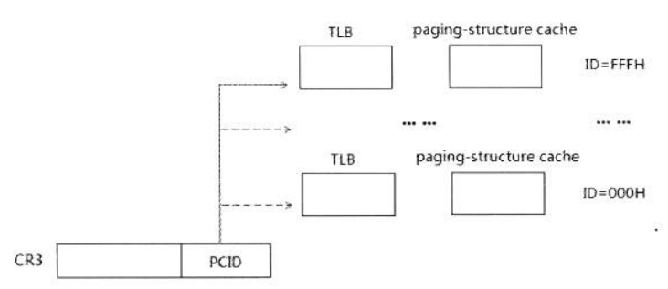

开启VT,进入VMX操作之后,VT能做的超乎想象。在VT做了高度仿真之后,就可以避免VT检测，让各GUEST以为运行在真机上。

# 0x1 事件注入

事件注入在前文提到,是VMM的重要组成,所谓事件一般指

- 中断
- 异常
- NMI
- SMI

而VMM提供事件注入机制,就好像他们被拦截了但是又正常到达了一样。

## 0x1-1 Vector 事件

Vector事件分为**中断**和**异常**,叫做向量事件是因为一旦发生中断和异常,会自动跳转到对应的处理程序,而每个中断和异常都有ID,此ID被称为向量,这个向量决定了去哪里处理。

这个"哪里"就算IDT,ID就算IDT的索引。


### 0x1-1-1中断

中断一般是程序处理期间随机发生的异步的,打断进程执行,来自于硬件外部IO信号。

软件可以使用INT N产生中断。

### 0x1-1-2 异常

同步的一种检测执行错误时发生的打断进程执行的过程,比如除0,断点,页面异常。

而异常,一般分为三种情况,分别是

- fault 

即错误,他是可以纠正的,如果能纠正,继续进程执行。

- trap

int3 只增加RIP,一般不额外处理。

- abort

程序需要终止,不可修复错误。

## 0x1-2 事件注入字段

事件注入是向VMCS的中断信息字段写入完成的,即

```c++
__vmx_vmwrite(VM_ENTRY_INTR_INFO_FIELD, *(PUINT64)&ExceptionInfo);
//VM Entry写入Len 下次进入VM Entry的时候Rip+Len
__vmx_vmwrite(VM_ENTRY_INSTRUCTION_LEN, uInstLen);
```

其中中断信息字段结构如下


结构上,这个字段结构和开启异常位图之后拦截的结构非常相似,区别就是Type,异常拦截只拦截异常.

而Vector就算决定了IDT的索引,最多支持128个。

而第11位,代表是否栈上有错误码,如果有,那么必须还得从VMCS读出错误码,因为异常Handler需要用到,不然栈对不齐。

值得一提的是,VM事件注入的另一个重要字段就是`**VM_ENTRY_INSTRUCTION_LEN** ,他决定着把RIP入栈时候的值(==中断异常需要把RIP RFALGS等压入堆栈,方便iretq返回==)

## 0x1-3 向量事件注入

在上面的事件注入字段中,如果V位被设置,那么下次VM Entry的时候就会Deliver事件。

用代码实现入下

完善EventInfo后进行事件注入。如果有ErrCode还需要写入VMCS的这个地方错误码。

```C++
// Injects interruption to a guest
VOID EventInjectInterruption(INTERRUPT_TYPE InterruptionType, EXCEPTION_VECTORS Vector, BOOLEAN DeliverErrorCode, ULONG32 ErrorCode)
{
	INTERRUPT_INFO Inject = { 0 };
	Inject.Valid = TRUE;
	Inject.InterruptType = InterruptionType;
	Inject.Vector = Vector;
	Inject.DeliverCode = DeliverErrorCode;
	__vmx_vmwrite(VM_ENTRY_INTR_INFO, Inject.Flags);

	if (DeliverErrorCode) {
		__vmx_vmwrite(VM_ENTRY_EXCEPTION_ERROR_CODE, ErrorCode);
	}
}
```

下面是Intel规定的那些Vetcor事件有错误代码

| 名称           | 向量号            | 类型      | 助记词  | 是否错误代码 |
| -------------- | ----------------- | --------- | ------- | ------------ |
| 除以零误差     | 0 (0x0)           | 过错      | #DE     | 不           |
| 调试           | 1 (0x1)           | 故障/陷阱 | ＃D B   | 不           |
| 不可屏蔽中断   | 2 (0x2)           | 打断      | -       | 不           |
| 断点           | 3 (0x3)           | 陷阱      | #BP     | 不           |
| 溢出           | 4 (0x4)           | 陷阱      | ＃OF    | 不           |
| 超出范围       | 5 (0x5)           | 过错      | #BR     | 不           |
| 无效操作码     | 6 (0x6)           | 过错      | #UD     | 不           |
| 设备不可用     | 7 (0x7)           | 过错      | #NM     | 不           |
| 双重故障       | 8 (0x8)           | 中止      | #DF     | 是（零）     |
| 协处理器段溢出 | 9 (0x9)           | 过错      | -       | 不           |
| 无效的 TSS     | 10 (0xA)          | 过错      | #TS     | 是的         |
| 段不存在       | 11 (0xB)          | 过错      | #NP     | 是的         |
| 堆栈段错误     | 12 (0xC)          | 过错      | #SS     | 是的         |
| 一般性保护错误 | 13 (0xD)          | 过错      | #GP     | 是的         |
| 页错误         | 14 (0xE)          | 过错      | #PF     | 是的         |
| 预订的         | 15 (0xF)          | -         | -       | 不           |
| x87 浮点异常   | 16 (0x10)         | 过错      | #MF     | 不           |
| 对齐检查       | 17 (0x11)         | 过错      | #AC     | 是的         |
| 机检           | 18 (0x12)         | 中止      | #MC     | 不           |
| SIMD 浮点异常  | 19 (0x13)         | 过错      | #XM/#XF | 不           |
| 虚拟化异常     | 20 (0x14)         | 过错      | #VE     | 不           |
| 预订的         | 21-29 (0x15-0x1D) | -         | -       | 不           |
| 安全异常       | 30 (0x1E)         | -         | #SX     | 是的         |
| 预订的         | 31 (0x1F)         | -         | -       | 不           |
| 三重故障       | -                 | -         | -       | 不           |
| FPU 错误中断   | 中断请求 13       | 打断      | #FERR   | 不           |

## 0x1-4异常位图

事件注入一般要和异常位图联系起来使用,因为事件注入一般用于拦截异常,中断之后,为了使GUEST像之前一样运行。

# 0x2 EPT 无痕Hook

## 0x2-1 MTF

MTF(MMonitor Trap Flag)的功能和RFLAGS的TF位功能完全相同，在开启此位之后,VMResume之后,每次CPU执行一条指令都会触发VM-EXIT;

```C++
/* Set the monitor trap flag */
VOID HvSetMonitorTrapFlag(BOOLEAN Set)
{
	ULONG CpuBasedVmExecControls = 0;

	// Read the previous flag
	__vmx_vmread(CPU_BASED_VM_EXEC_CONTROL, &CpuBasedVmExecControls);

	if (Set) {
		CpuBasedVmExecControls |= CPU_BASED_MONITOR_TRAP_FLAG;
	}
	else {
		CpuBasedVmExecControls &= ~CPU_BASED_MONITOR_TRAP_FLAG;
	}

	// Set the new value 
	__vmx_vmwrite(CPU_BASED_VM_EXEC_CONTROL, CpuBasedVmExecControls);
}
```

设置 MTF 会导致带有退出原因的 vm-exit (EXIT_REASON_MONITOR_TRAP_FLAG)

MTF是实现EPT Hook无痕Hook的关键

## 0x2-2 EPT 读写无痕钩子

EPT无痕钩子有两种应用场景,分别是读写和执行钩子。

读写钩子应用于监控,什么读写了这块内存。而执行钩子,应用于无痕Hook。

总体来说,除了执行钩子和调试器(OD xDbg)这种下内存断点不太一样,读写基本上一样，只不过用MTF代替了TF单步执行。

对于EPT 读写钩子,Hook思路如下

- 设置EPT 页级Hook,使整页**读或写**无效
- EPT Violation 进行逻辑处理,如果遇到EPT 无效,而地址在Hook的页中,则分为两种情况

1. 访问的地址刚好是自己设置的地址,进行额外的逻辑处理(如监控,返回假数据)
2. 访问读写的地址不是自己的地址,那么需要恢复页面属性,并设置MTF

- MTF导致VM Exit,进行一些判断,如果确实是上次设置MTF导致的,那么继续恢复不可读写,等待下次无效。

经过这样即可实现EPT 无痕读写监控的实现。

## 0x2-3 EPT 无痕Hook的实现

对于Hook,现在普遍实行这一种方法,他的执行效率更高,但是也有明显缺陷。适合Hook的页面经常被执行。

Hook思路如下

- 设置EPT 页级Hook,使整**读和写**页无效,而只留下可执行属性
- 分配一个新的物理内存(**P2**),EPT中的Pml1Entry的PhyFrameNumber(原来的**P1**)替换成新分配的。
- 修改P2,使其变成一个绝对跳转,跳转到Hook的地方去执行。
- 页面受到读写访问,EPT Violation,此时将此页面可读/写,并设置MTF位
- MTF VM Exit,判断是否是EPT Hook导致的,是则设置不可读写,并替换回P2物理内存。

### 0x2-3-1 EPT Hook中的细节

首先,毫无疑问地,在设置完新的EPT Entry之后,首先刷新EPT TLB

使用如下函数进行EPT TLB的刷新。

```c++
VOID EptSetPML1AndInvalidateTLB(PEPT_PML1_ENTRY EntryAddress, EPT_PML1_ENTRY EntryValue, INVEPT_TYPE InvalidationType)
{
	// acquire the lock
	SpinlockLock(&Pml1ModificationAndInvalidationLock);
	// set the value
	EntryAddress->Flags = EntryValue.Flags;

	// invalidate the cache
	if (InvalidationType == INVEPT_SINGLE_CONTEXT)
	{
		InveptSingleContext(EptState->EptPointer.Flags);
	}
	else
	{
		InveptAllContexts();
	}
	// release the lock
	SpinlockUnlock(&Pml1ModificationAndInvalidationLock);
}
```

值得一提的是其中的自旋锁,因为在VMM VM Exit Handler中,此时是关闭中断的,可以理解为IRQL最高。Windows的NT(IRQL低的API),以及自带的自旋锁是无法使用的。

由于恢复属性涉及到多核,因此这里加了自己实现的自旋锁来进行多核同步

自旋锁实现如下

```c++
inline BOOLEAN SpinlockTryLock(volatile LONG* Lock)
{
	return (!(*Lock) && !_interlockedbittestandset(Lock, 0));
}
```

如果bts不到,就继续等待,直到设置成功,说明拿到此锁。

```c++
void SpinlockLock(volatile LONG* Lock)
{
	unsigned wait = 1;

	while (!SpinlockTryLock(Lock))
	{
		for (unsigned i = 0; i < wait; ++i)
		{
			_mm_pause();
		}

		// Don't call "pause" too many times. If the wait becomes too big,
		// clamp it to the max_wait.

		if (wait * 2 > max_wait)
		{
			wait = max_wait;
		}
		else
		{
			wait = wait * 2;
		}
	}
}
```

# 0x3 Win10下监控CR3

## 0x3-1 VPID和TLB

TLB用于将线性地址快速转换成物理地址,不经过页表映射。是一种Cache机制。

因为是基于线性地址->物理地址,因此每次切换CR3,都会刷新TLB,这是必须的,不然切换CR3,实际上的线性地址对应的物理地址是完全不同的,如果此时仍然用TLB的缓存去把线性地址转换物理地址,会出错。

而VPID则是在VMCS填充的时候可以指定开启。

```C++
SecondaryProcBasedVmExecControls = HvAdjustControls(CPU_BASED_CTL2_RDTSCP |
	CPU_BASED_CTL2_ENABLE_EPT | CPU_BASED_CTL2_ENABLE_INVPCID |
	CPU_BASED_CTL2_ENABLE_XSAVE_XRSTORS | CPU_BASED_CTL2_ENABLE_VPID, MSR_IA32_VMX_PROCBASED_CTLS2);
```

> 转换后备缓冲区 (TLB) 是用于虚拟地址到物理地址转换的高速内存页面缓存。它遵循本地原则，以避免对最近使用的页面进行耗时查找。
>
> 主机映射与来宾不一致，反之亦然。每个来宾都有自己的地址空间，映射表不能在另一个来宾（或主机）中重复使用。因此，像 Intel Core 2 (VMX) 这样的第一代 VM 在每个 VM 进入（恢复）和 VM 退出时刷新 TLB。但是刷新 TLB 是一个阻碍，它是现代 CPU 中最关键的组件之一。
>
> 英特尔工程师开始考虑这个问题。Intel Nehalem TLB 条目已更改，引入了虚拟处理器 ID。所以每个 TLB 条目都用这个 ID 标记。CPU 不指定 VPID，由管理程序分配，而主机 VPID 为 0。从 Intel Nehalem 开始，不得刷新 TLB。当进程尝试访问实际 VPID 与 TLB 条目 VPID 不匹配的映射时，会发生标准 TLB 未命中。一些 Intel 数据显示，与 Intel Core 2 的 Meron 相比，VM 往返转换的延迟性能提高了 40%。

使用如下来设置VPID

```C
__vmx_vmwrite(VIRTUAL_PROCESSOR_ID, 1);
```

一般来说，HOST CPU的TLB默认被标识为0;

==INVVPID（指令）根据**虚拟处理器标识符** (VPID) 使转换后备缓冲区 (TLB) 和分页结构缓存中的映射无效。==

使用方式如下,INVVPID两个参数,第一个参数是

```C++
typedef enum _INVVPID_ENUM
{
	INDIVIDUAL_ADDRESS = 0x00000000,
	SINGLE_CONTEXT = 0x00000001,
	ALL_CONTEXT = 0x00000002,
	SINGLE_CONTEXT_RETAINING_GLOBALS = 0x00000003
}INVVPID_ENUM, *PINVVPID_ENUM;
```

用于指定使多少TLB无效。


### 0x3-1-1 开启VPID的注意事项

开启VPID，支持INVVPID之后,硬件是不会自己VM Entry VM Exit自动刷新TLB的。

以前是自动刷新的

> **如果你只是启用 VPID 而没有任何额外的假设，所有进程都会开始一个接一个地崩溃，最终，内核崩溃，这是因为我们没有使 TLB 无效。**

意思是,现在需要处理隐式TLB刷新的问题(显示TLB刷新不需要处理,比如系统调用INVPCID)

MOV CR3,XX这种是隐式刷新TLB的,因此一旦开启,需要手动拦截,使TLB无效。

```C++
	case TYPE_MOV_TO_CR:
	{
		switch (CrExitQualification->Fields.ControlRegister)
		{
		case 0:
			__vmx_vmwrite(GUEST_CR0, *RegPtr);
			__vmx_vmwrite(CR0_READ_SHADOW, *RegPtr);
			break;
		case 3:
			__vmx_vmwrite(GUEST_CR3, (*RegPtr & ~(1ULL << 63)));
			// InveptSingleContext(EptState->EptPointer.Flags); (changed, look for "Update 1" at the 8th part for more detail)
			InvvpidSingleContext(VPID_TAG);
			break;
		case 4:
			__vmx_vmwrite(GUEST_CR4, *RegPtr);
			__vmx_vmwrite(CR4_READ_SHADOW, *RegPtr);

			break;
		default:
			LogWarning("Unsupported register %d in handling control registers access", CrExitQualification->Fields.ControlRegister);
			break;
		}
	}
```

### 0x3-1-2 KPTI CR3问题

Meltdown补丁开启后,CR3是分为UserCr3和Kernel CR3的.

简而言之,KPTI导致了一个非常**影响效率**的问题,即本该是Gobal Pte的那些内核TLB不应当被刷新(但是由于User CR3没映射 Kernel CR3映射 内核了),这就导致User CR3->Kernel CR3的时候,内核的地址TLB缓存也会刷新。**因为User CR3根本没有内核的线性地址**。

解决方法是==PCID机制==

PCID机制是Intel 64较为新的处理器的一种机制,这个机制如下;

- CR4.PCIDE用于开启PCID机制

- PCID全称进程上下文标识符,CR3的后12位就是PCID号
- 每个PCID号都有一个TLB支持,总共有0xFFFF个TLB,处理器只处理当前的PCID的TLB;




- CR3的最高位,为0时,此时切换CR3(PCID也切换)时,会发生如下情况


例子:

User CR3的PCID号是1,Kernel CR3的PCID号是2;

```assembly
mov kernel_cr3,0x0xxxxx002;
mov cr3,kernel_cr3
```

此时,PCID切换到2号,TLB也切换到2号PCID的TLB,因为内核地址是GLOBAL PAGE,一般都会在PCID为2的缓存里面。

因此内核的TLB并不会刷新,可以较快速度的运行。

这也就导致了,CR3的最高位必须是0，允许操作系统更改 CR3 值而不会使所有 TLB 条目（标记有相同的**EP4TA**和 VPID）无效，除了那些标记为全局位的条目。

因此解释了这行代码

```c++
			__vmx_vmwrite(GUEST_CR3, (*RegPtr & ~(1ULL << 63)));
			// InveptSingleContext(EptState->EptPointer.Flags); (changed, look for "Update 1" at the 8th part for more detail)
			InvvpidSingleContext(VPID_TAG);
```

修改完CR3,同时刷新TLB,因为一旦开了==VPID==,就不会刷新了。这里注意VPID和PCID的区别！

VPID是VT的,PCID是硬件本身有的指令。

同样,有INVPCID这条指令,它类似于 INVVPID，不同之处在于它不特定于管理程序。

他是用于开启PCID之后，手动刷新TLB目录的。

