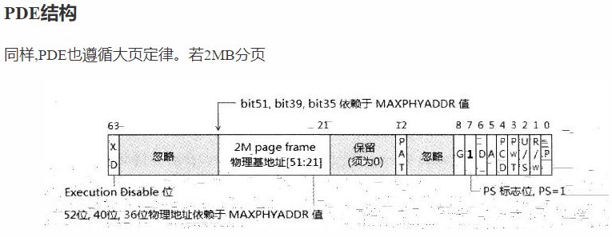

# Perfect pte hook

PTE HOOK在Hook内核的时候,非常不稳定，容易蓝屏。

归根结底,是因为写法问题,PTE HOOK虽然可以被DPC PG检测,但是也不失位win10下一种较为完美的过PG方法。

而且更重要的是,在某些特殊情况下,PTE HOOK只Hook单进程的效果让他更优秀。

# PTE Hook的原理

PTE Hook,即页表替换。

因为内核代码,除了某些不共享的区域,大部分内核代码都是共享的,比如各种内核API,以及NtOskrnl等。

共享的底层原因是---**部分PML4E相同**。

考虑如下情况

A进程的CR3为0x1000,根据IA32E分页知识,他指向一块4KB的物理内存,有512个PML4E.

B进程的CR3为0x2000。

假如0x1000的第一个PML4E和0x2000的第一个PML4E相同,那么两个进程的虚拟地址相同的地方(0-512G),映射的物理页也是相同的。

即虚拟地址一样,最终映射的物理地址也一样。

这就是Windows内核的代码共享的原因。

因此修改单个进程的内核代码，就是修改全部进程的内核代码,因为修改的物理地址是一样的。

而PTE Hook原理就是,从PML4E开始替换。导致单个进程的内核代码和其他进程的内核代码隔离开来。

**一定要从PML4E开始修改,而不是简单地修改最后一级的PTE，因为修改PTE,不修改PML4E,本质上还是修改的所有的进程。因为PML4E指向的物理内存是一样的,页表映射结构也都是一样的,如果要改,那就从头开始改。**

# 实现完美PTE Hook需要注意的细节

==实现 Perfect pte hook,要考虑三点==

## 大页问题

第一,大页问题,即某些情况下,内核的分页是大页,即2MB的页面。

一般有两种解决方法

- 2MB连续物理内存替换

即使用`MmAllocateContiguousMemorySpecifyCache`申请一块连续的物理内存。

```c++
PVOID p2MbMemory_ = MmAllocateContiguousMemorySpecifyCache(4*256 * PAGE_SIZE, low, high, low, MmCached);
```

来直接修改新PDE的物理地址,同时复制这2MB的物理内存到

这里有一个大坑,即如果是2MB分页,PDE的物理地址必须是2MB对齐的。即申请的连续物理内存必须是2MB对齐。如果替换不是对齐,那么会出现硬件错误。



这种方法较为简单,**但是连续的物理内存经测试,不好申请,经常返回0.**

- 分割Pde大页,转为小页

即把Pde位7的PageSize位给置0，同时申请512个4kb物理内存,一次复制完之前的2,Mb大页内存,依次排列。

根据IA32E分页,如果是2MB,是9 9 9 21分页,如果是4kb分页,是9 9 9 9 12分页。

大页的21位 2Mb内存,和小页分页 9 12寻址,一次排列,效果是一样的。

而离散的小页更容易申请,因此采取此方法。

值得一提的是,这里有一个坑,不能用ExAlloc申请NoPaged内存来充当新的PDE 和PTE项。会造成三重错误,原因暂时未知。

统一采取`MmAllocateContiguousMemorySpecifyCache`

## G位问题

这是影响PTE Hook稳定性的重大原因,PTE的G位属性一定要清空。

G位代表切换CR3,不刷新VA->PA的Cache,正常的内核代码G位都是1,这是为了切换CR3,也不会刷新TLB,速度更快，因为内核代码共享。但是因为PTE HOOK之后,其他进程的内核代码和被Hook的进程已经不相同,如果再G位置位置位,会炸掉。

## 在回调中进行替换

正如标题,PTE Hook最好的时机是再回调中替换,此时一般不会有硬件锁。

