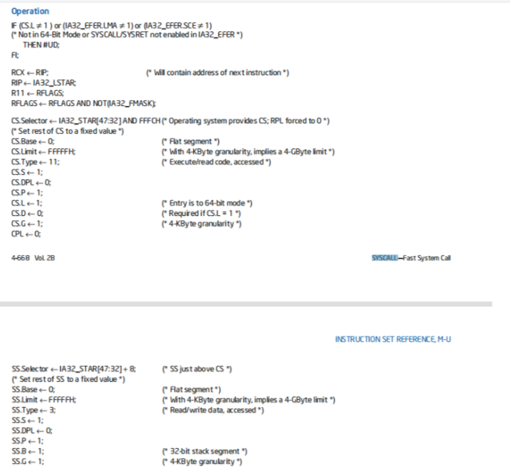
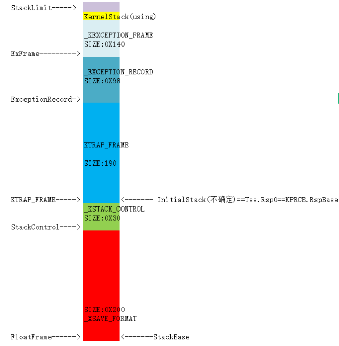

# 0x0 参考

- [[原创]Windows内核逆向-----<KiSystemCall64>](https://bbs.pediy.com/thread-269253.htm)

- **Intel白皮书**

# 0x1 R3-R0通过自陷指令进入R0的系统调用

## 0x1-1 Windows x64下的系统调用指令 

我们知道，系统调用是指

> 系统调用是指在操作系统内核中定义的一组接口，应用程序通过调用这些接口来请求操作系统执行一些服务，比如访问磁盘、创建新进程等。

在x86的windows系统架构中,windows使用int 2e陷阱门进入内核,eax保留的是系统调用服务号，堆栈保存参数。在配备了sysenter指令的机器上,则使用这条指令。

而x64的windows依然是使用int2e＋快速调用,但是快速调用为syscall指令。

### 0x1-1-1 syscall指令

syscall指令依赖于msr寄存器。Windows下依旧是rax作为系统服务号。下面是一个普通的系统调用,用于操作打开进程。

```assembly
.text:000000018009D3F0 NtOpenProcess   proc near               ; CODE XREF: 
.text:000000018009D3F0                                         ; 
.text:000000018009D3F0                 mov     r10, rcx        ; NtOpenProcess
.text:000000018009D3F3                 mov     eax, 26h ; '&'
.text:000000018009D3F8                 test    byte ptr ds:7FFE0308h, 1
.text:000000018009D400                 jnz     short loc_18009D405
.text:000000018009D402                 syscall                 ; Low latency system call
.text:000000018009D404                 retn
```

可以看到,他比较了KUSER_SHARED_DATA这个结构中的308h偏移处,其实这个标志位就是用于判断CPU是否支持快速调用。

**支持,rcx赋值r10,eax赋值系统服务号,调用syscall**。不支持,int2e进入中断门。

根据intel白皮书,syscall指令如下操作:



RIP从MSR[IA32_LSTAR]找到,旧RIP保存到RCX.(RCX作为传参寄存器之一,在进入内核syscall之前已经保存到不用的r10寄存器中)

CS从MSR[IA32_STAR]的32到47位拿。SS恒等于CS+8;

EFLAGS从MSR[IA32_FMASKS];旧EFLAGS保存在r11中。

**注意,syscall不像中断门,调用门那样会自动切换TSS.RSP0,他是不切换堆栈的**

==由此可见,r10,r11寄存器是系统调用专享用寄存器,后面也有体现,赋值SSDT表的时候==

## 0x1-2 KiSystemCall64 

在经过sycall之后,RIP被改到nt!KiSystemCall64之中。

这个函数是用来保存KTRAP_FRAME并根据rax找到系统调用地址。

通过陷入指令进入是必然要保存KTRAP_FRAME的。以便于退出回复。

不仅是sycall,异常通过的IDT(和int指令是一个意思)都是需要保存KTRAP_FRAME的。

syscall不会切换堆栈,首先就是进行栈的切换

```assembly
swapgs	;切换Gs基质
mov gs:10h, rsp
mov     rsp, gs:_KPCR.Prcb.RspBase ; 可以看到 这个RspBase==InitialStack 直接等于KTRAP_FRAME的最低端
```

然后接下来就是填充完整个KTRAP_FRAME了。

值得一提的是,他会检查是不是从R3来的,然后关闭SMAP(防止复制参数时CPU出错)

```assembly
test    byte ptr [rbp+0F0h], 1 ; CS
jz      short loc_14040A625
stac                    ; 关smap
```

下面是线程内核堆栈图



SatckBase在SwapContext时候被存入到KPCR.RspBase,因此直接从KPCR.KPRCB的地方找到RspBase就是KTRAP_FRAME的最低端。

而Syscall不切换Rsp(即不从TSS中找RSP0),因此直接就算KTRAP_FRAME。

而其他进入0环的方式，会找TSS.RSP0,来切换栈,此时是需要加一些东西才能到KTRAP_FRAME的。

### 0x1-2-1 KiSystemServiceStart

从KiSystemCall64到KiSystemServiceStart,基本都是在进行KTRAP_FRAME填充。

从现在,系统调用派遣开始。

```assembly
KiSystemServiceStart:         
mov     [rbx+_ETHREAD.Tcb.TrapFrame], rsp ; 可以看到,其实这个TrapFrame就是rsp 而我们的initialstack==ktrap_frame+size
mov     edi, eax
shr     edi, 7
and     edi, 20h        ; 其实就是在判断位12是不是1,用这个区分GDI系统调用
and     eax, 0FFFh      ; 去掉高位
 KiSystemServiceRepeat:                  ; CODE XREF: KiSystemCall64+90E↓j
lea     r10, KeServiceDescriptorTable
lea     r11, KeServiceDescriptorTableShadow
test    [rbx+_ETHREAD.Tcb._union_45.ThreadFlags], 80h
jz      short UseSSDT
test    [rbx+_ETHREAD.Tcb._union_45.ThreadFlags], 200000h ; 在检查一下,是不是GDI线程
jz      short UseSSSDT
lea     r11, KeServiceDescriptorTableFilter

UseSSSDT:                               ; CODE XREF: KiSystemCall64+392↑j
mov     r10, r11 ;最终 R10就是要操作的SSDT表
UseSSDT:
```

即只有SSDTINDEX为GDI系统调用并且是GDI线程才会使用SSSDT

紧接着,开始根据SSDT表的结构以及rax寻找真正的系统调用,并且找到参数个数

```assembly
cmp     eax, [r10+rdi+10h] ;rdi是偏移,是0x20的倍数  0x10处是SSDT的系统服务个数
jnb     IndexTooBig
mov     r10, [r10+rdi]  ; SSDTBase   取出0x0处
movsxd  r11, dword ptr [r10+rax*4] ;他是一个ULONG数组 
mov     rax, r11  ;赋值r11
sar     r11, 4          ; 相当于/16(2^4)
add     r10, r11		;
cmp     edi, 20h
jnz     short loc_14040A9D0
mov     r11, [rbx+0F0h]
```

r10在下文就是直接被call r10了,他就是真正的系统调用。

推断得出,x64 SSDT表为

```c++
class SSDT{
PULONG SSDTBase;
UINT64 Unk;
PVOID SSDTMaxNum;
UINT64 Unk1;
}
```

TargetCALL=`SSDT.SSDTBase[rax]/16+SSDTBase`

### 0x1-2-2 KiSystemServiceCopyEnd

x64的系统调用复制是以8字节为单位进行复制的。

rax是经过计算的,也就是SSDTBase[rax]的最后四位*8**因为复制一个参数需要8字节**

```assembly
lea     r11, KiSystemServiceCopyEnd
sub     r11, rax  ;rax就是需要额外复制的参数个数*8
jmp     r11
KiSystemServiceCopyStart:               ; DATA XREF: KiSystemServiceHandler+1A↑o
 mov     rax, [rsi+70h]
 mov     [rdi+70h], rax
 mov     rax, [rsi+68h]
 mov     [rdi+68h], rax
 mov     rax, [rsi+60h]
 mov     [rdi+60h], rax
 mov     rax, [rsi+58h]
 mov     [rdi+58h], rax
 mov     rax, [rsi+50h]
 mov     [rdi+50h], rax
 mov     rax, [rsi+48h]
 mov     [rdi+48h], rax
 mov     rax, [rsi+40h]
 mov     [rdi+40h], rax
 mov     rax, [rsi+38h]
 mov     [rdi+38h], rax
 mov     rax, [rsi+30h]
 mov     [rdi+30h], rax
 mov     rax, [rsi+28h]
 mov     [rdi+28h], rax
 mov     rax, [rsi+20h]
 mov     [rdi+20h], rax
 mov     rax, [rsi+18h]
 mov     [rdi+18h], rax
 mov     rax, [rsi+10h]
 mov     [rdi+10h], rax
 mov     rax, [rsi+8]
 mov     [rdi+8], rax
```

### 0x1-2-3 ETW判断

```assembly
 .text:000000014040AA90 KiSystemServiceCopyEnd:                 ; CODE XREF: KiSystemCall64+413↑j
                        ; DATA XREF: KiSystemServiceHandler+27↑o ...
test    cs:KiDynamicTraceMask, 1
jnz     ETWTrace
test    dword ptr cs:PerfGlobalGroupMask+8, 40h
jnz     ETWTrace
mov     rax, r10
call    rax  ;否则直接进行系统调用
nop     dword ptr [rax]
ETWTrace:

```

在检查KiDynamicTraceMask不为0,就会进行ETW记录。ETW进行syscallhook所谓的魔数就是就是从这来的

```assembly
mov     rcx, r10
mov     rdx, rsp
add     rdx, 20h
mov     r8, 4
mov     r9, rsp
add     r9, 70h
call    KiTrackSystemCallEntry ;这里面保存着魔数 用于定位ETW SYSCALL
mov     [rbp-50h], rax
mov     rcx, [rsp+20h]
mov     rdx, [rsp+28h]
mov     r8, [rsp+30h]
mov     r9, [rsp+38h]
mov     r10, [rsp+40h] ;ETWHook的原理,通过Hook某些未被PG监控的函数指针。堆栈定位到这个rsp+40 改变rsp+40的值,使得call rax时到我们的函数
add     rsp, 50h
mov     rax, r10
call    rax
```

### 0x1-2-4 InstrumentationCallback派遣


这是一个回调,出现在很多地方,异常派遣,系统调用结束,如果EPROCESS.InstrumentationCallback位置有值,则会改变KTRAP_FRAME的RIP,到InsrumentationCallBack去执行。同时把要返回的RIP放进r10

利用这个可以执行ShellCode,进行无线程注入。前提是Dll中无死循环。

```assembly
SetInstrumentationCallBack
mov     rax, gs:188h
mov     rax, [rax+_ETHREAD.Tcb._union_90.ApcState.Process]
mov     rax, [rax+_KPROCESS.InstrumentationCallback]
or      rax, rax
jz      short NoInstructmentationCallBack
cmp     word ptr [rbp+0F0h], 33h
jnz     short NoInstructmentationCallBack
mov     r10, [rbp+0E8h] ; TrapFrame的RIP 保存到r10
mov     [rbp+0E8h], rax ; 把KProcess.InstrumentaionCallBack放到RIP
```

#### 0x1-2-4-1 注册InstrumentationCallBack

可以直接修改`_KPROCESS.InstrumentationCallback`,但是不是官网注册,可能发生不可预料的结果。

Windows自带`ZwSetInformationProcess()`可以修改设置这个回调。代码如下:

```c++
NTSTATUS SetProcessCallBack(HANDLE ProcessId, ULONG_PTR InstrumentationCallBack) {
	NTSTATUS status = STATUS_SUCCESS;
	PEPROCESS Process = 0;
	KAPC_STATE Apc = { 0 };
	PACCESS_TOKEN token = { 0 };
	PULONG tokenMask = 0;

	if (!NT_SUCCESS(PsLookupProcessByProcessId(ProcessId, &Process))) {

		DbgPrintEx(77, 0, "[ProcessCallBack]:unable to get process!\r\n");

		return STATUS_UNSUCCESSFUL;
	}

	if (PsGetProcessExitStatus(Process) != STATUS_PENDING) {


		return STATUS_PROCESS_IS_TERMINATING;
	}

	//这样无需使用句柄了
	KeStackAttachProcess(Process, &Apc);

	//获取进程Token并设置DEBUG权限

	token = PsReferencePrimaryToken(Process);

	//设置Debug权限 把3个权限都置上 因为他的权限为3个ULONG数组
	//分别代表当先权限 开启的 以及默认的
	tokenMask = (PULONG)((ULONG_PTR)token + 0x40);
	//21位是DEBUG权限(位20)
	tokenMask[0] |= 0x100000;
	tokenMask[1] |= 0x100000;
	tokenMask[2] |= 0x100000;

	//设置Instrumentaion
	//但是 注意 要改先前模式,因为&InstrumentationCallBack可能地址校验不过去

	ULONG64 uOffset=GetPreviousModeOffset();
	DbgPrintEx(77, 0, "PreviousModeOffset==0x%x", uOffset);


	status= ZwSetInformationProcess(NtCurrentProcess(), ProcessInstrumentationCallback, &InstrumentationCallBack, 8);

	if (!NT_SUCCESS(status)) {

		KeUnstackDetachProcess(&Apc);

		return status;
	}

	KeUnstackDetachProcess(&Apc);

	return status;
}
```

#### 0x1-2-4-2设置回调时TOKEN机制

通过逆向,设置回调需要具备DEBUG权限,修改方法如下:

```cassandra
+0x4b8 Token            : _EX_FAST_REF
```

在EPROCESS.Token中,这里面保存着每个进程的TOKEN.他是一个锁。

```assembly
ffffba8d`3c6f7538  ffff8302`932d9067
```

我们去掉最后4位,就是_TOKEN结构了。

```ceylon
kd> dt _token ffff8302`932d9060
nt!_TOKEN
   +0x000 TokenSource      : _TOKEN_SOURCE
   +0x010 TokenId          : _LUID
   +0x018 AuthenticationId : _LUID
   +0x020 ParentTokenId    : _LUID
   +0x028 ExpirationTime   : _LARGE_INTEGER 0x06207526`b64ceb90
   +0x030 TokenLock        : 0xffffba8d`3b8f8690 _ERESOURCE
   +0x038 ModifiedId       : _LUID
   +0x040 Privileges       : _SEP_TOKEN_PRIVILEGES
   +0x058 AuditPolicy      : _SEP_AUDIT_POLICY
   +0x078 SessionId        : 0
   +0x07c UserAndGroupCount : 5
   +0x080 RestrictedSidCount : 0
   +0x084 VariableLength   : 0xa4
   +0x088 DynamicCharged   : 0x1000
   +0x08c DynamicAvailable : 0
   +0x090 DefaultOwnerIndex : 1
   +0x098 UserAndGroups    : 0xffff8302`932d94f0 _SID_AND_ATTRIBUTES
   +0x0a0 RestrictedSids   : (null) 
   +0x0a8 PrimaryGroup     : 0xffff8302`93174790 Void
   +0x0b0 DynamicPart      : 0xffff8302`93174790  -> 0x101
   +0x0b8 DefaultDacl      : 0xffff8302`9317479c _ACL
   +0x0c0 TokenType        : 1 ( TokenPrimary )
   +0x0c4 ImpersonationLevel : 0 ( SecurityAnonymous )
   +0x0c8 TokenFlags       : 0x2800
   +0x0cc TokenInUse       : 0x1 ''
   +0x0d0 IntegrityLevelIndex : 4
   +0x0d4 MandatoryPolicy  : 1
   +0x0d8 LogonSession     : 0xffff8302`8fa80cb0 _SEP_LOGON_SESSION_REFERENCES
   +0x0e0 OriginatingLogonSession : _LUID
   +0x0e8 SidHash          : _SID_AND_ATTRIBUTES_HASH
   +0x1f8 RestrictedSidHash : _SID_AND_ATTRIBUTES_HASH
   +0x308 pSecurityAttributes : 0xffff8302`93877650 _AUTHZBASEP_SECURITY_ATTRIBUTES_INFORMATION
   +0x310 Package          : (null) 
   +0x318 Capabilities     : (null) 
   +0x320 CapabilityCount  : 0
   +0x328 CapabilitiesHash : _SID_AND_ATTRIBUTES_HASH
   +0x438 LowboxNumberEntry : (null) 
   +0x440 LowboxHandlesEntry : (null) 
   +0x448 pClaimAttributes : (null) 
   +0x450 TrustLevelSid    : 0xffff8302`931764d0 Void
   +0x458 TrustLinkedToken : (null) 
   +0x460 IntegrityLevelSidValue : (null) 
   +0x468 TokenSidValues   : (null) 
   +0x470 IndexEntry       : 0xffff8302`90c822d0 _SEP_LUID_TO_INDEX_MAP_ENTRY
   +0x478 DiagnosticInfo   : (null) 
   +0x480 BnoIsolationHandlesEntry : (null) 
   +0x488 SessionObject    : (null) 
   +0x490 VariablePart     : 0xffff8302`932d9540
```

其中涉及到调试权限的就是Privileges这个成员了。

```ceylon
+0x040 Privileges       : _SEP_TOKEN_PRIVILEGES
```

```c++
    [+0x000] Present          : 0x1e72ffffb8 [Type: unsigned __int64]
    [+0x008] Enabled          : 0x1e60b1e890 [Type: unsigned __int64]
    [+0x010] EnabledByDefault : 0x1e60b1e890 [Type: unsigned __int64]
```

这个成员一共有三个权限Mask,分别是现在,可以使用,以及默认。

使用Windbg命令!token查看,可以确定调试权限在哪

```clike
kd> !TOKEN ffff8302`932d9060
_TOKEN 0xffff8302932d9060
TS Session ID: 0
User: S-1-5-18
User Groups: 
 00 S-1-5-32-544
    Attributes - Default Enabled Owner 
 01 S-1-1-0
    Attributes - Mandatory Default Enabled 
 02 S-1-5-11
    Attributes - Mandatory Default Enabled 
 03 S-1-16-16384
    Attributes - GroupIntegrity GroupIntegrityEnabled 
Primary Group: S-1-5-18
Privs: 
 03 0x000000003 SeAssignPrimaryTokenPrivilege     Attributes - 
 04 0x000000004 SeLockMemoryPrivilege             Attributes - Enabled Default 
 05 0x000000005 SeIncreaseQuotaPrivilege          Attributes - 
 07 0x000000007 SeTcbPrivilege                    Attributes - Enabled Default 
 08 0x000000008 SeSecurityPrivilege               Attributes - 
 09 0x000000009 SeTakeOwnershipPrivilege          Attributes - 
 10 0x00000000a SeLoadDriverPrivilege             Attributes - 
 11 0x00000000b SeSystemProfilePrivilege          Attributes - Enabled Default 
 12 0x00000000c SeSystemtimePrivilege             Attributes - 
 13 0x00000000d SeProfileSingleProcessPrivilege   Attributes - Enabled Default 
 14 0x00000000e SeIncreaseBasePriorityPrivilege   Attributes - Enabled Default 
 15 0x00000000f SeCreatePagefilePrivilege         Attributes - Enabled Default 
 16 0x000000010 SeCreatePermanentPrivilege        Attributes - Enabled Default 
 17 0x000000011 SeBackupPrivilege                 Attributes - 
 18 0x000000012 SeRestorePrivilege                Attributes - 
 19 0x000000013 SeShutdownPrivilege               Attributes - 
 20 0x000000014 SeDebugPrivilege                  Attributes - Enabled Default 
 21 0x000000015 SeAuditPrivilege                  Attributes - Enabled Default 
 22 0x000000016 SeSystemEnvironmentPrivilege      Attributes - 
 23 0x000000017 SeChangeNotifyPrivilege           Attributes - Enabled Default 
 25 0x000000019 SeUndockPrivilege                 Attributes - 
 28 0x00000001c SeManageVolumePrivilege           Attributes - 
 29 0x00000001d SeImpersonatePrivilege            Attributes - Enabled Default 
 30 0x00000001e SeCreateGlobalPrivilege           Attributes - Enabled Default 
 33 0x000000021 SeIncreaseWorkingSetPrivilege     Attributes - Enabled Default 
 34 0x000000022 SeTimeZonePrivilege               Attributes - Enabled Default 
 35 0x000000023 SeCreateSymbolicLinkPrivilege     Attributes - Enabled Default 
 36 0x000000024 SeDelegateSessionUserImpersonatePrivilege  Attributes - Enabled Default 
Authentication ID:         (0,3e7)
Impersonation Level:       Anonymous
TokenType:                 Primary
Source: *SYSTEM*           TokenFlags: 0x2800 ( Token in use )
Token ID: bca9             ParentToken ID: 0
Modified ID:               (0, b13e)
RestrictedSidCount: 0      RestrictedSids: 0x0000000000000000
OriginatingLogonSession: 0
PackageSid: (null)
CapabilityCount: 0      Capabilities: 0x0000000000000000
LowboxNumberEntry: 0x0000000000000000
Security Attributes:
Unable to get the offset of nt!_AUTHZBASEP_SECURITY_ATTRIBUTE.ListLink
Process Token TrustLevelSid: S-1-19-512-8192
```

```c
 20 0x000000014 SeDebugPrivilege                  Attributes - Enabled Default
```

位20为调试权限。置位即可,三个全置位

### 0x1-2-5 sysret

在执行完之后,会调用sysret进行返回。指令效果和syscall完全相反

# 0x2R0-R0的系统调用

我们在驱动之中,通常也会使用系统调用函数。

他和R3-R0的最大区别就是,如果在驱动中用Zw开头的系统调用而不是Nt开头或者(是直接从SSDT定位的)**其实就是和Nt开头的是一样的**,是无视句柄权限(ObReferenceObjectByHandle)这个检查的。

他的原理是ZwXXX->KiSystemInternl->修改Previousmode->NtXXX

```c++
NTSTATUS __stdcall ZwOpenKey(PHANDLE KeyHandle, ACCESS_MASK DesiredAccess, POBJECT_ATTRIBUTES ObjectAttributes)
{
  unsigned __int64 v3; // rt0
  NTSTATUS result; // eax

  _disable();
  v3 = __readeflags();
  KiServiceInternal();
  return result;
}
```

比如使用ZwOpenKeysM可以看到,他调用了`KiServiceInternal()`；

```c++
void KiServiceInternal()
{
  char v1; // ST28_1
  __int64 v2; // ST138_8

  _enable();
  Ethread = KeGetCurrentThread();
  __asm { prefetchw byte ptr [rbx+_ETHREAD.Tcb.TrapFrame] }
  v1 = Ethread->_union_171.UserAffinity.Reserved[0];
  LOBYTE(Ethread->_union_171.UserAffinity.Reserved[offsetof(_ETHREAD, Tcb)]) = 0;// 这个就是PreviousMode
  v2 = Ethread->TrapFrame;
  JUMPOUT(&KiSystemServiceStart);
}
```

在这个函数内部,直接调用了`KiSystemServiceStart()`,并且修改了Previousmode。

这就是Zw和Nt(==这里所说的Zw和Nt均是0环函数,3环ntdll!Zw和ntdll!Nt是完全一样的==)区别。

`KiSystemServiceStart()`则是直接开始找SSDT了,而跳过了KTRAP_FRAME的填充过程。