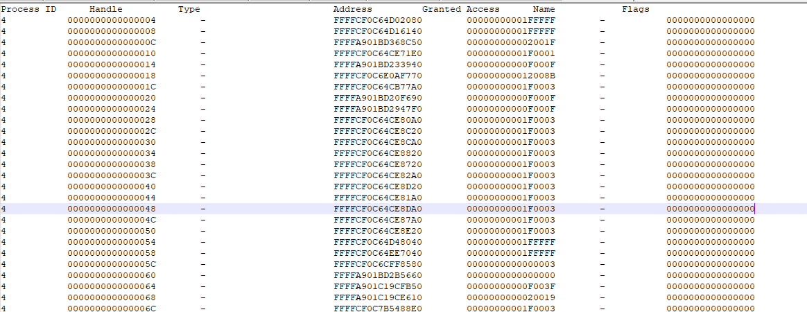
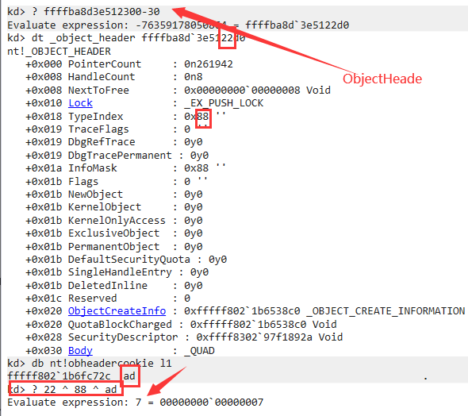

# 0x0 参考

- [[Windows内核对象管理全景解析完结]]("https://www.anquanke.com/post/id/220061")

- [Windows内核对象管理全景解析前奏]("https://www.anquanke.com/post/id/219839")

- [Reversing Windows Internals (Part 1) - Digging Into Handles, Callbacks & ObjectTypes](https://rayanfam.com/topics/reversing-windows-internals-part1/#introduction)

# 0x1 句柄

Windows在内核用结构体(内核对象)指针,而在R3,每个程序则使用句柄。

> 简而言之，句柄是 Windows 内核返回给用户模式应用程序的一个值（如果您需要特权或拥有未被 DACL 拒绝的帐户[）](https://docs.microsoft.com/en-us/windows/win32/secauthz/dacls-and-aces)并且该句柄可用于对该对象进行进一步的操作。

也就是,在内核,我拥有内核对象的指针,可以对他进行任何操作。但是在R3,我想要对内核对象进行操作要同时有用句柄以及在句柄表相应的操作特权。

ReadVirtualMemory(handle,)->syscall->0x222->句柄表->内核对象->真正返回内核对象

但是最终的原理是,syscall进入系统调用,根据句柄查询+对应的权限找到内核对象的指针(==如果权限不够,那么这一步是失败的,即找不到内核对象的指针==),使用各种API对改内核对象进一步操作。

## 0x1-1 用户模式下枚举所有句柄^*^

我们只需要调用ntdll的`NtQuerySystemInformation()`就能枚举所有的进程所有的句柄,而且在R3下,甚至可以找到该句柄对应的内核对象地址。



实现如下:

```c++
_NtQuerySystemInformation NtQuerySystemInformation = (_NtQuerySystemInformation)GetProcAddress(GetModuleHandleA("ntdll.dll"), "NtQuerySystemInformation");


	// Loop until the Function Succeeds
	while (NtQuerySystemInformation(SystemHandleInformation, HandleInformation, GuessSize, &RequiredSize) == STATUS_INFO_LENGTH_MISMATCH)
	{
		// Free First the Memory
		VirtualFree(HandleInformation,
			(SIZE_T)GuessSize,
			MEM_DECOMMIT);

		// Update the Guess Size
		GuessSize = RequiredSize;

		// Allocate Memory Again - Resize
		HandleInformation = (PSYSTEM_HANDLE_INFORMATION)VirtualAlloc(NULL,
			(SIZE_T)GuessSize,
			MEM_RESERVE | MEM_COMMIT,
			PAGE_READWRITE);

	}

	// Check the New Size
	cout << "\nNew Size : " << GuessSize;


	for (DWORD a = 0; a < HandleInformation->HandleCount; a++)
	{
		// Hold the Current Index Handle
		SYSTEM_HANDLE Handle = HandleInformation->Handles[a];
		printf("[+]Pid:%x\t\tHandle:%x\t\t\tR0Object:%pGrantedAccess:%x\r\n"Handle.ProcessId,(PVOID)Handle.Handle,(PVOID)Handle.Object,(PVOID)Handle.GrantedAccess);
	}

```

##  0x1-2 R0下的句柄管理

私有句柄的管理是以进程为单位的。

在EPROCESS.ObjectTable中字段。

```c++
kd> dt nt!_EPROCESS -y object
   +0x418 ObjectTable : Ptr64 _HANDLE_TABLE
```

ObjectTable的结构是:

```C
kd> dt nt!_HANDLE_TABLE
   +0x000 NextHandleNeedingPool : Uint4B
   +0x004 ExtraInfoPages   : Int4B
   +0x008 TableCode        : Uint8B
   +0x010 QuotaProcess     : Ptr64 _EPROCESS
   +0x018 HandleTableList  : _LIST_ENTRY
   +0x028 UniqueProcessId  : Uint4B
   +0x02c Flags            : Uint4B
   +0x02c StrictFIFO       : Pos 0, 1 Bit
   +0x02c EnableHandleExceptions : Pos 1, 1 Bit
   +0x02c Rundown          : Pos 2, 1 Bit
   +0x02c Duplicated       : Pos 3, 1 Bit
   +0x02c RaiseUMExceptionOnInvalidHandleClose : Pos 4, 1 Bit
   +0x030 HandleContentionEvent : _EX_PUSH_LOCK
   +0x038 HandleTableLock  : _EX_PUSH_LOCK
   +0x040 FreeLists        : [1] _HANDLE_TABLE_FREE_LIST
   +0x040 ActualEntry      : [32] UChar
   +0x060 DebugInfo        : Ptr64 _HANDLE_TRACE_DEBUG_INFO
```

### 0x1-2-1 私有句柄表的遍历

通常,在R0,句柄表的是通过` +0x008 TableCode

#### 0x1-2-1-1 通过TableCode+句柄当作索引进行遍历

句柄实际上是一个索引,**Handle/4**得到索引。

TableCode是一个多级指针,如果他为0,那么直接执行一个HANDLE_TABLE_ENTRY结构。

最后一位是几，就是几级指针,多级指针中指针数为512。最后一级指针只有256个成员,因为HANDLE_TABLE_ENTRY是128位的。一个指针是一页4096字节。

寻找方法如下:

```c
kd> dt _HANDLE_TABLE ffff83029315cf40
nt!_HANDLE_TABLE
   +0x000 NextHandleNeedingPool : 0xc00
   +0x004 ExtraInfoPages   : 0n0
   +0x008 TableCode        : 0xffff8302`93dff001
   +0x010 QuotaProcess     : 0xffffba8d`3b882080 _EPROCESS
   +0x018 HandleTableList  : _LIST_ENTRY [ 0xffff8302`933e8898 - 0xffff8302`9315b898 ]
   +0x028 UniqueProcessId  : 0x288
   +0x02c Flags            : 0x12
   +0x02c StrictFIFO       : 0y0
   +0x02c EnableHandleExceptions : 0y1
   +0x02c Rundown          : 0y0
   +0x02c Duplicated       : 0y0
   +0x02c RaiseUMExceptionOnInvalidHandleClose : 0y1
   +0x030 HandleContentionEvent : _EX_PUSH_LOCK
   +0x038 HandleTableLock  : _EX_PUSH_LOCK
   +0x040 FreeLists        : [1] _HANDLE_TABLE_FREE_LIST
   +0x040 ActualEntry      : [32]  ""
   +0x060 DebugInfo        : (null) 
```

 `+0x008 TableCode        : 0xffff8302`93dff001`为二级指针。

```c
kd> dq 0xffff8302`93dff000
ffff8302`93dff000  ffff8302`9325a000 ffff8302`940a1000
ffff8302`93dff010  ffff8302`957ff000 00000000`00000000
```

有三个HANDLE_TABLE_ENTRY数组

在`ffff8302`940a1000`这个中。(越过前面256个,这其实第261个句柄,也就是261*4)

```c
kd> dt _handle_table_entry ffff8302`940a1000+0x10*5
nt!_HANDLE_TABLE_ENTRY
   +0x000 VolatileLowValue : 0n2097151
   +0x000 LowValue         : 0n2097151
   +0x000 InfoTable        : 0x00000000`001fffff _HANDLE_TABLE_ENTRY_INFO
   +0x008 HighValue        : 0n-5004280426864246787
   +0x008 NextFreeHandleEntry : 0xba8d3977`3050fffd _HANDLE_TABLE_ENTRY
   +0x008 LeafHandleValue  : _EXHANDLE
   +0x000 RefCountField    : 0n2097151
   +0x000 Unlocked         : 0y1
   +0x000 RefCnt           : 0y1111111111111111 (0xffff)
   +0x000 Attributes       : 0y111
   +0x000ObjectPointerBits:0y101110101000110000010000111(0xba8d3b7a10e)
   +0x008 GrantedAccessBits : 0y0010100001111111111111101 (0x50fffd)
   +0x008 NoRightsUpgrade  : 0y0
   +0x008 Spare1           : 0y001100 (0xc)
   +0x00c Spare2           : 0xba8d3977
```

定位到,可以找到Object,以及GrantedAccess.但是ObjectPointerBits是加密的,需要进行解密

解密ObjectPointerBis的方法为:

如对上面`0xba8d3b7a10e`,前面加上四个ffff,然后后面补上0;即可得到nt!Object_Header结构。

即'0xffffba8d3b7a10e0',

```c
kd> dt _object_header 0xffffba8d3b7a10e0
nt!_OBJECT_HEADER
   +0x000 PointerCount     : 0n32769
   +0x008 HandleCount      : 0n1
   +0x008 NextToFree       : 0x00000000`00000001 Void
   +0x010 Lock             : _EX_PUSH_LOCK
   +0x018 TypeIndex        : 0x99 ''
   +0x019 TraceFlags       : 0 ''
   +0x019 DbgRefTrace      : 0y0
   +0x019 DbgTracePermanent : 0y0
   +0x01a InfoMask         : 0x8 ''
   +0x01b Flags            : 0 ''
   +0x01b NewObject        : 0y0
   +0x01b KernelObject     : 0y0
   +0x01b KernelOnlyAccess : 0y0
   +0x01b ExclusiveObject  : 0y0
   +0x01b PermanentObject  : 0y0
   +0x01b DefaultSecurityQuota : 0y0
   +0x01b SingleHandleEntry : 0y0
   +0x01b DeletedInline    : 0y0
   +0x01c Reserved         : 0xffffba8d
   +0x020 ObjectCreateInfo : 0xfffff802`1b6538c0 _OBJECT_CREATE_INFORMATION
   +0x020 QuotaBlockCharged : 0xfffff802`1b6538c0 Void
   +0x028 SecurityDescriptor : (null) 
   +0x030 Body             : _QUAD
```

Body指向的就是Object了。

### 0x1-2-2 GrantedAccess以及Windows句柄权限验证机制

句柄的作用是找到结构体和根据句柄表中的权限进一步操作内核对象。权限即GrantedAccess。

他在HANDLE_TABLE_ENTRY这个结构体中。修改句柄表的这个权限,就是修改这个值。

**0x1fffff**表示**完全控制**。==内核对句柄权限的验证是通过==

`ObReferenceObjectByHandle()`进行的。这个函数内部就是通过遍历句柄表实现的。

```c++
NTSTATUS
ObReferenceObjectByHandle(
    _In_ HANDLE Handle,
    _In_ ACCESS_MASK DesiredAccess,
    _In_opt_ POBJECT_TYPE ObjectType,
    _In_ KPROCESSOR_MODE AccessMode,
    _Out_ PVOID *Object,
    _Out_opt_ POBJECT_HANDLE_INFORMATION HandleInformation
    );
```

在进行根据句柄对内核对象进行操作的前面,通常会有这个函数。如NtReadVirtualMemory

如

```c++
if ( a4 )
  {
    status = ObReferenceObjectByHandleWithTag(
            hProcess,
            Access,
            (int)PsProcessType,
            AccessMode,
            0x6D566D4D,//tags
            (__int64)&Object);
```

以上摘自NtReadVirtualMemory,他会自动地把Access赋值成读所具有的权限。

只有权限大于Access,Object才会被赋值。

**值得一提的是,AccessMode==KernelMode,无论大于小于,无视句柄权限。AccessMode来自ETHREAD.PreviousMode**

### 0x1-2-3全局句柄表

全局句柄表中,只存在Process和Thread对象。用于标识进线程对象。

线程的TID,进程的PID，则是全局句柄表的句柄。

全局句柄表位于`PspCidTable`中。他也是一个HANDLE_TABLE结构,也具有多级指针。

唯一区别是经过解密后,他直接指向Body而非Object_Header

# 0x2 句柄回调

句柄回调是指

> 为了在请求进程句柄或与线程或进程句柄相关的任何内容时设置的回调

简而言之,通过OpenProcess,OpenThread 以及DupliateHandle来进行创建句柄,都会被回调拦截。

使用`ObRegisterCallbacks ()`进行注册回调。

```c++
NTSTATUS ObRegisterCallbacks(
  [in]  POB_CALLBACK_REGISTRATION CallbackRegistration,
  [out] PVOID                     *RegistrationHandle
);
```

如果想要在驱动使用这个函数，必须如下这样做

> 因此您可以在编译驱动程序时将**/INTEGRITYCHECK添加到链接器**

## 0x2-1 OB_CALLBACK_REGISTRATION

```c++
typedef struct _OB_CALLBACK_REGISTRATION {
  USHORT                    Version;
  USHORT                    OperationRegistrationCount;
  UNICODE_STRING            Altitude;
  PVOID                     RegistrationContext;
  OB_OPERATION_REGISTRATION *OperationRegistration;
} OB_CALLBACK_REGISTRATION, *POB_CALLBACK_REGISTRATION;
```

```
Version
```

请求的对象回调注册的版本。驱动程序应指定 OB_FLT_REGISTRATION_VERSION。

```
OperationRegistrationCount
```

**OperationRegistration**数组中的条目数。

```
Altitude
```

指定驱动程序高度的 Unicode 字符串。有关海拔高度的更多信息，请参阅[加载顺序组和微过滤器驱动程序的海拔高度](https://learn.microsoft.com/en-us/windows-hardware/drivers/ifs/load-order-groups-and-altitudes-for-minifilter-drivers)。

```
RegistrationContext
```

当回调例程运行时，系统将**RegistrationContext值传递给回调例程。**该值的含义由驱动程序定义。

```
OperationRegistration
```

[指向OB_OPERATION_REGISTRATION](https://learn.microsoft.com/en-us/windows-hardware/drivers/ddi/wdm/ns-wdm-_ob_operation_registration)结构数组的指针。每个结构指定[ObjectPreCallback](https://learn.microsoft.com/en-us/windows-hardware/drivers/ddi/wdm/nc-wdm-pob_pre_operation_callback)和[ObjectPostCallback](https://learn.microsoft.com/en-us/windows-hardware/drivers/ddi/wdm/nc-wdm-pob_post_operation_callback)回调例程以及调用例程的操作类型。

## 0x2-2回调被加载的过程


**OpenProcess (用户模式) -> NtOpenProcess (用户模式) -> NtOpenProcess (内核模式) -> PsOpenProcess -> ObOpenObjectByPointer -> ObpCreateHandle->ObpPreInterceptHandleCreate**

这是OpenProcess的全过程。

而回调是在ObpPreInterceptHandleCreate被调用的。在`ObpCallPreOperationCallbacks() `中被调用。

### 0x2-2-1 句柄创建在PsOpenProcess中的检查


通过检查**SeDebugPrivilege**,如果有调试权限,那么打开的句柄默认是0x1fffff,即最高权限。

```c++
   if ( !(HandleAttributes & 0x400) || (AccessMode = 1, v21) )// 用户模式下的访问需要检查是否有调试权限
      AccessMode = AccessMode_1;
    v_SeDebugPrivilege = (_LUID)SeDebugPrivilege;
    *(_OWORD *)&SubjectContext.ClientToken = 0i64;
    *(_OWORD *)&SubjectContext.PrimaryToken = 0i64;
    SeCaptureSubjectContextEx(KeGetCurrentThread(), KeGetCurrentThread()->_union_90.ApcState.Process, &SubjectContext);
    Privilege.PrivilegeCount = 1;
    Privilege.Control = 1;
    Privilege.Privilege.Luid = v_SeDebugPrivilege;// 相当于是ObRef中的Mask作用
                                                // 也就是必须有调试权限
    Privilege.Privilege.Attributes = 0;
    Result = SePrivilegeCheck(&Privilege, &SubjectContext, AccessMode);
    bIsHasDebugPrivilge = Result;
    if ( AccessMode )
      SePrivilegedServiceAuditAlarm(0i64, &SubjectContext, (__int64)&Privilege, Result);
    SeReleaseSubjectContext(&SubjectContext);
    if ( bIsHasDebugPrivilge )                  // 也就是说如果有调试权限 默认是Handle权限赋值最多
    {
      v28 = v57;
      if ( _bittest(&v28, 0x19u) )
        HandleAttributes_1 |= 0x1FFFFFu;
      else
        HandleAttributes_1 |= v57;
      v57 = 0;
    }
```

上述代码摘自PsOpenProcess。从上面可以推断出,Windows是如何检查某个进程有某个权限的。上面就是检查了调试权限。

```c++
BOOLEAN HasPrivilege(IN PPRIVILEGE_SET Privilege)
{
	BOOLEAN Result;
	SECURITY_SUBJECT_CONTEXT SubjectContext;

	/* Capture and lock the security subject context */
	SeCaptureSubjectContext(&SubjectContext);
	SeLockSubjectContext(&SubjectContext);

	/* Do privilege check */
	Result = SePrivilegeCheck(Privilege, &SubjectContext, UserMode);

	/* Audit the privilege */
	SePrivilegeObjectAuditAlarm(NULL,
		&SubjectContext,
		0,
		Privilege,
		Result,
		UserMode);


	/* Unlock and release the security subject context and return */
	SeUnlockSubjectContext(&SubjectContext);
	SeReleaseSubjectContext(&SubjectContext);
	return Result;
}
```

通过'SeCaptureSubjectContext()获取SubjectContext,这相当于权限的转储,`SeLockSubjectContext()`锁住。

然后`SePrivilegeCheck()`和`SePrivilegeObjectAuditAlarm()`检查权限。

==这是Windows内核通用的权限检查方法==。

检查之后,调用

```c++
status = ObOpenObjectByPointer(
               (ULONG_PTR)Process,
               HandleAttributes,
               (char *)&AccessState,
               0,
               (__int64)PsProcessType,
               AccessMode_1,
               (unsigned __int64 *)&Handle);
```

`ObOpenObjectByPointer()`调用`ObpCreateHandle()`进行创建句柄。

```c++
__int64 __fastcall ObpCreateHandle(
 _OB_OPEN_REASON OpenReason,
 void *Object,
 unsigned int DesiredAccess,
 _ACCESS_STATE *AccessState,
 unsigned int ObjectPointer,
 unsigned int Attribute,
 char AccessMode,
 struct _OBJECT_CREATE_INFO *CreateInfo,
 int AccessMask2,
 PVOID *NewObject,
 PVOID *Handle);
```

第一个参数表示了原因

```c++
typedef enum _OB_OPEN_REASON
{
         ObCreateHandle = 0,
         ObOpenHandle = 1,
         ObDuplicateHandle = 2,
         ObInheritHandle = 3,
         ObMaxOpenReason = 4
} OB_OPEN_REASON;
```

在`ObpCreateHandle()`,会根据AccessMode把句柄创建到不同的表中。

```c++
  if ( _bittest((const signed int *)&v11, 9u) )
  {
    KernelObjectTaBle = ObpKernelHandleTable;   // 内核模式请求 内核句柄公用一个句柄表
    Process_1 = (_EPROCESS *)PsInitialSystemProcess;
Kernel:
    ObjectTable = KernelObjectTaBle;
    goto KernelHandle;
  }
  if ( LOBYTE(KeGetCurrentThread()->_union_190.Affinity.Reserved[0]) != 1 )
  {
    KernelObjectTaBle = *(_QWORD *)(KeGetCurrentThread()->_union_90.ApcState.Process + 0x570);
    goto Kernel;
  }
  ObjectTable = ObReferenceProcessHandleTable(Process);// 用户模式 直接返回ObjectTable
  KernelObjectTaBle = ObjectTable;
  if ( !ObjectTable )
```

`ObReferenceProcessHandleTable()`函数根据Process返回ObjectTable.

```c++
_int64 __fastcall ObReferenceProcessHandleTable(_EPROCESS *Process)
{
  _EX_RUNDOWN_REF *v1; // rdi
  _EPROCESS *v2; // rsi
  __int64 ObjectTable; // rbx

  v1 = &Process->RundownProtect;                // 锁类似,可以使内核安全访问,拿到这个锁，哪怕进程结束
                                                // 也不会清理空间(EPROCESS空间),防止出错
  v2 = Process;
  ObjectTable = 0i64;
  if ( (unsigned __int8)ExAcquireRundownProtection_0(&Process->RundownProtect) )
  {
    ObjectTable = v2->ObjectTable;
    if ( !ObjectTable )
      ExReleaseRundownProtection_0(v1);
  }
  return ObjectTable;                           // 直接返回ObjectTable
}
```

#### 0x2-2-1-1 RunDownProtect机制

防止创建句柄时进程结束,导致的进程清理空间，最终出现错误。本质上是一把锁。获取之后进程结束不会清理空间。

### 0x2-2-2 句柄回调支持的判断

回调调用时,会判断对象的ObjectType是否支持回调以及是否有回调链表

```c++
if ( ObjectType->TypeInfo._union_2.ObjectTypeFlags & 0x40
    && ObjectType->CallbackList.Flink != &ObjectType->CallbackList )// 判断这个对象(Process Thread为主)是否有回调
  {
    v170 = v158;
    status = ObpPreInterceptHandleCreate(v92, bIsUseKernelHandle, &v170, &v180);// 调用回调
```

```c#
ObjectType->TypeInfo._union_2.ObjectTypeFlags & 0x40
```

修改这个,可以禁止某个类型对象的回调,但是会触发PatchGuard。

并且,绝大多数反作弊一旦禁止就会蓝屏。

之后,根据ObjectType->CakkBackList,依次调用回调。

# 0x3 对象类型

Windows的对象类型,即OBJECT_TYPE.

> **_OBJECT_TYPE**是 Windows 中重要的结构之一，它存储了不同对象的定义，如 Process、Thread、Mutex 等

对于Windows管理的内核对象,通常他的结构是这样的:

1. _POOL_HEADER
2. _OBJECT_QUOTA_CHARGES（可选）
3. _OBJECT_HANDLE_DB（可选）
4. _OBJECT_NAME（可选）
5. _OBJECT_CREATOR_INFO（可选）
6. _OBJECT_HEADER
7. 对象体（例如_EPROCESS）

可以通过_OBJECT_HEADER的`+0x018 TypeIndex`来找到此内核对象的在ObjectType数组中的索引。但是需要解密。其中,==ObTypeIndexTable==是ObjectType的数组,且已导出。

==p.s:以上只适用于win10==

在Windows内核导出函数中,有函数可以根据对象来找到对象类型。

```c++
__int64 __fastcall ObGetObjectType(__int64 a1)
{
  return ObTypeIndexTable[(unsigned __int8)ObHeaderCookie ^ *(unsigned __int8 *)(a1 - 24) ^ (unsigned __int64)(unsigned __int8)((unsigned __int16)(a1 - 48) >> 8)];
}
```

具体运算方法为:

```c++
index=(UCHAR)(ObHeaderCookie) ^ (UCHAR)(pObjectHeader->TypeIndex) ^ (UCHAR)(pObjectHeader>>8) 
```

如寻找一个Process:



得到7的索引,找到

```c++
kd> dt _object_type ffffba8d`396b67a0
nt!_OBJECT_TYPE
   +0x000 TypeList         : _LIST_ENTRY [ 0xffffba8d`396b67a0 - 0xffffba8d`396b67a0 ]
   +0x010 Name             : _UNICODE_STRING "Process"
   +0x020 DefaultObject    : (null) 
   +0x028 Index            : 0x7 ''
   +0x02c TotalNumberOfObjects : 0xa2
   +0x030 TotalNumberOfHandles : 0x5fd
   +0x034 HighWaterNumberOfObjects : 0xa2
   +0x038 HighWaterNumberOfHandles : 0x601
   +0x040 TypeInfo         : _OBJECT_TYPE_INITIALIZER
   +0x0b8 TypeLock         : _EX_PUSH_LOCK
   +0x0c0 Key              : 0x636f7250
   +0x0c8 CallbackList     : _LIST_ENTRY [ 0xffffba8d`396b6868 - 0xffffba8d`396b6868 ]
```

## 0x3-1TypeInfo

`+0x040 TypeInfo         : _OBJECT_TYPE_INITIALIZER`

这个结构里面


```C++
kd> dt nt!_OBJECT_TYPE_INITIALIZER
   +0x000 Length           : Uint2B
   +0x002 ObjectTypeFlags  : Uint2B
   +0x002 CaseInsensitive  : Pos 0, 1 Bit
   +0x002 UnnamedObjectsOnly : Pos 1, 1 Bit
   +0x002 UseDefaultObject : Pos 2, 1 Bit
   +0x002 SecurityRequired : Pos 3, 1 Bit
   +0x002 MaintainHandleCount : Pos 4, 1 Bit
   +0x002 MaintainTypeList : Pos 5, 1 Bit
   +0x002 SupportsObjectCallbacks : Pos 6, 1 Bit
   +0x002 CacheAligned     : Pos 7, 1 Bit
   +0x003 UseExtendedParameters : Pos 0, 1 Bit
   +0x003 Reserved         : Pos 1, 7 Bits
   +0x004 ObjectTypeCode   : Uint4B
   +0x008 InvalidAttributes : Uint4B
   +0x00c GenericMapping   : _GENERIC_MAPPING
   +0x01c ValidAccessMask  : Uint4B
   +0x020 RetainAccess     : Uint4B
   +0x024 PoolType         : _POOL_TYPE
   +0x028 DefaultPagedPoolCharge : Uint4B
   +0x02c DefaultNonPagedPoolCharge : Uint4B
   +0x030 DumpProcedure    : Ptr64     void 
   +0x038 OpenProcedure    : Ptr64     long 
   +0x040 CloseProcedure   : Ptr64     void 
   +0x048 DeleteProcedure  : Ptr64     void 
   +0x050 ParseProcedure   : Ptr64     long 
   +0x050 ParseProcedureEx : Ptr64     long 
   +0x058 SecurityProcedure : Ptr64     long 
   +0x060 QueryNameProcedure : Ptr64     long 
   +0x068 OkayToCloseProcedure : Ptr64     unsigned char 
   +0x070 WaitObjectFlagMask : Uint4B
   +0x074 WaitObjectFlagOffset : Uint2B
   +0x076 WaitObjectPointerOffset : Uint2B
```

`+0x002 SupportsObjectCallbacks : Pos 6, 1 Bit`这个位代表这个内核对象是否支持回调

ValidAccessMask,有的时候打开反作弊之后,不能调试,原因是修改了这个位,使权限掩码无效。

```C++
 [+0x01c] ValidAccessMask  : 0x1fffff [Type: unsigned long]
```

