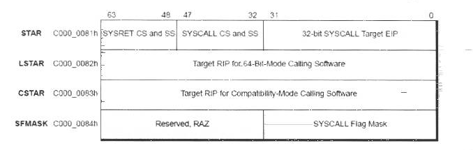
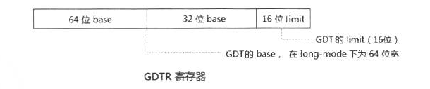
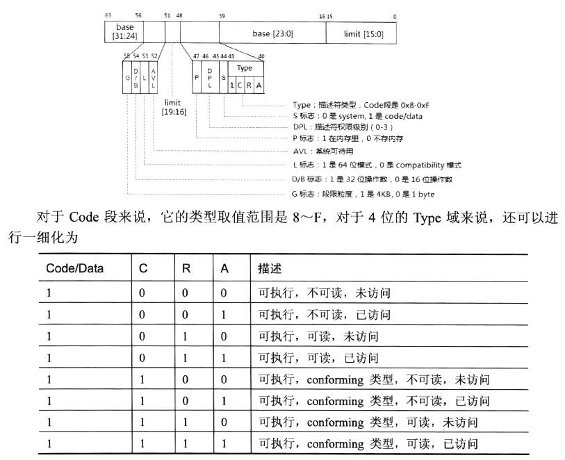
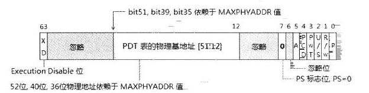

# 0x0 参考

**《x86_x64体系探索及编程》**

**《Intel开发手册》**

# 0x1 x64与x86指令架构的区别


## 0x1-1 寄存器区别


在x86中,通用寄存器 eax-edx esi edi esp ebp等..而x64中新增了r8-r15这些通用寄存器。而且 x64新增了8位的寄存器 spl bpl sil dil,这是x86中没有的。r8-r15也拆分了,r8w 16位 r8d 是32位的。同样地,x64增加了9个128位的浮点寄存器,XMM0-XMM8,或者是用于多媒体。另外,x64没有pushad/aq这些指令。因此x64想要保存堆栈只能依次push来保存堆栈和寄存器环境。

## 0x1-2地址差别

x64中,线性地址只有48位有效,可以理解为从0x0-0xffffffffffff

其中,0x0-0x800000000000是UserAddress,而0x800000000000-0xffffffffffff是内核空间


其中高16位是地址符号扩展，要么全1,要么全0。

canonical和non-canonical地址的区别是高16位若全为0 1则是canonical(规范地址)

### 0x1-2-1 微软使用的地址。

微软的内核地址是从0xfffff80000000000开始的,也就是只用了44位,中间的这些虚拟地址,可以进行高地址注入。因为这块地址在硬件上是合法的。

## 0x1-3 x64全局变量寻址

x86架构下,全局变量的寻址直接是ds:[consant],但是x64下不是这样,是RIP+offset偏移。

如下图:


这个全局变量的地址计算==RIP+7+0xA81B=17F60C000。

## 0x1-4 x64调用约定

x64统一了函数的调用约定,只要fastcall调用约定。传参是

rcx rdx r8 r9,不够则mov [rsp+20],arg5...依次类推。

==注:==是mov [rsp+20],xx,而非push xx;

x64会在函数的prolog就会先push 非易失寄存器,然后提升堆栈,自此不在变动RSP。提升的堆栈用于函数传递参数,栈低地址则是返回地址和传进来的函数参数。

所以布局如下


在返回的时候,Rsp就会恢复成OldRsp,然后返回上一个函数。

但也不是绝对的,因为==预留栈空间问题==,函数在调用下一个函数的时候,至少提升0x20,如果参数小于4个,就会出现预留栈空间的多问题,这个时候可能出现如下代码

```assembly
mov qword ptr ss:[rsp+0x10],rbx 
mov qword ptr ss:[rsp+0x18],rsi 
push rbp                        
push rdi                        
push r14                        
```

此函数可能只有一个参数,因此预留栈空间被占用。当release时,会出现这种情况。

局部变量的位置就是在提升堆栈的时候,sub rsp,xx,

其中rsp+0-rsp+参数个数*8是为下个函数保存的预留栈空间,rsp+参数个数*8-rsp+提升的就是局部变量的空间。

==由图得到栈帧提升值=(局部变量个数+所有调用函数最大数)*8==

## 0x1-5 x64InlineHook

- mov rax,xx;jmp rax 
- ff 25 00 00 00 00 紧跟8字节地址无限跳转
- ff 15 00 00 00 00 紧跟8字节地址无限Call

# 0x2 x64保护模式

## 0x2-1 控制寄存器

### 0x2-1-1 CR8


保存当前IRQL,即Windows下的IRQL。中断请求级别。高忽视低

### 0x2-1-2 CR3

指向第一级页转换表结构,IA-32E分页下就是PML4


MAXPHYADDR指物理地址线最大值,CPUID.EAX=80000008H查询

EAX[16:8]返回虚拟地址,EAX[8:0]返回是最大物理地址总线

```assembly
mov eax,0x80000008                                                                 |
cpuid 
;得到如下结果
rax=0000000000003027
```

即最大虚拟地址48位,物理地址总线最大为39位。

其中,CR3,后12位是在CR4.PCIDE开启后,才有用,第63位也是,否则都是0;


### 0x2-1-3 CR0

重要的控制位寄存器。


#### PE位

保护模式开启位

#### PG位

分页开启

#### WP位

WP=1,Supervios权限无法修改ReadOnly内存,否则可以修改。只针对0 1 2特权


### 0x2-1-4 CR4


对于CR0的扩展。


#### TSD位

TSD==1,RDTSC和RDTSCP只能在R0权限使用。

#### SMEP位

SMEP=1,superviosr不能执行PTE属性中U/S=1的页面，同样的,还有SMAP,是访问,可以通过stac关闭。

#### VMXE位

VMXE=1,代表开启虚拟化,通过CPU.EAX=01H的第五位判断是否支持硬件虚拟化。

值得一提的是,VMXE对于AMD无效。

#### PCIDE机制

PCID机制是Intel 64较为新的处理器的一种机制,这个机制如下;

- CR4.PCIDE用于开启PCID机制

- PCID全称进程上下文标识符,CR3的后12位就是PCID号
- 每个PCID号都有一个TLB支持,总共有0xFFFF个TLB,处理器只处理当前的PCID的TLB;


- CR3的最高位,为0时,此时切换CR3(PCID也切换)时,会发生如下情况


但是如果是1,那就不会刷新了。

Windows 在开启KPTI之后,要使用这个机制;User CR3的PCID号是1,Kernel CR3的PCID号是2;


### 0x2-1-5 CR2

保存发生0E错误时的LinerAddress

### 0x2-1-6 EFER扩展功能寄存器

MSR寄存器的一个,位于0xC0000080h,只读寄存器,无法修改。但是开了VT之后,可以给GUEST_EFER写入此寄存器值,此时可以修改,是挂钩syscall的一种思路。


```c++
kd> rdmsr C0000080h
msr[c0000080] = 00000000`00000d01
```


### 0x2-2 MSR寄存器

MSR寄存器是一堆寄存器的组合,通过索引进行访问。MSR功能如下


### 0x2-2-1 MSR对特殊指令的支持

#### Syscall/sysret




````C
kd> rdmsr c0000081
msr[c0000081] = 00230010`00000000
````

代表进入内核,syscall用的CS=10,SS=cs+8,**其实刚好就是用的下一个在GDT表中的段描述符。**

sysret之后,CS=0x23,SS=0x23+0x10=0x33 刚好就是下一个GDT表的段描述符

SFMASK则是用于和RFLAGS进行进行NOT AND操作的,主要是用于关闭一些位,比如TF位。不然你进入SYSCALL,直接单步,会触发异常。

#### Swapgs

x64数据段内存段无法表示基质(==段的强制平坦==)

导致gs中选择子无法满足表示基质，用IA32_GS_BASE当作64位基质

IA32_KERNEL_GS_BASE:0xC0000102h

IA32_GS_BASE:0xC0000101H

在执行swapgs时,切换这两个MSR的值，即


一般用于system系统调用时切换swapgs,因为syscall进入内核不切换栈,swapgs从KPCR中找到线程内核栈，具体参考系统调用。

值得一提的是,windbg查这两个寄存器的值:

```c++
kd> rdmsr c0000101h
msr[c0000101] = fffff802`176cd000
kd> rdmsr c0000102h
msr[c0000102] = 00000000`00beb000
```

这是因为IA32_GS_BASE和IA32_KERNEL_GS_BASE已经发生切换。因此windbg查看就是这样。而且windbg调试内核时,必须切换,不然windbg无法调试。

也就是说windbg调试内核必须swapgs。IA32_GS_BASE必须是R0的KPCR。但是可以通过驱动程序打印出值。需要用到操作msr寄存器的指令

### 0x2-2-2 MSR寄存器的操作

#### rdmsr进行读

```assembly
mov rcx,176h
rdmsr
```

读到的内容放到edx:eax

```c++
kd> r
rax=0000000000000001 rbx=fffff802176cd180 rcx=00000000c0000101
rdx=000000ce00000000 rsi=0000000000000001 rdi=0000000000000004
rip=fffff8021ae00fb5 rsp=fffff80220291c58 rbp=ffffba8d3b41b040
 r8=0000000000000108  r9=ffffba8d396b9000 r10=0000000000000083
r11=fffff80220291c88 r12=0000000000000000 r13=fffff802176cd180
r14=0000000000000000 r15=ffffffffffffff00
iopl=0         nv up ei pl nz na pe nc
cs=0010  ss=0018  ds=002b  es=002b  fs=0053  gs=002b             efl=00000202
nt!DbgBreakPointWithStatusEnd+0x3:
fffff802`1ae00fb5 0f32            rdmsr
kd> t
fffff802`1ae00fb7 b90f1f8400      mov     ecx,841F0Fh
kd> r
rax=00000000176cd000 rbx=fffff802176cd180 rcx=00000000c0000101
rdx=00000000fffff802 rsi=0000000000000001 rdi=0000000000000004
rip=fffff8021ae00fb7 rsp=fffff80220291c58 rbp=ffffba8d3b41b040
 r8=0000000000000108  r9=ffffba8d396b9000 r10=0000000000000083
r11=fffff80220291c88 r12=0000000000000000 r13=fffff802176cd180
r14=0000000000000000 r15=ffffffffffffff00
iopl=0         nv up ei pl nz na pe nc
cs=0010  ss=0018  ds=002b  es=002b  fs=0053  gs=002b             efl=00000202
```

可以看到,x64读msr寄存器是rdx:rax,也就是0xc0000101h的值是edx:eax==fffff802176cd000

#### wrmsr进行写

```assembly
mov rcx,index
mov rdx,writedata
mov rax,rdx
shr rdx,32
wrmsr
```

同样地,写msr也需要拆开进行写

### 0x2-2-3 实验验证Swapgs

前面提到,windbg任何时候rdmsr都必然是KERNEL_GS_BASE是R3地址,实际上swapgs之前KERNEL_GS_BASE一直都是R0地址。swapgs的本质都是KERNEL_GS_BASE和GS_BASE两个MSR寄存器互换,可以在驱动中验证这一点

首先写一个Swapgs,它用于swapgs之后,读取MSR的两个SWAPGS相关寄存器的值,并存储起来。

```assembly
_Swapgs PROC

push rdi
push rsi

swapgs

cmp rdx,0
jz ArgIsZero
cmp rcx,0
jz ArgIsZero

mov rdi,rdx ;保存一下
mov rsi,rcx

mov rcx,0c0000101h;读GsBase
call _ReadMsr
mov [rdi],rax

mov rcx,0c0000102h;读KernelGsBase
call _ReadMsr
MOV [rsi],rax


ArgIsZero:
pop rsi
pop rdi
ret

_Swapgs ENDP
```

然后在驱动中打印出swapgs前后KERNEL_GS_BASE和GS_BASE验证

```c++
EXTERN_C NTSTATUS DriverEntry(PDRIVER_OBJECT DriverObject, PUNICODE_STRING uRegPath) {

	UNREFERENCED_PARAMETER(uRegPath);


	NTSTATUS status=STATUS_SUCCESS;

	DriverObject->DriverUnload = Unload;

	const UINT64 IA32_KERNEL_GS_BASE = 0xc0000102;
	const UINT64 IA32_GS_BASE = 0xc0000101;

	UINT64 KernelGsBase = _ReadMsr(IA32_KERNEL_GS_BASE);
	UINT64 GsBase = _ReadMsr(IA32_GS_BASE);

	KdPrint(("[+]before swapgs KernelGsBase==0X%p,GsBase==0x%p\r\n",KernelGsBase,GsBase));

	_Swapgs(&KernelGsBase,&GsBase);

	_Swapgs(0, 0);//一定要再次切换 不然调用KdPrint直接卡死

	KdPrint(("[+]After swapgs KernelGsBase==0X%p,GsBase==0x%p\r\n", KernelGsBase, GsBase));

	return status;

}
```

最终Windbg提示如下,验证成功。

```c++
[+]before swapgs KernelGsBase==0X000000068B918000,GsBase==0xFFFFF802176CD000
[+]After swapgs KernelGsBase==0XFFFFF802176CD000,GsBase==0x000000068B918000
```

## 0x2-3 long-mode下的保护模式

> 保护模式即保护资源的模式,指区分权限级别以及特权级指令限制,使得用户态无法访问修改被保护的资源,如OS 内核,CR寄存器,MSR寄存器等。


保护模式分为段保护和页保护,long-modex64下有意**忽略段保护的一些属性**。

long-mode本质上是建立在保护模式上的。


在intel64中,long-mode又被称为==IA-32E==。

### 0x2-3-1 段保护(管理)

保护模式下段式管理管理的资源有


**段保护的职责是把和段基址相对的地址也就是逻辑地址转换为线性地址和进行行为控制,防止随意访问**。

#### 段的内存管理

实模式下,逻辑地址=段基质<<4+段偏移。

在保护模式下,段的基质是从段描述符加载来的。是段寄存器先加载好,意思是段寄存器有值之后,才可以去段描述符中查找段基址。


在x64 IA-32E下,base强制为0,也就是平坦模型,且不检查段界限。

#### 段的保护措施

在加载段时候,段保护会进行检查。

- limit(x64已去除)
- 段type
- 段Privilege

值得一提的是,一旦段选择子加载进段寄存器,即段寄存器出现段选择子,则以后不会检查段的DPL和Type。除非修改段寄存器,让他重新加载段描述符。

##### 段选择子

他是段的标识符,结构如下

==他是用于加载到段寄存器的可视部分的==


当段选择子(段寄存器)为0-3时,这个段选择子无效。

当段选择子寄存器被修改时,如果权限校验通过。段选择子就会被加载到段寄存器中。

x64下,对于Null Selector加载到段选择子处理器不会检查,运行加载Null Selector到除CS寄存器之外任何寄存器。并进行访问。

Null selector的意义在于当retf iret时,即高权到低权限,如果ES,DS,FS这些段寄存器DPL<CPL,处理器默认会把这些段寄存器加载Null选择子。

防止R0->R3返回后,仍然可以访问R0的数据

##### 描述符表

段选择子用于描述符表,共有3种描述符表,为GDT,LDT,IDT.

对于GDT表,用GDTR来表示。



GDTR是一个80位寄存器

ldgt [内存地址]用于加载gdt,其中低16位是limit

##### 段选择子寄存器

段选择子寄存器保护可视和不可视部分


其中只有Sel可视,当段选择子寄存器加载段选择子,不可视部分也加载,不可视的作用是cache,防止查表浪费时间。

也就是前面所说的一旦段寄存器加载了段选择子,不会在进行一些DPL权限检查。

##### 段描述符

==段描述符是段选择子指向的在段描述符表中的具体内容==,此处指向意味着索引。

对于段描述符,种类分为段描述符,和门描述符。

按照系统性质分为系统和非系统描述符(**代码数据段描述符**)


**对于Code代码段的描述符一般是如下结构**



值得注意的是L位,L即long mode的段描述符,开启后,limit和base无效。


**对于门描述符,如调用门是如下结构**


即s位是1,扩展128位。

调用门描述符可以在LDT,也可以在GDT中。

**对于TSS描述符(LDT描述符也是如此)**

long-mode下TSS不用于切换,结构如下:

```c++
kd> dt _KTSS64
nt!_KTSS64
   +0x000 Reserved0        : Uint4B
   +0x004 Rsp0             : Uint8B
   +0x00c Rsp1             : Uint8B
   +0x014 Rsp2             : Uint8B
   +0x01c Ist              : [8] Uint8B
   +0x05c Reserved1        : Uint8B
   +0x064 Reserved2        : Uint2B
   +0x066 IoMapBase        : Uint2B
```

TSS描述符如下


TSS描述符可从TR寄存器(段选择子)找到。寻找方式如下

```C
kd> r tr
tr=0040 //40是在GDT表的第八个
kd> r gdtr
gdtr=fffff80220279fb0
kd> dq fffff80220279fb0+8*8
fffff802`20279ff0  20008b27`80000067 00000000`fffff802
fffff802`2027a000  0040f300`00003c00 00000000`00000000
fffff802`2027a010  00000000`00000000 00000000`00000000
fffff802`2027a020  00000000`00000000 00000000`00000000
kd> dt _ktss64 fffff80220278000
nt!_KTSS64
   +0x000 Reserved0        : 0
   +0x004 Rsp0             : 0xfffff607`8ad3fc90
   +0x00c Rsp1             : 0
   +0x014 Rsp2             : 0
   +0x01c Ist              : [8] 0
   +0x05c Reserved1        : 0
   +0x064 Reserved2        : 0
   +0x066 IoMapBase        : 0x68
```

IA-32E下的TSS已经不用于任务切换,只用于保存ISR中断执行时的堆栈和其他特权级的堆栈

其中Ist就是中断例程所用的栈。

#### LDT描述符和LDT

LDT描述符只能位于GDT表中


LDT描述符指向的内存就是LDT表,没有意义,因为注册LDT必须使用GDT,GDT被PatchGuard监控。

### 0x2-3-1 页保护(管理)


**页管理的职责就是将线性地址,也就是虚拟地址,经过页管理转换成物理地址和进行访问控制,防止随意访问**

#### IA-32E页转换模式

具体分为3种清空,4K,2M,1G页面的转换。

在进行页面转换时,需要用到CR0,CR2,CR3,CR4和IA32_EFER这些寄存器。

对于4KB分页,采取9 9 9 9 12分页,从CR3开始。多级指针查找。

48位虚拟地址,前16位符号扩展,不能使用


上图为4KB分页,2MB则意味着PDE表项的PS=1。

值得注意的是,物理地址一定是按照页粒度对齐的。

即4KB分页,最末级指针的物理地址一定是4KB对齐,2MB分页,PDE所描述的物理地址一定是低21位为空,不能跨页,这是硬件规定。在PTEHOOK大页时容易出错。

##### **CR3结构**


本质就是多级指针,这样可以节省内存,CR3指向一个4KB物理页,因此只需要低12位忽略(低12是属性)。

##### PML4E结构


==任何时候,CR3和PML4E都是指向一块4KB内存的==

但是如果开了1GB分页,PDPTE的[30:12]都为空,并且低12位属性。

##### PDPTE结构

如上面所说,


如果PS(位7=1),则PDPTE[30:12]为0,代表物理地址按照1GB对齐。


否则,2MB或者4KB的则是一样的



##### PDE结构

同样,PDE也遵循大页定律。若2MB分页


物理页必须对齐,即12-21位强制为0,PS=1

##### PTE结构


4KB分页才会有的结构,8-12为忽略。

#### 页表项的其他位含义

P:存在位,经常用于OS。

R/W位:读写位,页保护的读写

U/S:0则Superviosr才可以访问,1则User也可以访问,高地址注入的关键 内存加载

注入Dll,3换地址,

A:访问位,处理器不清除,只置位。

PS:大页标志

D:脏位,代表写过,处理器不清除,只置位。

G:CR4.PGE=1是,G位可置位,代表CR3更新时,TLB不刷新


### 0x2-3-2 TLB与Cache

页表是多级指针,一层层对地址访问会很耗时。TLB解决这个问题。

TLB(**Translation Lookaside buffers**)本质上是一种cache,通过TLB可以绕过多次查找内存,之间找到转换结构，这个结果包含最终的物理地址和页面的属性。

可以简单理解为LinerAddress和PageNumer的关系。

分页的实质是线性地址=PageNumber+Page offset

CR3是多级指针,但是其实可以看成一个一级指针,但是一级指针就要全部映射,耗内存,因此,CR3变成多级指针。但是可以看成一个一级指针。

如果把CR3看出一级指针(即一系列4KB物理地址线性排列),那么PageNumber就是9 9 9 9 12的9 9 9 9,即PageNumber就是前36位,最后12位是物理内存。


在不同的分页模式下,Page Number位数变化,Page Offset也会变化。

