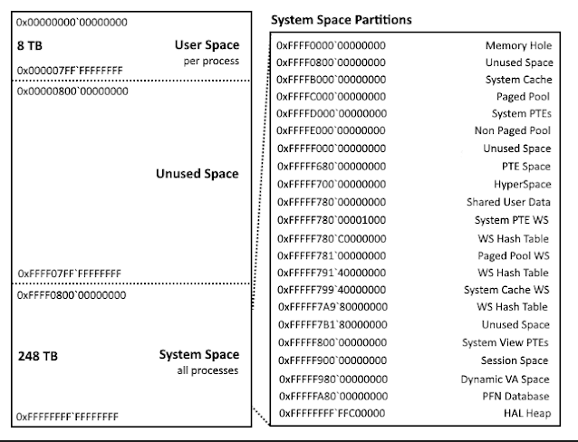
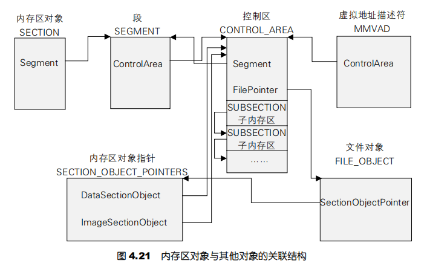
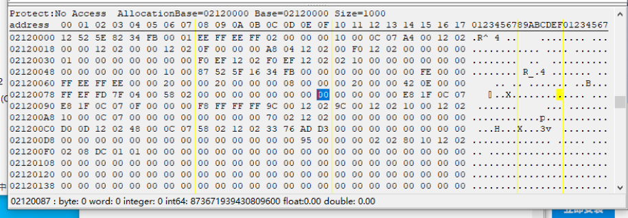
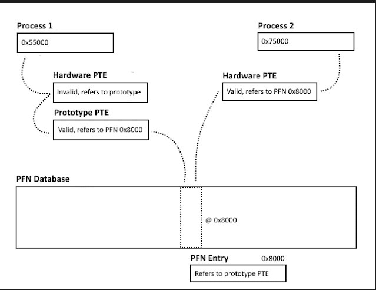
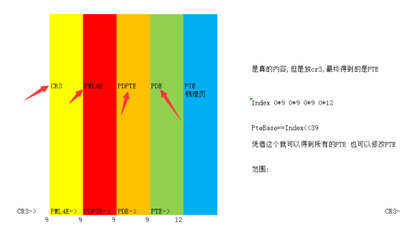
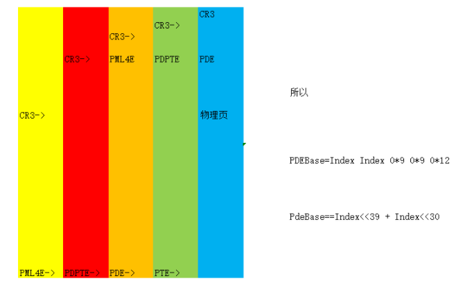

# 0x0参考

**《Windows内核原理与实现》**

**[Windows内存管理笔记](https://bbs.pediy.com/thread-270951.htm)**

**《Windows internals》**

**[Exploring Windows virtual memory management](https://www.triplefault.io/2017/08/exploring-windows-virtual-memory.html)**

# 0x1 Windows内核管理概论

对于内存管理的不同,本质是算法的不同。如位图法,链表法,slab等等。

**首先**,对于Windows来说,在x64 windows下,仍然采取低半空间规范地址为用户独立空间,其本质是PML4表中低256个PML4E各异,内核空间全进程共享,本质是高256个PML4E相同。x64下弱化了段的概念,直接得到线性地址,没有逻辑地址。因为强制平坦。

**其次**,Windows的虚拟地址分配与收回按照严格方式进行。进程使用内存必须申请,因此OS根据申请与释放进行维护每个进程的虚拟空间使用情况。

**同时**,Windows使用按需分配策略,即只有虚拟地址真正使用,才会被分配页表,俗称挂物理页。

**对于虚拟内存**

- Windows采取每个进程有一颗AVL的一组VAD虚拟地址描述符,这些描述可以根据虚拟地址快速定位到指定的描述符上。
- 来判断R3空间的使用清空,方便分配和进程销毁时候的清理。

**对于物理内存**

- Windwos要实现页面的换出[^1]与换入。Windows采取了MMPFNDATABASE页帧数据库的管理方式用于描述每个页面的状态。页帧数据库是一个MMPFN的结构体的数组。

而这个数据库,管理0-0xFFF的物理地址就是第一个MMPFN,以此类推,即0x30+PFN

- 同时,Windows维护了一个链表,将所有相同属性的物理地址链接起来。

同时,对于页面错误,Windows提供Page Fault Handler,把换出的数据重新读到内存。

## 0x1-1 系统地址的空间内存管理



对于系统内存,Windows采取池的概念进行维护。

出了特殊的模块,大部分都是建立在内核池中。在初始化时,windows建立两种内存池,分别是可以被换入磁盘的分页内存池和不能换入的非分页内存池。 

**非分页**池这由保证始终驻留在物理内存中的系统虚拟地址范围组成。因此，可以随时访问它们，而不会导致页面错误

-这意味着可以从任何IRQL访问它们。需要非分页池的原因之一是因为在DPC/调度级别或更高级别上无法满足页面错误。因此，任何可能在DPC/分派级别或更高级别执行或访问的代码和数据都必须位于不可分页内存中。

**分页池**这是系统空间中的一个虚拟内存区域，可以分页到系统内外。不需要从DPC/调度级别或更高级别访问内存的设备驱动程序可以使用分页池。它可以从任何流程上下文访问。

==可以通过某些API来把内存常驻进改地址空间 R3可以使用VirtualLock R0驱动中用MmProbeAndLockPages==

对于这些内存的分配和回收,可以通过

```c++
ExAllocatePool、ExAllocate-PoolWithTag和ExFreePool来进行分配
```

### 0x1-1-1 系统空间管理情况

通过MiState(结构MI_SYSTEM_INFORMATION)和MiVisibleState(结构_MI_VISIBLE_STATE)可以查看Windows系统内存空间管理的情况。

```c++
kd> dt _MI_VISIBLE_STATE fffff802`1b64ed40
nt!_MI_VISIBLE_STATE
   +0x000 SessionWsList    : _LIST_ENTRY [ 0xffffcb80`6e2dc080 - 0xffffcb80`6efbe080 ]
   +0x010 SessionIdBitmap  : 0xffff8302`8fab5600 _RTL_BITMAP
   +0x018 PagedPoolInfo    : _MM_PAGED_POOL_INFO
   +0x030 MaximumNonPagedPoolInPages : 0x00000001`00000000
   +0x038 SizeOfPagedPoolInPages : 0x00000001`00000000
   +0x040 SystemPteInfo    : _MI_SYSTEM_PTE_TYPE
   +0x0a0 NonPagedPoolCommit : 0x4b49
   +0x0a8 SmallNonPagedPtesCommit : 6
   +0x0b0 BootCommit       : 0x128b
   +0x0b8 MdlPagesAllocated : 0x578
   +0x0c0 SystemPageTableCommit : 0x88a
   +0x0c8 ProcessCommit    : 0x263a
   +0x0d0 DriverCommit     : 0n12446
   +0x0d4 PagingLevels     : 0x4 ''
   +0x0d8 PfnDatabaseCommit : 0x3221
   +0x100 SystemWs         : [6] _MMSUPPORT_FULL
   +0x880 SystemCacheShared : _MMSUPPORT_SHARED
   +0x900 AggregateSystemWs : [1] _MMSUPPORT_AGGREGATION
   +0x920 MapCacheFailures : 0
   +0x928 PagefileHashPages : 0
   +0x930 PteHeader        : _SYSPTES_HEADER
   +0xa48 SystemVaTypeCount : [16] 0
   +0xac8 SystemVaType     : [256]  ""
   +0xbc8 SystemVaRegions  : [13] _MI_SYSTEM_VA_ASSIGNMENT
```

```c++
nt!_MI_SYSTEM_INFORMATION
   +0x000 Pools            : _MI_POOL_STATE
   +0x0c0 Sections         : _MI_SECTION_STATE
   +0x400 SystemImages     : _MI_SYSTEM_IMAGE_STATE
   +0x4a8 Sessions         : _MI_SESSION_STATE
   +0x1550 Processes        : _MI_PROCESS_STATE
   +0x15c0 Hardware         : _MI_HARDWARE_STATE
   +0x1780 SystemVa         : _MI_SYSTEM_VA_STATE
   +0x1c40 PageCombines     : _MI_COMBINE_STATE
   +0x1c60 PageLists        : _MI_PAGELIST_STATE
   +0x1d00 Partitions       : _MI_PARTITION_STATE
   +0x1dc0 Shutdowns        : _MI_SHUTDOWN_STATE
   +0x1e38 Errors           : _MI_ERROR_STATE
   +0x1f00 AccessLog        : _MI_ACCESS_LOG_STATE
   +0x1f80 Debugger         : _MI_DEBUGGER_STATE
   +0x20a0 Standby          : _MI_STANDBY_STATE
   +0x2140 SystemPtes       : _MI_SYSTEM_PTE_STATE
   +0x2340 IoPages          : _MI_IO_PAGE_STATE
   +0x23b0 PagingIo         : _MI_PAGING_IO_STATE
   +0x2460 CommonPages      : _MI_COMMON_PAGE_STATE
   +0x2540 Trims            : _MI_SYSTEM_TRIM_STATE
   +0x2580 Enclaves         : _MI_ENCLAVE_STATE
   +0x25c8 Cookie           : 0
   +0x25d0 BootRegistryRuns : (null) 
   +0x25d8 ZeroingDisabled  : 0n0
   +0x25dc FullyInitialized : 0 ''
   +0x25dd SafeBooted       : 0 ''
   +0x25e0 TraceLogging     : (null) 
   +0x2600 Vs               : _MI_VISIBLE_STATE
```

使用windbg!poolused 2查看

```c++
kd> !poolused 2
Using a machine size of fff7d pages to configure the kd cache

*** CacheSize too low - increasing to 81 MB

Max cache size is       : 85884928 bytes (0x147a0 KB) 
Total memory in cache   : 261680 bytes (0x100 KB) 
Number of regions cached: 2283
52044 full reads broken into 52083 partial reads
    counts: 49797 cached/2286 uncached, 95.61% cached
    bytes : 1009831 cached/115552 uncached, 89.73% cached
** Transition PTEs are implicitly decoded
** Prototype PTEs are implicitly decoded
.
 Sorting by NonPaged Pool Consumed

               NonPaged                  Paged
 Tag     Allocs         Used     Allocs         Used

 ConT       535      5935104          0            0	UNKNOWN pooltag 'ConT', please update pooltag.txt
 EtwB       148      5206272         16       442368	Etw Buffer , Binary: nt!etw
 Thre      1725      4416000          0            0	Thread objects , Binary: nt!ps
 File      9386      3741536          0            0	File objects 
 EtwR     14617      3229088          0            0	Etw KM RegEntry , Binary: nt!etw
 NtxF      7350      2704800          0            0	FCB_NONPAGED                      NtfsFcbNonpagedDataLookasideList , Binary: ntfs.sys
 AmlH         5      2621440          0            0	ACPI AMLI Pooltags 
 FMsl     11963      2296896          0            0	STREAM_LIST_CTRL structure , Binary: fltmgr.sys
 Vad      13703      2192480          0            0	Mm virtual address descriptors , Binary: nt!mm
 MmCa      5932      2184080          0            0	Mm control areas for mapped files , Binary: nt!mm
 Even     14230      1833088          0            0	Event objects 
 ALPC      3044      1812224          0            0	ALPC port objects , Binary: nt!alpc
 MmPb         3      1617920          0            0	Paging file bitmaps , Binary: nt!mm
 MmCi      2111      1298848          0            0	Mm control areas for images , Binary: nt!mm
 NtxI      4900      1254400          0            0	FCB_NONPAGED_INDEX                NtfsFcbNonpagedIndexLookasideList , Binary: ntfs.sys
 smSt        93      1205440          0            0	ReadyBoost various store allocations , Binary: nt!store or rdyboost.sys
 Pool         5      1060864          0            0	Pool tables, etc. 
 ScPC         9      1009712          0            0	reset bus code 
 AcpD       992       979968          0            0	ACPI device data , Binary: acpi.sys
 EtwG      2029       908992          0            0	Etw Guid , Binary: nt!etw
```

**总之,系统空间大部分空间都是共享的,因为每个Cr3的PML4E相同,而且系统空间分配都是看内存池。即本来就分配好了物理内存,并且挂上了物理页,需要使用Alloc使用。**

**就正如R3进程的堆空间。**

## 0x1-2用户空间的管理

对于用户空间,Windows采取VAD树的方式进行管理。

而对于VAD树中的结点,进行管理的内存属性不一样。分为Mapped和Private的内存。

```c++
kd> !VAD ffffba8d3e512300+7D8
VAD             Level         Start             End              Commit
ffffba8d3ee4d620  7              10              10               0 Mapped       READONLY           Pagefile section, shared commit 0x1
ffffba8d3ee4f100  6              20              20               0 Mapped       READONLY           Pagefile section, shared commit 0x1
ffffba8d3ee4f240  7              30              30               0 Mapped       READONLY           Pagefile section, shared commit 0x1
ffffba8d3ee4e020  5              40              5c               0 Mapped       READONLY           Pagefile section, shared commit 0x1d
ffffba8d3e871600  7              60              9f              18 Private      READWRITE          
ffffba8d3e871b00  6              a0             19f               7 Private      READWRITE          
ffffba8d3ee4e160  4             1a0             1a3               0 Mapped       READONLY           Pagefile section, shared commit 0x4
ffffba8d3e872140  6             1b0             1b1               2 Private      READWRITE          
ffffba8d3ee4eca0  5             1c0             1c0               0 Mapped       READONLY           Pagefile section, shared commit 0x1
ffffba8d3ee4f6a0  7             1d0             1d0               0 Mapped       READONLY           Pagefile section, shared commit 0x1
ffffba8d3ee4f2e0  6             1e0             1e0               0 Mapped       READONLY           Pagefile section, shared commit 0x1
ffffba8d3ee4e980  7             1f0             1ff               0 Mapped       READWRITE          Pagefile section, shared commit 0x10
ffffba8d3e8718d0  3             200             3ff               5 Private      READWRITE          
ffffba8d3ee4da80  7             400             407               2 Mapped  Exe  EXECUTE_WRITECOPY  \Users\admin\Desktop\InstDrv.exe
ffffba8d3ee4e700  6             410             4d8               0 Mapped       READONLY           \Windows\System32\locale.nls
ffffba8d3e871dd0  5             4e0             4e3               1 Private      READWRITE          
ffffba8d3ee4fba0  6             530             537               0 Mapped       READONLY           Pagefile section, shared commit 0xd
ffffba8d3e8794e0  7             540             540               1 Private      READWRITE          
ffffba8d3ee50280  4             550             556               0 Mapped       READONLY           \Program Files\WindowsApps\Microsoft.LanguageExperiencePackzh-CN_19041.52.157.0_neutral__8wekyb3d8bbwe\Windows\System32\zh-CN\MFC42.dll.mui
ffffba8d3e87b240  7             560             560               1 Private      READWRITE          
ffffba8d3ee4d8a0  6             570             580               0 Mapped       READONLY           \Windows\System32\C_1252.NLS
ffffba8d3ee50500  7             590             593               0 Mapped       READONLY           Pagefile section, shared commit 0x4
ffffba8d3e876e20  5             5a0             5af               6 Private      READWRITE          
ffffba8d3ee50780  6             6b0             6b5               0 Mapped       READONLY           \Program Files\WindowsApps\Microsoft.LanguageExperiencePackzh-CN_19041.52.157.0_neutral__8wekyb3d8bbwe\Windows\System32\zh-CN\user32.dll.mui
ffffba8d3e876fb0  2             6c0             7bf             104 Private      READWRITE          
ffffba8d3ee50640  7             7c0             940               0 Mapped       READONLY           Pagefile section, shared commit 0x181
```

对于进程地址空间,使用需要用保留+提交两个阶段才可以使用一段内存。

**保留**是指只在VAD树中进行的属性进行挂载,不会挂物理页,以后会用。

**提交**就是指挂上物理页。

### 0x1-2-1VAD的结构

VAD的作用仅仅是对进程的虚拟内存进行占位和描述。他不会操控任何读写属性。但是可以表示。真正能够读写进行限制的是段和页的属性。即段的读写属性和页PTE的读写属性。

对Windows API进行限制的读写属性是MMPFNDATA中每个MMPFN的OriginalPte,通过修改这个可以欺骗API。

最终决定读写是靠硬件PTE,也就是页表中的PTE属性。

```c++
kd> dt _mmvad ffffba8d3ee4d620
nt!_MMVAD
   +0x000 Core             : _MMVAD_SHORT
   +0x040 u2               : <anonymous-tag>
   +0x048 Subsection       : 0xffffba8d`396a0580 _SUBSECTION
   +0x050 FirstPrototypePte : 0xffff8302`8fc02350 _MMPTE
   +0x058 LastContiguousPte : 0xffff8302`8fc02350 _MMPTE
   +0x060 ViewLinks        : _LIST_ENTRY [ 0xffffba8d`3ee529a0 - 0xffffba8d`3ee4f2a0 ]
   +0x070 VadsProcess      : 0xffffba8d`3e512301 _EPROCESS
   +0x078 u4               : <anonymous-tag>
   +0x080 FileObject       : (null) 
```

#### MMVAD_SHORT

是VAD的主要结构,后面则是Mapped类型的VAD结点专用的。

```c++
kd> dx -id 0,0,ffffba8d3969a040 -r1 (*((ntkrnlmp!_MMVAD_SHORT *)0xffffba8d3ee4d620))
(*((ntkrnlmp!_MMVAD_SHORT *)0xffffba8d3ee4d620))                 [Type: _MMVAD_SHORT]
    [+0x000] NextVad          : 0x0 [Type: _MMVAD_SHORT *]
    [+0x008] ExtraCreateInfo  : 0x0 [Type: void *]
    [+0x000] VadNode          [Type: _RTL_BALANCED_NODE]
    [+0x018] StartingVpn      : 0x10 [Type: unsigned long]
    [+0x01c] EndingVpn        : 0x10 [Type: unsigned long]
    [+0x020] StartingVpnHigh  : 0x0 [Type: unsigned char]
    [+0x021] EndingVpnHigh    : 0x0 [Type: unsigned char]
    [+0x022] CommitChargeHigh : 0x0 [Type: unsigned char]
    [+0x023] SpareNT64VadUChar : 0x0 [Type: unsigned char]
    [+0x024] ReferenceCount   : 0 [Type: long]
    [+0x028] PushLock         [Type: _EX_PUSH_LOCK]
    [+0x030] u                [Type: <anonymous-tag>]
    [+0x034] u1               [Type: <anonymous-tag>]
    [+0x038] EventList        : 0x0 [Type: _MI_VAD_EVENT_BLOCK *]
```

==StartingVpn==即开始虚拟地址帧,End为结束。

u.VadFlags中有些成员

```c++
   [+0x000 ( 0: 0)] Lock             : 0x0 [Type: unsigned long]
    [+0x000 ( 1: 1)] LockContended    : 0x0 [Type: unsigned long]
    [+0x000 ( 2: 2)] DeleteInProgress : 0x0 [Type: unsigned long]
    [+0x000 ( 3: 3)] NoChange         : 0x0 [Type: unsigned long]
    [+0x000 ( 6: 4)] VadType          : 0x0 [Type: unsigned long]
    [+0x000 (11: 7)] Protection       : 0x1 [Type: unsigned long]
    [+0x000 (17:12)] PreferredNode    : 0x0 [Type: unsigned long]
    [+0x000 (19:18)] PageSize         : 0x0 [Type: unsigned long]
    [+0x000 (20:20)] PrivateMemory    : 0x0 [Type: unsigned long]
```

其中PrivateMemory就是显示Mapped还是Private

NoChange可以用来锁页,但是只针对私有内存。

VadType如下定义

```c++
typedef enum _MI_VAD_TYPE {
    VadNone,
    VadDevicePhysicalMemory,
    VadImageMap,
    VadAwe,
    VadWriteWatch,
    VadLargePages,
    VadRotatePhysical,
    VadLargePageSection
} MI_VAD_TYPE, *PMI_VAD_TYPE;
```

**Protection**没有任何作用,只是表示VAD的读写属性。

```c
指定了内存的属性：1为READONLY；2为EXECUTE；3为EXECUTE _READ；4为READWITER；5为WRITECOPY；6为EXECUTE _READWITER；7为EXECUTE_WRITECOPY
```

==VAD仅仅是用来管理确定用户空间那些分配,那些未分配。这是它最大的作用==。

==还有一个即对于Private内存的锁页,可以进行限制的作用。他不能够承担起任何关于页面属性的责任,用它来判断页面的属性是不准确的==。

另外,VAD对于共享内存会包含他的原型PTE。

即如下,可以注意到，他是一个数组。

```c++
   +0x050 FirstPrototypePte : 0xffffd10f`1f203f50 _MMPTE
   +0x058 LastContiguousPte : 0xffffd10f`1f203ff8 _MMPTE
```

#### 内存区对象(_SECTION)与共享内存

**实现共享内存的底层原语就叫做SECTION对象;**

>  **实际上，内存区对象代表了一种物理存储资源，它可能在物理内存中，也可能在系统页面文件中，或者在其他的文件中。**

它本质上就是描述了一块**物理内存**,他与其他对象的关系如下



Section对象经常用于镜像文件(==创建进程时的镜像==)和共享内存。

如果Section表示的是一个文件镜像,如可以在VAD中查找EXE属性的

```c++
ffffba8d3ee4da80  7   400   407    2 Mapped  Exe  EXECUTE_WRITECOPY \Users\admin\Desktop\InstDrv.exe
```

查看他的MMVAD

```c++
kd> dt _mmvad ffffba8d3ee4da80
nt!_MMVAD
   +0x000 Core             : _MMVAD_SHORT
   +0x040 u2               : <anonymous-tag>
   +0x048 Subsection       : 0xffffba8d`3d3f7390 _SUBSECTION
   +0x050 FirstPrototypePte : 0xffff8302`95534880 _MMPTE
   +0x058 LastContiguousPte : 0xffff8302`955348b8 _MMPTE
   +0x060 ViewLinks        : _LIST_ENTRY [ 0xffffba8d`3d3f7318 - 0xffffba8d`3d3f7318 ]
   +0x070 VadsProcess      : 0xffffba8d`3e512301 _EPROCESS
   +0x078 u4               : <anonymous-tag>
   +0x080 FileObject       : (null) 
```

==ViewLinks==代表有多少进程链接了这个镜像文件,如果是Dll,可以遍历出所有的加载此dll的进程。

配合VadsProcess

```c++
  +0x060 ViewLinks        : _LIST_ENTRY [ 0xffffba8d`3d3f7318 - 0xffffba8d`3d3f7318 ]
   +0x070 VadsProcess      : 0xffffba8d`3e512301 _EPROCESS
```

可以看出,ViewLinks链接的是EPROCESS+0x18的位置。即这个结构

```c
EPROCESS; 
+0x018 ProfileListHead  : _LIST_ENTRY
```

值得注意,前面一直强调,SECTION对象是描述物理内存的。它是如何描述的呢?

```c++
2: kd> dx -id 0,0,ffff8e89ff852080 -r1 ((ntkrnlmp!_SEGMENT *)0xffffd10f28c8fd30)
((ntkrnlmp!_SEGMENT *)0xffffd10f28c8fd30)                 : 0xffffd10f28c8fd30 [Type: _SEGMENT *]
    [+0x000] ControlArea      : 0xffff8e89ffa792c0 [Type: _CONTROL_AREA *]
    [+0x008] TotalNumberOfPtes : 0x286 [Type: unsigned long]
    [+0x00c] SegmentFlags     [Type: _SEGMENT_FLAGS]
    [+0x010] NumberOfCommittedPages : 0x0 [Type: unsigned __int64]
    [+0x018] SizeOfSegment    : 0x286000 [Type: unsigned __int64]
    [+0x020] ExtendInfo       : 0x7ff615830000 [Type: _MMEXTEND_INFO *]
    [+0x020] BasedAddress     : 0x7ff615830000 [Type: void *]
    [+0x028] SegmentLock      [Type: _EX_PUSH_LOCK]
    [+0x030] u1               [Type: <anonymous-tag>]
    [+0x038] u2               [Type: <anonymous-tag>]
    [+0x040] PrototypePte     : 0xffffd10f2313f000 [Type: _MMPTE *]
```

有一个PrototypePte原型Pte,这个是一个MMPTE列表,SECTION对象就是靠这个来描述物理内存的。

```c++
2: kd> dq 0xffffd10f2313f000
ffffd10f`2313f000  8a000000`0396b121 0a000000`bee26121
ffffd10f`2313f010  0a000001`33625121 0a000000`61724121
ffffd10f`2313f020  0a000000`01723121 0a000000`b9322121
ffffd10f`2313f030  0a000000`58a21121 0a000000`6ab20121
ffffd10f`2313f040  0a000000`b011f121 0a000000`5f61e121
ffffd10f`2313f050  0a000000`2f31d121 0a000000`4e81c121
ffffd10f`2313f060  0a000000`b851b121 0a000000`4ed1a121
ffffd10f`2313f070  0a000000`8ed30121 8e89ffa7`93780460
```

即里面全都是Pte,Pte也是一种资源,但是这个和物理Pte(Pte_Base开始描述的Pte)地址是肯定不一样的。这个只是表示物理内存的。

**FirstPrototypePte**:这是共享内存很重要的一个概念。

用于表示共享内存的页面是否有效。并且此PTE描述的是真实的物理地址,实际上,FirstProtoTypePte就是在ControlArea.Segment.PrototypePte。

即原型PTE,是描述共享内存是否有效真正的PTE。

**在SubSection中**,对Section这个对象进行了分段。

Section结构中,最重要的是ControlArea,他描述了Section的一些内容。

SubSection同样有:

```c++
kd> dx -id 0,0,ffffba8d3969a040 -r1 ((ntkrnlmp!_SUBSECTION *)0xffffba8d3d3f7390)
((ntkrnlmp!_SUBSECTION *)0xffffba8d3d3f7390)                 : 0xffffba8d3d3f7390 [Type: _SUBSECTION *]
    [+0x000] ControlArea      : 0xffffba8d3d3f7310 [Type: _CONTROL_AREA *]
    [+0x008] SubsectionBase   : 0xffff830295534880 [Type: _MMPTE *]
    [+0x010] NextSubsection   : 0xffffba8d3d3f73c8 [Type: _SUBSECTION *]
    [+0x018] GlobalPerSessionHead [Type: _RTL_AVL_TREE]
    [+0x018] CreationWaitList : 0x0 [Type: _MI_CONTROL_AREA_WAIT_BLOCK *]
    [+0x018] SessionDriverProtos : 0x0 [Type: _MI_PER_SESSION_PROTOS *]
    [+0x020] u                [Type: <anonymous-tag>]
    [+0x024] StartingSector   : 0x0 [Type: unsigned long]
    [+0x028] NumberOfFullSectors : 0x8 [Type: unsigned long]
    [+0x02c] PtesInSubsection : 0x1 [Type: unsigned long]
    [+0x030] u1               [Type: <anonymous-tag>]
    [+0x034 (29: 0)] UnusedPtes       : 0x0 [Type: unsigned long]
    [+0x034 (30:30)] ExtentQueryNeeded : 0x0 [Type: unsigned long]
    [+0x034 (31:31)] DirtyPages       : 0x0 [Type: unsigned long]
    kd> dx -id 0,0,ffffba8d3969a040 -r1 ((ntkrnlmp!_SUBSECTION *)0xffffba8d3d3f73c8)
((ntkrnlmp!_SUBSECTION *)0xffffba8d3d3f73c8)                 : 0xffffba8d3d3f73c8 [Type: _SUBSECTION *]
    [+0x000] ControlArea      : 0xffffba8d3d3f7310 [Type: _CONTROL_AREA *]
    [+0x008] SubsectionBase   : 0xffff830295534888 [Type: _MMPTE *]
    [+0x010] NextSubsection   : 0xffffba8d3d3f7400 [Type: _SUBSECTION *]
    [+0x018] GlobalPerSessionHead [Type: _RTL_AVL_TREE]
    [+0x018] CreationWaitList : 0x0 [Type: _MI_CONTROL_AREA_WAIT_BLOCK *]
    [+0x018] SessionDriverProtos : 0x0 [Type: _MI_PER_SESSION_PROTOS *]
    [+0x020] u                [Type: <anonymous-tag>]
    [+0x024] StartingSector   : 0x8 [Type: unsigned long]
    [+0x028] NumberOfFullSectors : 0x18 [Type: unsigned long]
    [+0x02c] PtesInSubsection : 0x3 [Type: unsigned long]
    [+0x030] u1               [Type: <anonymous-tag>]
    [+0x034 (29: 0)] UnusedPtes       : 0x0 [Type: unsigned long]
    [+0x034 (30:30)] ExtentQueryNeeded : 0x0 [Type: unsigned long]
    [+0x034 (31:31)] DirtyPages       : 0x0 [Type: unsigned long]
```

其中**NextSubsection**指向下一个SubSection,所有的SubSection的ControlArea都相等,同时与真正的Section对象的ControlArea一样。

控制区即内存区对象的核心,也是找到内存区对象描述的内存的核心。

```c++
kd> dx -id 0,0,ffffba8d3969a040 -r1 ((ntkrnlmp!_CONTROL_AREA *)0xffffba8d3d3f7310)
((ntkrnlmp!_CONTROL_AREA *)0xffffba8d3d3f7310)                 : 0xffffba8d3d3f7310 [Type: _CONTROL_AREA *]
    [+0x000] Segment          : 0xffff830295953bb0 [Type: _SEGMENT *]
    [+0x008] ListHead         [Type: _LIST_ENTRY]
    [+0x008] AweContext       : 0xffffba8d3ee4dae0 [Type: void *]
    [+0x018] NumberOfSectionReferences : 0x1 [Type: unsigned __int64]
    [+0x020] NumberOfPfnReferences : 0x8 [Type: unsigned __int64]
    [+0x028] NumberOfMappedViews : 0x1 [Type: unsigned __int64]
    [+0x030] NumberOfUserReferences : 0x2 [Type: unsigned __int64]
    [+0x038] u                [Type: <anonymous-tag>]
    [+0x03c] u1               [Type: <anonymous-tag>]
    [+0x040] FilePointer      [Type: _EX_FAST_REF]
    [+0x048] ControlAreaLock  : 0 [Type: long]
    [+0x04c] ModifiedWriteCount : 0x0 [Type: unsigned long]
    [+0x050] WaitList         : 0x0 [Type: _MI_CONTROL_AREA_WAIT_BLOCK *]
    [+0x058] u2               [Type: <anonymous-tag>]
    [+0x068] FileObjectLock   [Type: _EX_PUSH_LOCK]
    [+0x070] LockedPages      : 0x1 [Type: unsigned __int64]
    [+0x078] u3               [Type: <anonymous-tag>]

```

**FilePointer**:这是镜像文件特有的,如果是共享内存是靠页面文件支撑的,那么此处为空。

## 0x1-3 物理空间的管理


Windows对于物理空间的管理采用MMPFNDATABASE+链表构成。

### 0x1-3-1 MmPfnData

页帧数据库,物理地址/1000,得到页帧,在MmPfnData中可以进行数组查找,每一个都是MMPFN的结构

```c++
kd> dt _mmpfn
nt!_MMPFN
   +0x000 ListEntry        : _LIST_ENTRY
   +0x000 TreeNode         : _RTL_BALANCED_NODE
   +0x000 u1               : <anonymous-tag>
   +0x008 PteAddress       : Ptr64 _MMPTE
   +0x008 PteLong          : Uint8B
   +0x010 OriginalPte      : _MMPTE
   +0x018 u2               : _MIPFNBLINK
   +0x020 u3               : <anonymous-tag>
   +0x024 NodeBlinkLow     : Uint2B
   +0x026 Unused           : Pos 0, 4 Bits
   +0x026 Unused2          : Pos 4, 4 Bits
   +0x027 ViewCount        : UChar
   +0x027 NodeFlinkLow     : UChar
   +0x027 ModifiedListBucketIndex : Pos 0, 4 Bits
   +0x027 AnchorLargePageSize : Pos 0, 2 Bits
   +0x028 u4               : <anonymous-tag>
kd> dq mmpfndatabase
fffff802`1b6fc508  ffff9700`00000000 00000000`00000000
fffff802`1b6fc518  ffffba8d`396f7f00 00000000`00000006
fffff802`1b6fc528  00000000`00000001 00000000`00000000
fffff802`1b6fc538  ffffcb80`6c190000 ffffba8d`396f6a60
fffff802`1b6fc548  00000001`00000000 00000000`0000001c
fffff802`1b6fc558  0002625a`00000000 00000000`0002625a
fffff802`1b6fc568  ffffba8d`396b6380 00000002`00000000
fffff802`1b6fc578  00002320`00002710 00000000`00000000
kd> dt _mmpfn ffff9700`00000000+30*50
nt!_MMPFN
   +0x000 ListEntry        : _LIST_ENTRY [ 0x0f00436e`49400000 - 0xffffef80`00000000 ]
   +0x000 TreeNode         : _RTL_BALANCED_NODE
   +0x000 u1               : <anonymous-tag>
   +0x008 PteAddress       : 0xffffef80`00000000 _MMPTE
   +0x008 PteLong          : 0xffffef80`00000000
   +0x010 OriginalPte      : _MMPTE
   +0x018 u2               : _MIPFNBLINK
   +0x020 u3               : <anonymous-tag>
   +0x024 NodeBlinkLow     : 0
   +0x026 Unused           : 0y0000
   +0x026 Unused2          : 0y0000
   +0x027 ViewCount        : 0 ''
   +0x027 NodeFlinkLow     : 0 ''
   +0x027 ModifiedListBucketIndex : 0y0000
   +0x027 AnchorLargePageSize : 0y00
   +0x028 u4               : <anonymous-tag>

```

如上,是找50000物理地址的MMPFN。我们可以验证一下,MMPFN的正确性

==记住,下面的验证只适应私有内存==:

```c++
kd> !pte 600000
                                           VA 0000000000600000
PXE at FFFFEFF7FBFDF000    PPE at FFFFEFF7FBE00000    PDE at FFFFEFF7C0000018    PTE at FFFFEF8000003000
contains 0A0000009633B867  contains 0A0000009D93C867  contains 0A0000009C7C1867  contains 830000002ABA0867
pfn 9633b     ---DA--UWEV  pfn 9d93c     ---DA--UWEV  pfn 9c7c1     ---DA--UWEV  pfn 2aba0     ---DA--UW-V

kd> dt _mmpfn ffff9700`00000000+30*2aba0
nt!_MMPFN
   +0x000 ListEntry        : _LIST_ENTRY [ 0x00000000`00000001 - 0xffffef80`00003000 ]
   +0x000 TreeNode         : _RTL_BALANCED_NODE
   +0x000 u1               : <anonymous-tag>
   +0x008 PteAddress       : 0xffffef80`00003000 _MMPTE
   +0x008 PteLong          : 0xffffef80`00003000
   +0x010 OriginalPte      : _MMPTE
   +0x018 u2               : _MIPFNBLINK
   +0x020 u3               : <anonymous-tag>
   +0x024 NodeBlinkLow     : 0xffff
   +0x026 Unused           : 0y0000
   +0x026 Unused2          : 0y0000
   +0x027 ViewCount        : 0xa1 ''
   +0x027 NodeFlinkLow     : 0xa1 ''
   +0x027 ModifiedListBucketIndex : 0y0001
   +0x027 AnchorLargePageSize : 0y01
   +0x028 u4               : <anonymous-tag>
```

得出,找到PFN,发现,MMPFN的PteAddress==页表PteAddress,对于私有内存,MMPFN的PteAddress保存的就是进程PteBase区域的PteAddress。

```c++
kd> dx -id 0,0,ffffba8d3e512300 -r1 (*((ntkrnlmp!_MIPFNBLINK *)0xffff970000802e18))
(*((ntkrnlmp!_MIPFNBLINK *)0xffff970000802e18))                 [Type: _MIPFNBLINK]
    [+0x000 (35: 0)] Blink            : 0x1 [Type: unsigned __int64]
    [+0x000 (55:36)] NodeBlinkHigh    : 0x0 [Type: unsigned __int64]
    [+0x000 (59:56)] TbFlushStamp     : 0x0 [Type: unsigned __int64]
    [+0x000 (61:60)] Unused           : 0x0 [Type: unsigned __int64]
    [+0x000 (62:62)] PageBlinkDeleteBit : 0x0 [Type: unsigned __int64]
    [+0x000 (63:63)] PageBlinkLockBit : 0x0 [Type: unsigned __int64]
    [+0x000 (61: 0)] ShareCount       : 0x1 [Type: unsigned __int64]
    [+0x000 (62:62)] PageShareCountDeleteBit : 0x0 [Type: unsigned __int64]
    [+0x000 (63:63)] PageShareCountLockBit : 0x0 [Type: unsigned __int64]
    [+0x000] EntireField      : 0x1 [Type: unsigned __int64]
    [+0x000] Lock             : 1 [Type: __int64]
    [+0x000 (61: 0)] LockNotUsed      : 0x1 [Type: unsigned __int64]
    [+0x000 (62:62)] DeleteBit        : 0x0 [Type: unsigned __int64]
    [+0x000 (63:63)] LockBit          : 0x0 [Type: unsigned __int64]
```

其中,ShareCount也印证了这是一块私有内存。

##### MmGetVirtualForPhysical

Windows用它来从物理地址到虚拟地址的转换,本质上就是利用了MMPFN的性质。

即==私有内存MMPFN的PteAddress等于页表的PteAddress==

```c++
// Physical
unsigned __int64 __fastcall MmGetVirtualForPhysical(unsigned __int64 a1)
{
  return (a1 & 0xFFF) + (*(_QWORD *)(48 * (a1 >> 12) - 6047313952760i64) << 25 >> 16);// FFFF FA80 0000 0008
}
```

```assembly
MmGetVirtualForPhysical proc near       ; DATA XREF: .pdata:00000001400F4644↑o
                mov     rax, rcx
                shr     rax, 0Ch
                lea     rdx, [rax+rax*2] ; (物理内存>>0c)*3
                add     rdx, rdx        ; PfnDataBase的索引*6
                mov     rax, 0FFFFFA8000000008h ; MmPfnDataBase+8 但是实际上是固定的 收到ALSR制约
                                        ; (win10< 这个是固定地址)
                mov     rax, [rax+rdx*8] ; 索引*48(48d==30h)
                shl     rax, 19h        ; 相当于是去掉PteBase
                mov     rdx, 0FFFFF68000000000h ; PteBase
                shl     rdx, 19h
                and     ecx, 0FFFh
                sub     rax, rdx
                sar     rax, 10h
                add     rax, rcx
                retn
; ---------------------------------------------------------------------------
                align 10h
MmGetVirtualForPhysical endpxxxxxxxxxx37 1.text:000000014052D2B0 
```

算法如上所述,本质上取了个巧,a1是物理地址,首先取得物理地址的低12算出页面偏移偏移。

然后根据物理地址取得PFN,MMPFN.PteAddress<<25>>16+偏移取得虚拟地址。

<<25意义是去掉PTEBase,只留下距离PTEBase的索引,索引<<12>>3就是PteAddress描述的虚拟地址,但是<<25多移了16位,因此>>16.刚好<<9位，根据物理地址算出虚拟地址。

**这种算法决定了,对于共享物理内存,PteAddress到底是谁的进程的？不清楚,因此共享物理内存无法计算,事实上,对于共享内存,这个地方是原型pte的地址**。

另外,需要附加得到的值才有意义,因为返回的值是特定CR3的虚拟地址,这导致就算你不附加进程,假如你进程没有这块物理地址,所得到的虚拟地址也是无效的,**简而言之,不附加,你是无法使用这块虚拟地址的**。

## 0x1-4 OriginalPte

> MMPFN.OriginalPte是一个叫做“原始页表项”的内存管理数据结构中的一个成员变量。它用于存储Windows API查询时的页面属性，以便在操作系统中正确管理页面。它由硬件管理器维护，当硬件发生变化时，硬件管理器会自动更新该值。

即API查询时,返回的是OriginalPte,

对于共享内存是无效的。把Protection修改成0x18,NO_ACCESS

```c
#define MM_ZERO_ACCESS         0  // this value is not used.
#define MM_READONLY            1
#define MM_EXECUTE             2
#define MM_EXECUTE_READ        3
#define MM_READWRITE           4  // bit 2 is set if this is writable.
#define MM_WRITECOPY           5
#define MM_EXECUTE_READWRITE   6
#define MM_EXECUTE_WRITECOPY   7

#define MM_NOCACHE            0x8
#define MM_GUARD_PAGE         0x10
#define MM_DECOMMIT           0x10   // NO_ACCESS, Guard page
#define MM_NOACCESS           0x18   // NO_ACCESS, Guard_page, nocache.
#define MM_UNKNOWN_PROTECTION 0x100  // bigger than 5 bits!
```

```c++
kd> dx -id 0,0,ffffba8d3e512300 -r1 (*((ntkrnlmp!_MMPTE_SOFTWARE *)0xffff970001846870))
(*((ntkrnlmp!_MMPTE_SOFTWARE *)0xffff970001846870))                 [Type: _MMPTE_SOFTWARE]
    [+0x000 ( 0: 0)] Valid            : 0x0 [Type: unsigned __int64]
    [+0x000 ( 1: 1)] PageFileReserved : 0x0 [Type: unsigned __int64]
    [+0x000 ( 2: 2)] PageFileAllocated : 0x0 [Type: unsigned __int64]
    [+0x000 ( 3: 3)] ColdPage         : 0x0 [Type: unsigned __int64]
    [+0x000 ( 4: 4)] SwizzleBit       : 0x0 [Type: unsigned __int64]
    [+0x000 ( 9: 5)] Protection       : 0x18 [Type: unsigned __int64]
    [+0x000 (10:10)] Prototype        : 0x0 [Type: unsigned __int64]
    [+0x000 (11:11)] Transition       : 0x0 [Type: unsigned __int64]
    [+0x000 (15:12)] PageFileLow      : 0x0 [Type: unsigned __int64]
    [+0x000 (25:16)] UsedPageTableEntries : 0x0 [Type: unsigned __int64]
    [+0x000 (26:26)] ShadowStack      : 0x0 [Type: unsigned __int64]
    [+0x000 (31:27)] Unused           : 0x0 [Type: unsigned __int64]
    [+0x000 (63:32)] PageFileHigh     : 0x4072c000 [Type: unsigned __int64]
```

如上操作,用CE进行查看,发现已经是No_ACCESS了



但是仍然可以读出,此时我们使用WriteProcessMemory是失败的。

可以用于隐藏内存属性。

# 0x2 原型PTE

原型PTE是共享内存特有的,对于共享内存,有可能会发生如下情况:

> 在处理可共享内存时，Windows 会为共享内存的每一页创建一种**全局 PTE**——称为原型 PTE。此原型始终表示共享页面的物理内存的真实状态。如果标记为Valid，则此原型 PTE 可以像在任何其他情况下一样充当硬件 PTE。如果标记为Not Valid，原型将向页面错误处理程序指示内存需要从磁盘调回。当给定内存页存在原型 PTE 时，该页的 PFN 数据库条目将始终指向原型 PTE。

是因为,共享内存可能处于转换状态,也可能被换页出去硬件异常状态(==意味着共享内存这个页被换到磁盘上==),如果是转换状态,页面异常的处理只需要改变硬件PTE的V位即可,如果是硬件异常,则需要重新映射。

原型PTE就是风向标,特用来表面当硬件PTE无效(==软异常或者是硬异常导致的==)页面是软还是硬异常。



如下图,硬件PTE无效,但是原型PTE有效,因此Page Fault Handler处理时只需要把无效的硬件PTE修改V位即可。不必重新映射。

前文提到,对于私有内存,MMPFN.PteAddress就是硬件Pte的地址,这一点已经验证过,而对于共享内存,MMPFN.PteAddress是原型PTE，是Section对象ControlArea.Segment.PrototypePte。

验证如下:

使用这个VAD进行验证

```c++
ffffba8d3ee51040  5           75020           7502e               3 Mapped  Exe  EXECUTE_WRITECOPY  \Windows\SysWOW64\kernel.appcore.dll
```

发现,硬件PteAddress的地址并不等于PteAddress

```c++
kd> !pte 75020000
                                           VA 0000000075020000
PXE at FFFFEFF7FBFDF000    PPE at FFFFEFF7FBE00008    PDE at FFFFEFF7C0001D40    PTE at FFFFEF80003A8100
contains 0A0000009643B867  contains 0A00000093B45867  contains 0A00000097A9A867  contains 82000000218DB005
pfn 9643b     ---DA--UWEV  pfn 93b45     ---DA--UWEV  pfn 97a9a     ---DA--UWEV  pfn 218db     -------UR-V

kd> dt _mmpfn ffff9700`00000000+30*218db
nt!_MMPFN
   +0x000 ListEntry        : _LIST_ENTRY [ 0x00000000`00000001 - 0xffff8302`95453b60 ]
   +0x000 TreeNode         : _RTL_BALANCED_NODE
   +0x000 u1               : <anonymous-tag>
   +0x008 PteAddress       : 0xffff8302`95453b60 _MMPTE
   +0x008 PteLong          : 0xffff8302`95453b60
   +0x010 OriginalPte      : _MMPTE
   +0x018 u2               : _MIPFNBLINK
   +0x020 u3               : <anonymous-tag>
   +0x024 NodeBlinkLow     : 0x18dc
   +0x026 Unused           : 0y0000
   +0x026 Unused2          : 0y0000
   +0x027 ViewCount        : 0xd7 ''
   +0x027 NodeFlinkLow     : 0xd7 ''
   +0x027 ModifiedListBucketIndex : 0y0111
   +0x027 AnchorLargePageSize : 0y11
   +0x028 u4               : <anonymous-tag>
```

查看PteAddress的值,

```c++
kd> dq 0xffff830295453b60
ffff8302`95453b60  8a000000`218db121
```

可以看出,都是表述的同一块物理地址,但是硬件PTE的属性和原型PTE属性是不一样的。

查看原型PTE

```c++
    [+0x000 ( 0: 0)] Valid            : 0x1 [Type: unsigned __int64]
    [+0x000 ( 1: 1)] DemandFillProto  : 0x0 [Type: unsigned __int64]
    [+0x000 ( 2: 2)] HiberVerifyConverted : 0x0 [Type: unsigned __int64]
    [+0x000 ( 3: 3)] ReadOnly         : 0x0 [Type: unsigned __int64]
    [+0x000 ( 4: 4)] SwizzleBit       : 0x0 [Type: unsigned __int64]
    [+0x000 ( 9: 5)] Protection       : 0x9 [Type: unsigned __int64]
    [+0x000 (10:10)] Prototype        : 0x0 [Type: unsigned __int64]
    [+0x000 (11:11)] Combined         : 0x0 [Type: unsigned __int64]
    [+0x000 (15:12)] Unused1          : 0xb [Type: unsigned __int64]
    [+0x000 (63:16)] ProtoAddress     : -129742372068979 [Type: __int64]
```

` [+0x000 ( 9: 5)] Protection       : 0x9 [Type: unsigned __int64]`意味着是写拷贝属性。

而对于私有内存,不需要原型PTE这个概念。因为私有内存不会转换,修建工作集。

# 0x3 PTEBASE和页表自映射

## 0X3-1 PTEBASE

所谓PTEBASE是指PML4表中某一个值为CR3之后形成的连锁反应,图如下:



即某个PML4E是CR3,这样线性地址解析最终得到的物理地址就是PTE,而这个线性地址就是PteBase

为Index<<39==PteBase,修改这个地方的线性地址就是修改PTE,可以实现挂物理页的效果。



同理,解析时,CR3解析到第几层影响了最后线性地址解析到物理地址到底是什么。

## 0x3-2 页表自映射

页表自映射原理就是PTEBASE的求法,在win10中,页表基质是变动的。

即通过GetVirtualForPhysical获取CR3 Base,遍历,找到一块内存==CR3的Index,Index<<39找到页目录基质。

代码实现如下:

```c++
ULONG_PTR PageAttrHide::GetPteBase()
{
	UINT64 cr3=__readcr3();

	PHYSICAL_ADDRESS _cr3;

	_cr3.QuadPart = cr3;

	UINT64* pml4e_va=(UINT64*)MmGetVirtualForPhysical(_cr3);

	//DbgBreakPoint();
	//其实Cr3本质上是PML4E的指针,但是因为Windows为了方便,就在这PML4E数组里面有cr3
	//所以找到PML4E指向cr3的index
	UINT64 index = 0;
	//512
	for (int i = 0; i < 512; i++) {

		UINT64 Pte = *(pml4e_va+i);

		Pte &= 0xFFFFFFFFF000;

		if (Pte == cr3) {
			//找到PML4E Index 直接左移39位就是PTEBASE

			index = i;

			DbgPrintEx(77, 0, "Num==0x%d", i);

			break;
		}

		//DbgPrintEx(77, 0, "PML4E Phyaddr:0x%x cr3=0x%x\r\n", Pte,cr3);

	}

	if (index == 0) {

		DbgPrintEx(77, 0, "[OxygenDriver]err:fatal err, cr3 err\r\n");

		return 0;
	}

	UINT64 PteBase =  (index + 0x1FFFE00) << 39;

	//DbgPrintEx(77, 0, "[OxygenDriver]info: PteBase=0x%p\r\n", PteBase);
	return PteBase;
}
```

# 0x4突破限制映射PageTable的两种方法

## 0x4-1 PhysicalMemory Section对象映射

在Win10之前,使用MmMapIoSpace

```c++
PVOID
MmMapIoSpace (
    _In_ PHYSICAL_ADDRESS PhysicalAddress,
    _In_ SIZE_T NumberOfBytes,
    _In_ MEMORY_CACHING_TYPE CacheType
    );
```

是可以映射页表相关的内存的,比如CR3,Win10则不行。

采用另一种方法,内存区对象进行映射。前文讲过,内存区对象[^2]可以表述一块物理地址。Windows用名称为"PhysicalMemory"这个内存区对象表示了全部的物理内存。ZwMap即可映射。值得一提,这个内存区对象只能在内核打开。

```c++
/Cr3 = *(PULONG_PTR)((UINT64)Process + Cr3Offset);

	Offset.QuadPart = Cr3;

	//mapp cr3
	if (!NT_SUCCESS(ZwMapViewOfSection(hSection,
		NtCurrentProcess(),
		&Cr3Page, 0, PAGE_SIZE,
		&Offset, &nSize, ViewUnmap, MEM_TOP_DOWN, PAGE_READWRITE
	))) {

		DbgPrintEx(77, 0, "[+]unable to map cr3\r\n");

		return 0;
	}

```

其中Offset就是物理地址的偏移。映射之后Cr3Page就是映射的地址。

通过这个可以实现无附件读写,**但是目前EAC会检查进程是否有PhysicalMemory这个节区对象的句柄**

## 0x4-2 伪造PteAddress过MmMapIoSapce

这个需要逆MmMapIoSpace;

MmMapIoSpace是一个可以把物理地址变成物理地址的API,而且导出。

然而,高版本Win10,是禁止用这个来映射CR3相关的物理内存的。

简而言之,改函数校验是通过==MmPfnDataBase.PteAddress==

这是因为**所有进程的Cr3物理内存所对应的映射到虚拟地址的地址都是一样的**。

这是重点,每个进程的Cr3的物理地址都是不一样,但是最终这个Cr3映射到的线性地址是一样的。（这是因为页表自映射）;

这一点可以去MmPfnDataBase.PteAddress验证。

而MmMapIoSapce就是验证,通过改物理地址,找到PteAddress,看看是不是PML4E_BASE

如果是,那就不给映射。同样,MmMapIoSpace也用这种方法验证其他BASE(比如PteBase实际上是Pt物理地址),也是这种方法。

**因此破除方法很简单,创建一个4kb空间,然后修改Cr3对应的MmPfnDataBase.PteAddress给新的分配空间的PteAddress即可。**

这时候,Mm这个内存就不会失败了。

但是,这种方法实际上意义不大,因为只要是和页表有关的(PTE_BASE开始到结束),全都在MmMapIoSpace的屏蔽范围,也就是物理地址的PfnDataBase的PteAddress在上面的范围,通通不可映射。

而只改Cr3对应的PteAddress,也是只能够映射Cr3,没用实际意义。

---

[^1]:什么时候页面被换出呢？当系统认为内存紧缺，或者一个进程由于工作集的限制而不 允许拥有更多的物理页面时，Windows 会替换工作集中的页面。这项工作是由一个称为工 作集管理器（working set manager）的组件来完成的，它运行在一个称为平衡集管理器 （balance set manager）的系统线程中。工作集缩减的过程称为修剪（trim）。Windows 实 现了全面的工作集模型，包括控制进程的工作集，以及与页面替换算法结合起来管理物理 内存的全局分配。
[^2]: **实际上，内存区对象代表了一种物理存储资源，它可能在物理内存中，也可能在系统页面文件中，或者在其他的文件中。**