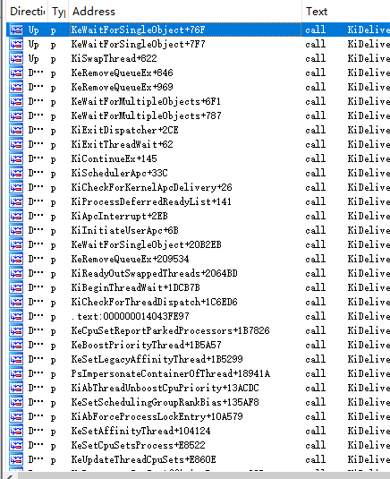
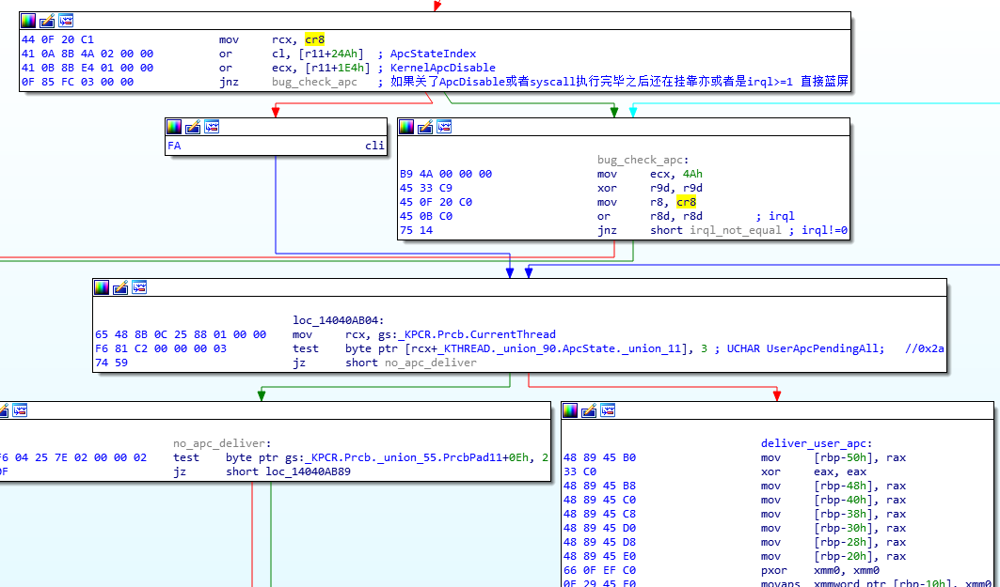
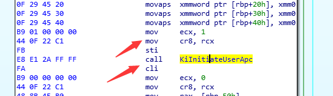
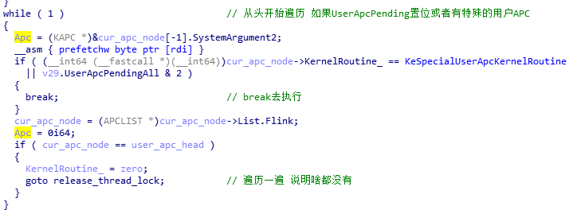
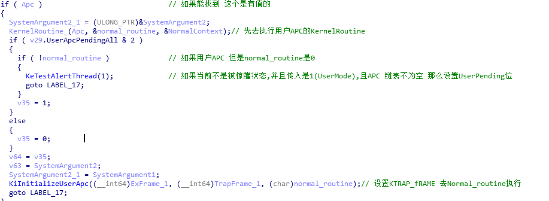
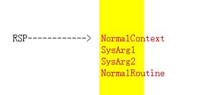

# 0x0 参考

《wrk》

《Windows internals 第六版》

# 0x1 APC定义及其相关结构

## 0x1-1 APC定义

APC全程异步过程调用,重点是**异步**和**调用**;是windows提供的一种基于线程的回调机制。

APC应用场景入下:

考虑如下情况,OS中存在两个线程,线程A和线程B;CPU正在执行线程A,但是线程A此时想要进行一些只有在线程B才能进行的操作,比如**退出和获取线程CONTEXT**。此时他可以插入APC,APC这个调用中是**退出或者是获取/修改线程CONTEXT的操作**。一旦线程切换,线程A插入的线程B的APC就会被执行,**而这个APC不会被线程C执行**，从而完成这个操作。

从上面描述,不难看出,APC其实有三大特征。

- ==基于特定线程环境的==
- ==异步的==
- ==一个调用==

**事实上,因为APC的这三个性质,APC还有一个很大的用处。**

考虑以下情况:

线程A正在读取一个很大的文件,大的一时半会读不完,这个时候可以使用APC,在IO硬件读完通知之后,向特定线程插入一个**中断APC**,这是一个和普通APC不一样的,他的IRQL==1,从而在这个APC中完成已经读写成功的操作。

### 0x1-1-1 APC应用

总的来说,APC应用大概分为两种场景

- **在不同的线程环境想要对特定的线程环境进行只有处于该特定环境才能做得事**

比如退出,修改获取线程的CONTEXT

- IO异步中断处理

即涉及IO异步操作

## 0x1-2 APC相关结构

### 0x1-2-1 KAPC_STATE

Windows在ETHREAD中的成员,提供了两个APC链表(==实际上算上备用APCState有四个==),一个是内核APC的链表,一个是用户APC的链表。

```c++
[+0x098] ApcState         [Type: _KAPC_STATE]
```

这个是当前正在使用的Apc状态,

他的结构成员如下

```C
	[+0x000] ApcListHead      [Type: _LIST_ENTRY [2]]
    [+0x020] Process          : 0xffff8e89fd780340 [Type: _KPROCESS *]
    [+0x028] InProgressFlags  : 0x0 [Type: unsigned char]
    [+0x028 ( 0: 0)] KernelApcInProgress : 0x0 [Type: unsigned char]
    [+0x028 ( 1: 1)] SpecialApcInProgress : 0x0 [Type: unsigned char]
    [+0x029] KernelApcPending : 0x0 [Type: unsigned char]
    [+0x02a] UserApcPendingAll : 0x0 [Type: unsigned char]
    [+0x02a ( 0: 0)] SpecialUserApcPending : 0x0 [Type: unsigned char]
    [+0x02a ( 1: 1)] UserApcPending   : 0x0 [Type: unsigned char]
```

不难看出,第一个成员就是ApcListHead,一个链表头,实际上,他链接的是一个_KAPC的结构。

而这个链表头有两个,其中Idx=0是内核链表,Idx=1是用户链表。

**InProgressFlags**代表是否正在处理APC;

**UserApcPendingAll**代表有用户APC正在等待。

而根据其成员可以看出,用户APC其实分为特殊用户APC和UserApc;

### 0x1-2-2 Alterted[2] 和 Alterable

```c++
[+0x072] Alerted          [Type: unsigned char [2]]
[+0x074 ( 4: 4)] Alertable        : 0x0 [Type: unsigned long]
```

**Alterable代表是否可以唤醒**,可以理解为一种开关,即在KeWaitSingleObject中,是否可以被APC打断。

而Alterted则是状态,即如果我在等待的时候被唤醒了,那么我就把这个位置1。

这个位决定了APC是否可以在被等待的时候执行,如果使用WaitXXEx,最后一个参数就是用来填写是否可以唤醒的。

### 0x1-2-3 ApcQueueable ApcStatePointer与ApcStateIndex

这属于时代的眼泪,x64已经无了。

### 0x1-2-4 SavedApcState

这是备用的ApcState,挂靠会用到,挂靠可以简单理解为

假设有两个进程,P1和P2,线程T1属于P1,线程T2属于P2;

CPU正在运行P1的T1,但是想要读写下P2的内存,CR3是不一样的,因此T1使用**[线程挂靠](# 0x4 线程附加)**来进行切换T1所属的进程。

事实上,一旦挂靠,如何恢复是个问题。因为每个进程的线程空间不一样,因此,Windows使用ApcState.Process来标志当前线程到底属于哪个进程。

如果涉及挂靠,那么T1的进程就是P2,但是总要恢复的,因此把APC_STATE整个复制到SavedApcState。等待恢复,在复原回来。

### 0x1-2-5 KAPC

这个便是APC的结构了,即插入APC链表的结构

```c++
nt!_KAPC
   +0x000 Type             : UChar
   +0x001 SpareByte0       : UChar
   +0x002 Size             : UChar
   +0x003 SpareByte1       : UChar
   +0x004 SpareLong0       : Uint4B
   +0x008 Thread           : Ptr64 _KTHREAD
   +0x010 ApcListEntry     : _LIST_ENTRY
   +0x020 KernelRoutine    : Ptr64     void 
   +0x028 RundownRoutine   : Ptr64     void 
   +0x030 NormalRoutine    : Ptr64     void 
   +0x020 Reserved         : [3] Ptr64 Void
   +0x038 NormalContext    : Ptr64 Void
   +0x040 SystemArgument1  : Ptr64 Void
   +0x048 SystemArgument2  : Ptr64 Void
   +0x050 ApcStateIndex    : Char
   +0x051 ApcMode          : Char
   +0x052 Inserted         : UChar
```

**ApcListEntry**就是链表挂入的地方

**KernelRoutine**是内核APC;而RundownRoutine是APC执行完之后,会执行,一般用来清楚APC占用的空间。**注意,APC是一定要是非分页的**。

**NormalRoutine**则是正常去执行的,一般来说,用户APC必须有NormalRoutine,内核APC可以没有。

如果没有NormalRoutine,那么就是一个特殊的内核APC(==中断APC==);

**ApcStateIndex**:事实上,线程也有一个ApcStateIndex,如果是0,代表当前没有挂靠,如果是1,代表当前挂靠。但是KAPC.ApcStateIndex的取值是0-3;

**这是因为,APC初始化和APC插入并不一定代表着这这个线程挂靠没有发生变化**。

**通常**

0.无论你挂靠还是不挂靠,都插入原始环境(亲生父母)

1.无论你挂靠不挂靠,都插入挂靠环境.()

2.选择插入**,初始APC的时候,**判断一下,**看线程的KTHREAD.ApcStateIndex,如果=0，插入原始环境,=1,插入挂靠环境。**

3.选择插入,初始APC，不判断,只要插入一瞬间,进行判断。判断原理与2一样。(防止初始化和创建时候APC环境不一样)

### 0x1-2-6 Apc控制位

```C++
    [+0x1e4] KernelApcDisable : 0 [Type: short]
    [+0x1e6] SpecialApcDisable : 0 [Type: short]
    [+0x1e4] CombinedApcDisable : 0x0 [Type: unsigned long]
```

**看名字似乎是各管各的,其实是SpecialApcDisable是个超级开关,掌管一切APC。**

**其次,KernelApcDisable也不能关闭,一旦关闭就会蓝屏。**

# 0x2 APC从初始化到插入过程

## 0x2-1 Apc的初始化

APC初始化是一个导出的内核API

```c
VOID
KeInitializeApc (
    __out PRKAPC Apc,
    __in PRKTHREAD Thread,
    __in KAPC_ENVIRONMENT Environment,
    __in PKKERNEL_ROUTINE KernelRoutine,
    __in_opt PKRUNDOWN_ROUTINE RundownRoutine,
    __in_opt PKNORMAL_ROUTINE NormalRoutine,
    __in_opt KPROCESSOR_MODE ApcMode,
    __in_opt PVOID NormalContext
    );
```

实际上,这个函数很简单

```c++
void __stdcall KeInitializeApc(_KAPC *Apc, _ETHREAD *Thread, char Environment, PVOID KernelRoutine, PVOID RundownRoutine, PVOID NormalRoutine, char ApcMode, PVOID NormalContext)
{
  Apc->Type = 18;                               // 固定的
  Apc->Size = 88;                               // 申请的KAPC一定要是非分页的
  if ( Environment == 2 )
    Environment = Thread->Tcb._union_190.Affinity.Reserved[0];// ApcIndex
                                                // 可以看到 如果是2,那么永远是初始化的时候的亲生父母
  Apc->ApcStateIndex = Environment;
  Apc->RundownRoutine = RundownRoutine;
  Apc->Thread = (__int64)Thread;
  Apc->NormalRoutine = NormalRoutine;
  Apc->KernelRoutine = KernelRoutine;
  Apc->ApcMode = NormalRoutine != 0i64 ? ApcMode : 0;
  Apc->NormalContext = (unsigned __int64)NormalContext & -(signed __int64)(NormalRoutine != 0i64);
  Apc->Inserted = 0;                            // 代表还未插入
}
```

只是把参数给填入。

值得注意的时候,当插入环境是2,那么会进行一次判断。

## 0x2-2 APC插入过程

### 0x2-2-1 KeInsertQueueApc

插入APC的的内核api也是导出的,如下

```C
BOOLEAN
KeInsertQueueApc (
    __inout PRKAPC Apc,
    __in_opt PVOID SystemArgument1,
    __in_opt PVOID SystemArgument2,
    __in KPRIORITY Increment
    );
```

在初始化完毕之后,就将以及初始化好的KAPC给插入到用户APC或者内核APC链表中。

实际上,KeInsertQueueApc是调用KiInsertQueueApc

KeInsertQueueApc的大体过程如下

首先获取线程的APC 锁,因为插入APC涉及链表操作。

```c++
cur_irql = KeGetCurrentIrql();
  __writecr8(2ui64);                            // 提升到DPC_LEVEL,这就是为什么APC必须在非分页
  if ( KiIrqlFlags && KiIrqlFlags & 1 && cur_irql <= 0xFu )// 下面是获取APC_LOCK,因为APC是个链表 需要同步
  {
    SchedulerAssist = KeGetCurrentPrcb()->SchedulerAssist;
    *(_DWORD *)(SchedulerAssist + 20) |= (-1 << (cur_irql + 1)) & 4;
  }
  kpcr = KeGetCurrentPrcb();
  v26 = 0;
  while ( 1 )
  {
    v18 = kpcr->SchedulerAssist;
    if ( v18 )
    {
      if ( kpcr->NestingLevel <= 1u )
      {
        v24 = *(_DWORD *)(v18 + 24);
        *(_DWORD *)(v18 + 24) = v24 + 1;
        if ( v24 == -1 )
          KiRemoveSystemWorkPriorityKick(kpcr);
      }
    }
    if ( !_interlockedbittestandset64((volatile signed __int32 *)&InsertThread->Tcb.ThreadLock, 0i64) )
      break;
    v22 = kpcr->SchedulerAssist;
    if ( v22 )
    {
      if ( kpcr->NestingLevel <= 1u )
      {
        v25 = *(_DWORD *)(v22 + 24) - 1;
        *(_DWORD *)(v22 + 24) = v25;
        if ( !v25 )
          KiRemoveSystemWorkPriorityKick(kpcr);
      }
    }
    do
      KeYieldProcessorEx(&v26);
    while ( InsertThread->Tcb.ThreadLock );     // 一直获取才能结束
```

涉及到上述代码，基本就是APC锁。

然后判断APC是否已经假如以及判断线程的MiscFlags是否运行插入

```c++
if ( !(InsertThread->Tcb._union_17.MiscFlags & 0x4000) || Apc_1->Inserted )// 如果不可以插入APC或者APC已经被插入
  {                                             // ApcQueueable:1;
    insert_success = 0;
  }
  else
  {
    Apc_1->Inserted = 1;
    Apc_1->SystemArgument1 = (__int64)SystemArgument1_1;
    Apc_1->SystemArgument2 = (__int64)SystemArgument2_1;
    KiInsertQueueApc(Apc_1);                    // 插入APC的核心函数
    LOBYTE(v19) = cur_irql;
    KiSignalThreadForApc(kpcr, Apc_1, v19);
    insert_success = 1;
  }
  KiReleaseThreadLockSafe(InsertThread);        // 释放ApcLock
  KiExitDispatcher((char)kpcr);
  if ( etw_open )                               // 如果开了ETW 记录并且APC插入成功 进行记录
  {
    if ( insert_success )
      EtwTiLogInsertQueueUserApc(
        KeGetCurrentThread()->_union_171.UserAffinity.Reserved[0],
        (_DWORD)InsertThread,
        (char)NormalRoutine,
        NormalContext,
        (char)SystemArgument1_1);
    ObfDereferenceObjectWithTag((ULONG_PTR)InsertThread);
  }
  return insert_success;
```

如果允许,则调用KiInsertQueueApc将APC插入;

### 0x2-2-2 KiInsertQueueApc

此函数首先验证APC.ApcIndex,正如上文所讲述那样

```c++
  Thread = (PETHREAD)Apc->Thread;
  if ( !Apc->ApcStateIndex && LOBYTE(Thread->Tcb._union_190.Affinity.Reserved[0]) )// 此时ApcIndex 0 1 3
  {                                             // 0进入
    apc_offset = 0x258i64;                      // SavedApcState
  }
  else
  {                                             // 3
    Apc->ApcStateIndex = Thread->Tcb._union_190.Affinity.Reserved[0];
    apc_offset = 0x98i64;                       // ApcState
  }
```

如果是3,则代表插入时候的环境。

接着就是插入判断逻辑了,简而言之就是

特殊apc-内核特殊,用户特殊,以及退出线程APC,通通插在链表头，同时因为退出线程APC和特殊用户APC本质上还是用户APC,因此需要把Pending置位。

```c++
if ( Apc->NormalRoutine )
  {
    if ( !(_BYTE)ApcMode )
      goto common_apc_insert;
    kernel_routine = (void (__noreturn *)())Apc->KernelRoutine;
    if ( kernel_routine == KiSchedulerApcTerminate )// 特殊的apc
                                                // 这是要退出了 需要插入头部
    {
      Thread->Tcb._union_90.ApcState._union_11.UserApcPendingAll |= 2u;//  +0x02a UserApcPending   : Pos 1, 1 Bit 赶紧处理
      apc_list = &Apc->ApcListEntry;
      apc_list_head = &insert_apc_state->ApcListHead[ApcMode];
      head_1 = (LIST_ENTRY *)apc_list_head->Flink;
      if ( *(PLIST_ENTRY *)(apc_list_head->Flink + 8) != apc_list_head )
        goto list_err;
      apc_list->Flink = (__int64)head_1;        // 头插法 说明这个还是比较特殊的 直接插到第一个位置
      apc_list->Blink = (__int64)apc_list_head;
      head_1->Blink = (__int64)apc_list;
      apc_list_head->Flink = (__int64)apc_list;
      return;
    }
    if ( (char *)kernel_routine != (char *)KeSpecialUserApcKernelRoutine )// 不是特殊的用户APC
    {
common_apc_insert:
      apc_list_1 = &Apc->ApcListEntry.Flink;
      list_head = &insert_apc_state->ApcListHead[ApcMode];
      Tail = (LIST_ENTRY *)list_head->Blink;
      if ( (LIST_ENTRY *)Tail->Flink == list_head )
      {
        *apc_list_1 = list_head;                // 尾插 说明普通用户APC和普通内核都不是很紧急
        apc_list_1[1] = Tail;
        Tail->Flink = (__int64)apc_list_1;
        list_head->Blink = (__int64)apc_list_1;
        return;
      }
list_err:
      __fastfail(3u);
    }
    list_head_1 = &insert_apc_state->ApcListHead[ApcMode];// 能走到这 说明是特殊的用户APC
    for ( list_head_2 = (_LIST_ENTRY *)list_head_1->Flink;
          list_head_2 != list_head_1;
          list_head_2 = (_LIST_ENTRY *)list_head_2->Flink )
    {
      ;
    }
    Thread->Tcb._union_90.ApcState._union_11.UserApcPendingAll |= 1u;// 把Pending置位,说明有APC
  }
  else
  {                                             // 能走到这,说明是特殊的内核APC
    v12 = &insert_apc_state->ApcListHead[ApcMode];
    for ( list_head_2 = (_LIST_ENTRY *)v12->Blink;
          list_head_2 != v12 && list_head_2[2].Flink;
          list_head_2 = (_LIST_ENTRY *)list_head_2->Blink )
    {
      ;
    }
  }
  head = (_LIST_ENTRY *)list_head_2->Flink;
  apc_list_2 = &Apc->ApcListEntry;
  if ( *(_LIST_ENTRY **)(list_head_2->Flink + 8) != list_head_2 )
    goto list_err;
  apc_list_2->Flink = (__int64)head;            // 头插法
  apc_list_2->Blink = (__int64)list_head_2;
  head->Blink = (__int64)apc_list_2;
  list_head_2->Flink = (__int64)apc_list_2;
}
```

总之,普通和特殊很大程度上就是插入APC链表需不需要排队的区别。

# 0x3 APC执行过程

APC执行,是调用

```c++
VOID
KiDeliverApc (
    IN KPROCESSOR_MODE PreviousMode,
    IN PKEXCEPTION_FRAME ExceptionFrame,
    IN PKTRAP_FRAME TrapFrame
    );
```



通过交叉引用不难看出,此函数是经常被调用的,

比如等待,换线程,系统调用退出,因此,**插入的APC一般是很快被执行的**。

`KiDeliverApc`函数内部把用户APC和内核APC都给执行了。

但是参数不同,可能不会执行用户APC;因为有时候会发生APC中断,这个 时候只能执行内核的中断APC;

如在系统调用完成之后的APC检查



如果UserPending置位,可以看出,他就会进行APC执行。



有点类似于APC中断,在这个函数里面有KiDeliverApc

```c++
B9 01 00 00 00                mov     ecx, 1
48 8B D4                      mov     rdx, rsp
4C 8D 45 80                   lea     r8, [rbp-80h]
E8 E0 7C E1 FF                call    KiDeliverApc
```

注意第一个参数是1,UserMode,这个很重要;

KiDeliverApc的参数如下:

```c++
VOID
KiDeliverApc (
    IN KPROCESSOR_MODE PreviousMode,
    IN PKEXCEPTION_FRAME ExceptionFrame,
    IN PKTRAP_FRAME TrapFrame
    );
```

首先,会判断`SpecialApcDisable`是否开启,如果开启,所有APC无法执行;

```C
apc_disable = HIWORD(cur_thread->Tcb._union_108.WaitBlock[3].SpareLong) == 0;//  +0x1e6 SpecialApcDisable
if ( apc_disable )                            // 总开关 一旦关了这个 APC不会被执行
{
    xxx
    
}

return;
```

## 0x3-1 内核APC执行

在一切无误之后(Lock获取,APC可以执行),先会找到Kernel APC的链表;

这是一个循环,直到链表中没值了;

```c++
while ( 1 )                                 // 一个循环
    {
      if ( (_KAPC_STATE *)ApcState->ApcListHead[0].Flink == ApcState )// 内核APC链表是空的
        goto user_apc_deliver;
}
```

如果有,找到之后,就会一次执行KernelRoutine和NormalRoutine(如果有);

```c++
__writecr8(1ui64);                      // 提升IRQL=1
        cur_thread->Tcb._union_90.ApcState._union_3.InProgressFlags = 1;// 正在执行APC
        SystemArgument2_1 = (ULONG_PTR)&SystemArgument2;
        kernel_routine(thread, &normal_routine, &NormalContext);// 先执行KernelRoutine
```

```c++
__writecr8(0i64);
normal_routine(NormalContext, SystemArgument1, SystemArgument2);// 如果有NormalRoutine ,在IRQL==0完成
__writecr8(1ui64);
```

值得一提的是,当APC去执行的时候,ApcState.InProgressFlags会被置位;

普通的APC是第一位,而特殊的APC是第二位;

## 0x3-2 用户APC执行

当所有的内核APC被执行完毕,会比较AccessMode,是否是1,是1才会顺带着执行UserApc;

```c++
user_apc_deliver:
    if ( AccessMode_1 == 1 )                    // 可以看到,只有当AccessMode是User的时候,才会顺带着执行用户APC
    {
      user_apc_head = (APCLIST *)&cur_thread->Tcb._union_90.ApcState.ApcListHead[1];
      if ( (APCLIST *)user_apc_head->List.Flink != user_apc_head )// 不为空
      {
          
          //寻找逻辑
          
      }
```

而用户APC的寻找逻辑就两条

- 是否APC UserPending 有 直接拿出来

- 是否有特殊用户APC;

  

不难看出,如果有的话,APC是不为0的;

查找完成,清空APC 这个结点,然后依次执行kernelroutine和`KiInitializeUserApc`



而KiInitializeUserApc就是用来执行用户的NormalRoutine的;

因为NormalRoutine是R3空间的,因此需要回到R3;

而内核APC所有的Routine都是内核的,因此不需要回到R3;

==事实上,回到R3之后,还会NtContinueEx,再次回到R0,然后再去执行用户APC,直到执行完毕==

而`KiInitializeUserApc`的作用就是

- 获取一个**CONTEXT**,这个CONTEXT在堆栈中;

- 设置RSP,指向CONTEXT最低端的PHOME域
- 修改RIP,修改为ntdll!KeUserApcDispatcher

```c++
 KeContextFromKframes((__m128i *)TrapFrame_1, (__m128i *)ExFrame_1, (__int64)Context);// 改函数就是把ExFrame和TrapFrame的东西复制到Context中 非常重要,方便以后恢复
```

```c++
Context->P1Home = (__int64)NormalContext_1;
  Context->P2Home = SysArg1;
  Context->P3Home = (__int64)SysArg2;
  Context->P4Home = (__int64)NormalRoutine_1;
  TrapFrame_1->Rsp = (ULONGLONG)Context;        // 这里 返回R3的RSP等于Context最顶部
  TrapFrame_1->Rip = KeUserApcDispatcher;       // 修改Rip到这个函数去执行用户APC
  TrapFrame_1->SegCs = 0x33;
```

因此,此时返回三环之后,RIP是KeUserApcDispatcher，而RSP是如下结构



返回R3之后,调用这个函数

`KiUserApcDispatcher`

```assembly
mov rcx, [rsp+18h]      ;normal routine
mov     rax, rcx        ; 从0环返回 此时RSP->Context
                        ; 因此+0x018 P4Home           : 0x00007ff8`5869de70
                        ; ContextRecord->P4Home = NormalRoutine_1;
mov     r9, rsp         ; pContext
sar     rcx, 2
mov     rdx, [rsp+8]    ; SysArg1
neg     rcx
mov     r8, [rsp+10h]   ; sysArg2
shld    rcx, rcx, 20h
test    ecx, ecx        ; 不难看出 wow64的APC 的NormalRoutine是加密的
jz      short wow_64_apc
mov     rcx, [rsp+0]    ; NormalContext
call    KiUserCallForwarder ; 在这个里面执行NormalRoutine
```

在执行完Apc之后,调用ZwContinueEx返回0环,**同时参数是刚才的那个Context**!

那个Context保存了如果没有执行用户APC本来改返回的所有上下文环境;

而NtContinueEx(WRK)则进行了如下校验

简而言之,如果返回了0环,进行APC测试(KeTestAlertThread),还有APC,那么就继续去执行;

```c++
if (((UserStack - sizeof(CONTEXT)) == (ULONG64)ContextRecord) &&
                    (Thread->ApcState.UserApcPending != FALSE)) {

                    //
                    // Save the context record and exception frame addresses
                    // in the trap frame and deliver the user APC bypassing
                    // the context copy.
                    //

                    TrapFrame->ContextRecord = (ULONG64)ContextRecord;
                    TrapFrame->ExceptionFrame = (ULONG64)ExceptionFrame;
                    KiDeliverApc(UserMode, NULL, TrapFrame);
                    Status = STATUS_SUCCESS;
                    leave;
                }
```

如果没有APC了,那么就根据提供的CONTEXT进行复原

```C
KiContinuePreviousModeUser(ContextRecord,
                                       ExceptionFrame,
                                       TrapFrame);
```

因此,形成了一个可以遍历所有用户APC的完美闭环;

# 0x4 线程附加

事实上,挂靠很简单;

```c++
VOID __fastcall KeStackAttachProcess(PEPROCESS Process, _KAPC_STATE *Apc)
```

函数定义如上;

而传入的APC_STATE,可能会用到,也可能不会用到;

```c++
if ( LOBYTE(cur_thread->_union_190.Affinity.Reserved[0]) )// ApcIndex
    {
      result.DpcRequestSummary = KiAttachProcess((__int64)cur_thread, Process_1, v6, 0, (__int64)Apc_1);
    }
    else
    {
      result.DpcRequestSummary = KiAttachProcess(
                                   (__int64)cur_thread,
                                   Process_1,
                                   v6,
                                   0,
                                   (__int64)&cur_thread->_union_200);
      Apc_1->Process = 0i64;
    }
```

如果线程已经附加(SavedAPcState被用了),那么就用传来的,否则就用备用的;

然后调用KiAttchProcess来进行附加,在这个里面进行复制之前的APCSTATE到提供的APCSTATE;

同时切换CR3;

在进入`KiAttachProcess`之后;

首先就复制cur_apc_state到saved_apc_state;

```c++
saved_apc->Process = cur_thread->Tcb.ApcState.Process;// 把当前的APC_STATE保存到SavedApc中
  saved_apc_1->_union_3.InProgressFlags = cur_thread->Tcb.ApcState._union_3.InProgressFlags;
  saved_apc_1->KernelApcPending = cur_thread->Tcb.ApcState.KernelApcPending;
  saved_apc_1->_union_11.UserApcPendingAll = cur_thread->Tcb.ApcState._union_11.UserApcPendingAll;
  ker_apc_list_head = cur_thread->Tcb.ApcState.ApcListHead[0].Flink;
```

其次就是复制用户链表和内核APC链表

最后切换CR3,当然,因为特殊的机制,切换CR3也有了变化;

```c++
new_cr3 = attch_process->Pcb.DirectoryTableBase;// KiLoadDirectoryTableBase
  if ( KiKvaShadow )                            // KPTI开启
  {
    no_flush_tlb_cr3 = attch_process->Pcb.DirectoryTableBase;
    if ( new_cr3 & 2 )                          // KernelCr3 如果是内核Cr3 那就不会使TLB失效
      no_flush_tlb_cr3 = new_cr3 | 0x8000000000000000ui64;// 最高位,即不需要刷新TLB
    __writegsqword(0x9000u, no_flush_tlb_cr3);  // KernelDirectoryTableBase
    KiSetAddressPolicy((unsigned __int8)attch_process->Pcb.AddressPolicy);
  }
  result = (unsigned int)HvlEnlightenments;     // 是否开启Hyper-V
  if ( HvlEnlightenments & 1 )
    result = HvlSwitchVirtualAddressSpace(new_cr3);// Hv切换Cr3
  else
    __writecr3(new_cr3);
  if ( !KiFlushPcid && KiKvaShadow )            // 不支持自动刷新pcid 并且KPTI开启
  {
    cr4 = __readcr4();
    if ( cr4 & 0x20080 )
    {
      result = cr4 ^ 0x80;
      __writecr4(cr4 ^ 0x80);
      __writecr4(cr4);
    }
    else
    {
      result = __readcr3();                     // 刷新TLB
      __writecr3(result);
    }
  }
```

简而言之,就是如果有PCIDE机制,那么为了更快的性能,Windows肯定是开PCIIDE的,kernel的PCID是2,User的是1,因此他就不刷新TLB了;
