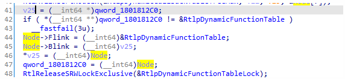

# 0x7 SEH的修复

- 在Dll内存注入的时候,对异常的修复是必不可少的。无论是x64和x86

## 0x7-1 正常加载Dll无需加载修复

我们正常注入dll,如果dll中有SEH,是会正常处理的。

```c++
    case DLL_PROCESS_ATTACH: {

        __try {
			int x = 0;
			int y = 5 / x;


        }
        __except (1) {

            MessageBox(0, L"异常触发\r\n", 0, 0);

            return 0;
        }

    }
```

**触发**SEH成功


**未修复SEH,注入直接报错**


### 0x7-2-1 x86SEH的修复

我们是用这个函数`_RtlInsertInvertedFunctionTable()`来进行修复x86SEH。

```c++
int __fastcall RtlInsertInvertedFunctionTable(int a1, int a2)
{
  int v3; // esi
  int v5[2]; // [esp+10h] [ebp-8h] BYREF

  RtlCaptureImageExceptionValues(v5);
  v3 = __ROR4__(v5[1] ^ MEMORY[0x7FFE0330], MEMORY[0x7FFE0330] & 0x1F);
  RtlAcquireSRWLockExclusive(&LdrpInvertedFunctionTableSRWLock);
  LdrProtectMrdata(0);
  RtlpInsertInvertedFunctionTableEntry(v3, a2, v5[0]);
  LdrProtectMrdata(1);
  return RtlReleaseSRWLockExclusive(&LdrpInvertedFunctionTableSRWLock);
}
```

我们使用`RtlpInsertInvertedFunctionTableEntry`来进行修复SEH,其中参数v3可以在这个函数里面找`RtlInsertInvertedFunctionTable`,第二个参数是`hModule`,第三个参数是`ImageSize`

但是对于win10,似乎不需要第一个参数了,直接调用

`RtlpInsertInvertedFunctionTableEntry`即可,它会在内部直接找到FunctionTable

然后我们获取注入模块大小,模块

下面是win7修复的代码,win7需要找到FunctionTable的

```c++
		HMODULE hntdll = GetModuleHandleA("ntdll.dll");
		PIMAGE_DOS_HEADER pDos = (PIMAGE_DOS_HEADER)hntdll;
		PIMAGE_NT_HEADERS pNts = (PIMAGE_NT_HEADERS)((PUCHAR)hntdll + pDos->e_lfanew);

		PIMAGE_DOS_HEADER pMyDos = (PIMAGE_DOS_HEADER)hModule;
		PIMAGE_NT_HEADERS pMyNts = (PIMAGE_NT_HEADERS)((PUCHAR)hModule + pMyDos->e_lfanew);
		ULONG sizeofImage = pMyNts->OptionalHeader.SizeOfImage;

		FindCode fs[1];
		initFindCodeStruct(&fs[0], "68****E8****56E8****5F5E5DC2**90", 0, 0);
		ULONG addr = findAddressByCode((ULONG)hntdll + pNts->OptionalHeader.BaseOfCode, (ULONG)hntdll + pNts->OptionalHeader.BaseOfCode + pNts->OptionalHeader.SizeOfCode, fs, 1);
		PVOID funcTable = (PVOID)*(PULONG)(addr + 1);
		RtlInsertInvertedFunctionTableProc RtlInsertInvertedFunctionTable = (RtlInsertInvertedFunctionTableProc)GetFunctionAddressByCodeAddress(addr + 5);

		RtlInsertInvertedFunctionTable(funcTable, hModule, sizeofImage);

```

这样即可直接修复SEH,win10直接调用`RtlInsertInvertedFunctionTable`,填hMoudle以及SizeOfImage即可。

### 0x7-2-2 x64SEH的修复

x64就更简单了,因为x64 SEH修复的API是导出的。

```C++
auto excep = pOpt->DataDirectory[IMAGE_DIRECTORY_ENTRY_EXCEPTION];
if (excep.Size) {
	RtlAddFunctionTable((PRUNTIME_FUNCTION)(pBase + excep.VirtualAddress),excep.Size / sizeof(IMAGE_RUNTIME_FUNCTION_ENTRY), (DWORD64)pBase);
}
```

首先我们找到PRUNTIME_FUNCTION表,也就是PE结构中的，然后直接调用

```c++
bool RtlAddFunctionTable(_In_reads_(EntryCount) PRUNTIME_FUNCTION FunctionTable,_In_ DWORD EntryCount,_In_DWORD64 BaseAddress);
```

这个函数的作用就是动态地给我们PE文件添加一个PRUNTIME_FUNCTION的表。三个参数分别就是异常表,异常表个数,和hModule

这样就可以动态添加了!甚至我们可以完全靠这个来动态添加x64的SEH,只需要构造好PRUNTIME_FUNTION_TABLE即可。

### 0x7-2-3 异常CallBacks

我们调用

```c++
NTSYSAPI BOOLEAN RtlInstallFunctionTableCallback(
  [in] DWORD64                        TableIdentifier,
  [in] DWORD64                        BaseAddress,
  [in] DWORD                          Length,
  [in] PGET_RUNTIME_FUNCTION_CALLBACK Callback,
  [in] PVOID                          Context,
  [in] PCWSTR                         OutOfProcessCallbackDll
);
```

**参数如下**

```
[in] TableIdentifier
```

动态函数表回调的标识符。 必须设置两个低序位。 例如， *BaseAddress*|0x3。

```
[in] BaseAddress
```

回调函数管理的内存区域的基址。

```
[in] Length
```

回调函数管理的内存区域的大小（以字节为单位）。

```
[in] Callback
```

指向调用的回调函数的指针，用于检索指定内存区域中函数的函数表条目。 有关 **PGET_RUNTIME_FUNCTION_CALLBACK** 类型的定义，请参阅 WinNT.h。

```
[in] Context
```

指向要传递给回调函数的用户定义数据的指针。

```
[in] OutOfProcessCallbackDll
```

**所以我们如下使用**:

首先注册回调

```C++
	HMODULE hModule = GetModuleHandle(0);
	PIMAGE_DOS_HEADER pDos = reinterpret_cast<PIMAGE_DOS_HEADER>(hModule);
	PIMAGE_NT_HEADERS pNts = reinterpret_cast<PIMAGE_NT_HEADERS>((UINT64)hModule + pDos->e_lfanew);

	RtlInstallFunctionTableCallback(((DWORD64)hModule) | 3, (UINT64)hModule, pNts->OptionalHeader.SizeOfImage, CallBacks, hModule, NULL)
```

根据回调参数,手动判断ControlPc^Rip^是否在PRUNTIME_FUNTION的Start和End里面,直接返回PRUNTIME_FUNCTION

这样他就会调用我们那个PRUNTIME_FUNCTION了。

```C++
PRUNTIME_FUNCTION GetRunTimeCallback(
	_In_ DWORD64 ControlPc,
	_In_opt_ PVOID Context
)
{
	PIMAGE_DOS_HEADER pDos = (PIMAGE_DOS_HEADER)Context;
	PIMAGE_NT_HEADERS pNts = (PIMAGE_NT_HEADERS)((PUCHAR)Context + pDos->e_lfanew);
	PIMAGE_DATA_DIRECTORY pExceptDir = &pNts->OptionalHeader.DataDirectory[IMAGE_DIRECTORY_ENTRY_EXCEPTION];
	
	PRUNTIME_FUNCTION pRunTimeFunc = (PRUNTIME_FUNCTION)((PUCHAR)Context + pExceptDir->VirtualAddress);
	int count = pExceptDir->Size / sizeof(RUNTIME_FUNCTION);
	PRUNTIME_FUNCTION find = NULL;

	for (int i = 0; i < count; i++)
	{
		ULONG64 startAddr = (pRunTimeFunc[i].BeginAddress + (ULONG64)Context);
		ULONG64 endAddr = (pRunTimeFunc[i].EndAddress + (ULONG64)Context);
		if (ControlPc >= startAddr && ControlPc <= endAddr)
		{
			find = &pRunTimeFunc[i];
			break;
		}

	}

	return find;

}
```

==我们可以认为这样就实现了动态添加SEH,因为他会调用我们的PRUNTIME_FUNCTION==

#### RtlInstallFunctionTableCallback函数的实现

这个函数实现其实是把我们的回调挂入一个全局链表,就像VEH的那个_LdrpVectorHandlerList[^1]一样



就是把Node初始化好之后,然后插入RtlpDynmicFunctionTable里面。==其实我们RtlAddFunctionTable也是插入这个链表==

我们验证下,可以看的,哪怕RtlAddFunctionTable也不是直接插入PE表,他也是直接插入这个`RtlpDynmicFunctionTable`动态链表,来进行动态调用!其实原理都是一样的。


那为什么有的有回调,有的没回调呢?而又是什么时候,它会调用我们挂入这个链表的函数呢?

我们层层回溯,其实在

`RtlLookupFunctionEntry()`

函数中,调用了`(_RUNTIME_FUNCTION*)RtlpLookupDynamicFunctionEntry(ControlPc, ImageBase);`

我们知道RtlLookipFunctionEntry是用来寻找指定RIP的PRUNTIME_FUNCTION的,R3的它回调用我们上面说的那个函数,从而找到PRUNTIME_FUNCTION,继续进行,这便是RtlAddFunctionTable以及RtlInstallFunctionTableCallBack的原理了。

遗憾的是,内核层并没有`RtlAddFunctionTable`和`RtlInstallFunctionTableCallBack`,也没用那个动态链表,所以我们是无法挂钩这个来拦截内核SEH的。

---


[^1]:名称不对,大体是这个意思

