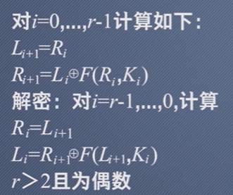
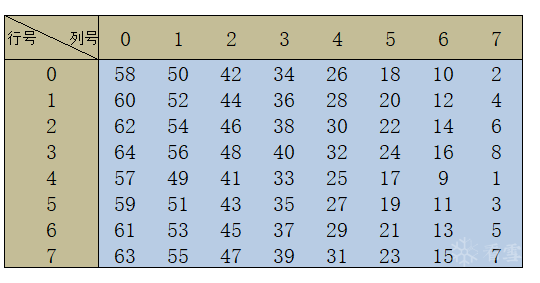

# 0x1分组密码定义

分组密码属于对称密码,即消息接受方和发送方拥有同一个密钥

主要特征是

- 任意比特m明文p,分成快,每一块进行加密。
- 解密则是相反

- 本质是由密钥k决定的明文->密文的可你映射

## 0x1-1分组密码发展过程

- 1977年DES,GOST,CAST等

- 1990年IDEA

现在DES安全性已不安全,密钥过段。

现已被AES取代,Rijndael算法取代DES。

SM4分组算法称为我国国标。

# 0X2 分组密码的设计原则

下面是理想分组加密的设计原则

- 加密和解密都可以通过映射表实现


- 对于n比特到n比特的可逆映射,有2^n^!种置换表

因此算力限制,无法穷举。密钥长度则是n*2^n^比特,密钥就是那张表。

## 0X2-1现代分组密码安全原则

- 扩散就是让明文中的每一位影响密文中的许多位，或者说让密文中的每一位受明文中的许多位的影响．这样可以隐蔽明文的统计特性。

- 混淆就是将密文与密钥之间的统计关系变得尽可能复杂，使得对手即使获取了关于密文的一些统计特性，也无法推测密钥。使用复杂的非线性代替变换可以达到比较好的混淆效果，而简单的线性代替变换得到的混淆效果则不理想。

## 0X2-2 分组密码常见结构

- Feistel结构

如DES CAST

- SPN结构

如AES

总之,分组函数一般会有轮函数。


## 0X2-2Feistel结构


即经过r轮迭代,将2t比特明文(L~0~，R~0~)映射成密文(R~r~,L~r~);

计算如下



对于解密则是反过来,从最后一轮密钥开始。

即解密只需要把子密钥逆序即可解密

在Feistel的轮函数中,主要是S盒和P,==而不要求轮函数可逆==

因此在进行解密时,不需要改动解密的轮函数

对于分组密码的涉及,要考虑雪崩效应,即变动一个比特,密文需要变动很多。

对于Feistel结构,雪崩效应慢,因此轮数较长。

## 0x2-2 SPN结构


要求S盒(==轮函数==)必须可逆,因此SPN加解密函数是不同的。

雪崩效应快。

# 0x3 DES

DES是一种基于Feistel的分组对称加密算法。

1998年由于密钥长度太短,停止使用。

DES是16轮Feistel,分组长度64比特,密钥为56比特。密钥实际上64比特,前八位是校验位。


对于DES,右半部分之间到下一轮的左半部分,左半部分经过右半部分和密钥以及f函数运算异或之后到下一个的右半部分。

## 0x3-1 DES加密过程

DES算法使用feistel框架,进行了16轮循环加密,并且以64比特为一组。

加密流程如下图:


值得一提的是,最后一轮可以视为没有交换位置，之间进行IP^-1^逆置换。


### 0x3-1-1 DES IP置换

首先对明文进行初始置换

这一步的作用是为了打乱顺序,没有密码学的意义。

置换表如下



置换表的每个值就是初始明文P的位置。如下图进行置换操作:


如下图算法进行IP置换

```c++
const unsigned char IP_table[64] = {
	58, 50, 42, 34, 26, 18, 10, 2,
	60, 52, 44, 36, 28, 20, 12, 4,
	62, 54, 46, 38, 30, 22, 14, 6,
	64, 56, 48, 40, 32, 24, 16, 8,
	57, 49, 41, 33, 25, 17,  9, 1,
	59, 51, 43, 35, 27, 19, 11, 3,
	61, 53, 45, 37, 29, 21, 13, 5,
	63, 55, 47, 39, 31, 23, 15, 7
};

void IP_substitution(unsigned char Plaintext[], unsigned char SubstitutionText[]) {


	for (int i = 0; i < 64; i++) {

		SubstitutionText[i] = Plaintext[IP_table[i]-1];//TP_Tale下标是从1开始的

	}

}
```

进行置换置换,开始进入LR分组,即分成低32和高32位。


```c++
void Create_LR_Group(unsigned char Originaltext[], unsigned char L_Gourptext[], unsigned char R_Gourptext[]) {

	memcpy(L_Gourptext, Originaltext, 32);
	memcpy(R_Gourptext, Originaltext + 31, 32);

}
```

### 0x3-1-2 F函数

DES中F函数是DES核心部分,F函数由如下部分组成

- E扩展
- S盒
- P置换

**E扩展**


在Feistel结构中,下一轮迭代是靠上一轮L~i-1~ xor F(Ri-1,Ki-1）完成的。

因此拿到R分组,首先进行E扩展,这是很重要的一步,他的作用到底是==结合S盒进行多表代换,而且是非线性的==

E扩展计算如下:

他将一个32比特数据变化成一个48位的数据


而扩展的两行也是有规律的,是从左到右递增的。

```c++
//E扩展表
const unsigned char E_Table[48] =
{
	32,    1,    2,     3,     4,     5,
	4,     5,    6,     7,     8,     9,
	8,     9,    10,    11,    12,    13,
	12,    13,   14,    15,    16,    17,
	16,    17,   18,    19,    20,    21,
	20,    21,   22,    23,    24,    25,
	24,    25,   26,    27,    28,    29,
	28,    29,   30,    31,    32,     1
};

void E_substitution(unsigned char R_Gourptext[], unsigned char E_Gourptext[]) {

	//R_Gourptext 是32bit(char代表一个bit),E_Gourptext经过扩展变成48bit
	for (int i = 0; i < 48; i++) {

		E_Gourptext[i] = R_Gourptext[E_Table[i] - 1];

	}
}
```

**S盒置换**

S盒函数是DES位移一个非线性加密模块,他的安全就是DES的安全。

他的本质就是对刚刚进行E扩展的R进行==多表代换==

S盒由八张S盒表构成,E扩展经过S盒最后会变成32位

对于刚刚经过E扩展产生的48bit数据,以6个为一组,B1=b1b2b3b4b5b6,进行==查S盒表==

如S1盒表如下


进入S盒时,对于E扩展的B(==已分为6bit==),b1b6代表列,0-3中选择,而中间4位代表行。选择一个进行代换。

所以说本质上是一个多表代换,最终6bit进入S盒出来是4bit

```c++
	//进入S盒
	for (int i = 0; i < 8; i++) {

		int row = (E_Gourptext[i][1] * 8 + E_Gourptext[i][2] * 4 + E_Gourptext[i][3] * 2 + E_Gourptext[i][4] * 1);
		int cow = (E_Gourptext[i][0] * 2 + E_Gourptext[i][5] * 1);
		//求出行列查S盒表
		unsigned int s_box_vaule = S_Table[i][cow][row];

		//分配会原先的R_Gourptext
		unsigned char bit1 = s_box_vaule & 0b1;
		unsigned char bit2 = (s_box_vaule & 0b10)>>1;
		unsigned char bit3 = (s_box_vaule & 0b100) >> 2;
		unsigned char bit4 = (s_box_vaule & 0b1000) >>3;


		//填入传入的参数
		Ret_Gourptext[i * 4 + 0] = bit1;
		Ret_Gourptext[i * 4 + 1] = bit2;
		Ret_Gourptext[i * 4 + 2] = bit3;
		Ret_Gourptext[i * 4 + 3] = bit4;

	}
```


**P置换**

P置换的作用类似IP置换,用于打乱S盒生成的数据,产生雪崩效应。使S盒产生的不同盒的bit打乱。


### 0x3-1-3 DES循环

对于DES,每轮迭代决定下一轮的RL,公式是

```C++
R[i+1]=L[i] ^ F(R[i],K[i]);
L[i+1]=R[i];
```

即如下

```c++
	//16次迭代
	for (int i = 1; i <= 16; i++) {


		unsigned char F_Out_bits[32] = { 0 };
		//F函数
		F(R[i - 1], sub_keys[i], F_Out_bits);
		//与Li-1进行异或得到Ri
		DES_XOR(L[i-1], F_Out_bits,Ret_Xor_bits);

		memcpy(R[i], Ret_Xor_bits, 32);
		memcpy(L[i], R[i - 1],32);

	}
```

最后进行合并

```c++
	//合并到Temptext中
	//最后一步其实没有交换 因为R本来该在高位 L应该在64位的地位
	//这样做是为了好解密
	memcpy(Temptext, R[16], 32);
	memcpy(Temptext + 31, L[16], 32);

	//对这个进行IP-1置换 即IP的逆运算
	reIP_Substitution(Temptext, Decryptiontext);
```

值得一提的是,合并的最后,其实是没有交换的。


==这是为了方便解密==。

## 0x3-2 DES密钥生成


DES的密钥生成过程如下。

### 0x3-2-1 PC-1置换

这一步将64位长度的密钥置换成了56位。其实去掉的8位用于校验。

去掉了**8、16、24、32、40、48、56、64**这些位。

PC1表如下

```c
const unsigned char PC_1_Table[56] =
{
	57, 49, 41, 33, 25, 17, 9,  1,
	58, 50, 42, 34, 26, 18, 10, 2,
	59, 51, 43, 35, 27, 19, 11, 3,
	60, 52, 44, 36, 63, 55, 47, 39,
	31, 23, 15, 7,  62, 54, 46, 38,
	30, 22, 14, 6,  61, 53, 45, 37,
	29, 21, 13, 5,  28, 20, 12, 4
};
```

```c++
void PC_1_Substitution(const unsigned char key[], _Out_ unsigned char Bit_key_pc_1[]) {

	//PC1 置换成56位密钥
	for (int i = 0; i < 56; i++) {

		Bit_key_pc_1[i] = key[PC_1_Table[i] - 1];

	}

}
```

### 0x3-2-2 CD分组以及移位

在经过PC1置换成56位后,将56 高28位D组,低28位C组。

然后对于C D分组进行循环移位操作。

> **当i=1、2、9、16轮中，C、D两组向左移动一位；在其他轮中，C、D两组向左移动两位(i>=1)。**

加起来刚好移位28。


## 0x3-3 DES解密过程


首先生成轮密钥,根据初始PC-1生成64位C0 D0作为高低位


把密钥的57位放在第一个位置,49放在第二个位置


进行位置变化,然后进行循环移1位。根据轮数不同,循环移位位数不同


经过PC-2进行位置重拍,得到K~1~子密钥


得到K~1~之后,根据子密钥进行明文第一轮加密。首先根据IP对明文进行位置变化


注意他的排法,IP表示索引,


IP位置置换没有密码学意义,他是为了消除明文的统计学意义。为了打乱ASCII码


