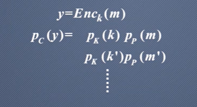

 # 0x1香农保密系统的信息理论

提出了熵和保密性的概念

# 0x1-1 香农保密系统数学模型

信道是公开的,比如邮件,网络等。

**信源**产生消息的来源,来源于一个固定的信源字母表。

信源会产生L长的字符序列,那么明文空间为:

这就是明文空间的数值大小,如果字符之间是无关系,即无记忆性时

即m出现的概率,等于事件出现概率乘。

**密钥源**字符必须来源于密钥字母表,而且密钥一般是无记忆均匀分布的。

**密文**

### 0x1-1-1 对于P,K,C之间的关系

- C统计特性完全由K,P的统计特性决定

即

**证明**:

条件概率公式是

p(x,y)=p(x|y)p(y)=p(y|x)p(x),根据这个可以推出==贝叶斯公式==

> 全概率公式： P(A) = ΣP(A|B) * P(B) 即概率A的总和等于条件概率A|B乘以条件概率B的总和。 
>
> 贝叶斯公式： P(A|B) = P(B|A) * P(A) / P(B) 即给定条件B的情况下，A的概率等于给定条件A的情况下B的概率乘以A的概率除以B的概率。
>
> 

P~c~(y)中y出现为y=Enc~k~(m),遍历所有可能出现y的明文和密钥之间的组合

即

m可以写成Dec~k~(y),代表k为密钥,可以映射为y的明文。

最终P~c~(y)为

### 0x1-1-2 信息熵

表示信息的不确定性,例:

单位是比特,而X平均不确定性为求期望

这就是X概率分布的熵。

例题:

也就是说明,没有不确定性,因此熵就是0;

如果p=1/2,算出H(X)=1bit,此时是最不确定的。

**联合熵**

就是指事件x y同时出现的不确定性

**条件熵**

即y~i~出现后对于X概率分布的条件熵

H(X|Y)的条件熵则是

即两次遍历

==值得注意的是==,概率分布的熵达到最大的时候就是一个概率分布每个条件出现都是均等的时候。

也就是此时不确定达到最大。

## 0x1-2 完美保密性

- 计算安全性

- 无条件安全性

在==唯密文攻击下==

差值就是敌手可以获取确定性信息

差值就是敌手可以确定的关于密钥的信息。

因此安全的加密算法,需要保证关于足够大的H(K|K)并且H(P|C)

