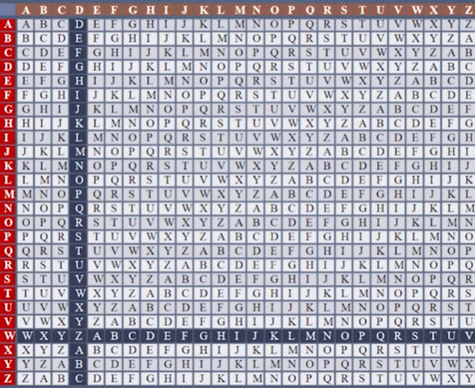

# 0x1 密码学概论

密码学应用于网络传输,在网络传输中,中转过多,因此要对信息进行加密防止获取。

包括两个分支

- 密码编码学:如何涉及密码方案

- 密码分析学:如何破解密码方案

# 0x2 密码学基本概念

**密文(ciphertext)与明文(Plaintext)**

加密之前,消息被称为明文，加密后被称为密文。

当接收方收到密文时，需要对其进行解密,从而知道明文。

**sender和receiver**

sender生产发送密文,receiver接受解析密文

**加密(encryption)和解密(decryption)**

明文到密文的过程,解密即密文到明文的过程

**加密算法(encryption alorithm)和解密算法(decryption alogrithm)**

发送者对明文加密的采用规则被称为加密算法。

**密钥(Key)**


密文通过不安全通道传到接收者。密钥运行机制如图。

根据密钥将密码分为==对称密码==和==非对称密码==。

对称密码也被称为==私钥密码==,即key1=key2。

非对称密码即加密密钥和解密密钥key1!=key2,也被称为==公钥密码==。

另外地,根据解密的方法也可以分为

- 流密码:按照比特进行加密
- 分组密码:分组加密,通常是私钥密码

**破译**

指对非发送给自己的密文尝试获取明文的行为。

**密码算法**

是指用加密算法把明文加密成密文。同样的,解密算法则是密文到明文。

**单向散列函数**

代表性的是sha512或者说md5.

用于唯一标识，把任意东西输入这个单向散列函数,就会出现一串数值。如表示文件是否被篡改。

==单向散列函数保证的不是机密性,而是完整性==

**数字签名**

也是用于标识,主要是用于身份标识。确保完整性，提供认证和防止否认机制。

**消息认证码**

也是认证机制,为了确认所期望的通信对象,提供认证机制。

**隐写术**

能够隐藏消息本身,和加密最大区别就是可以看懂明文，在明文之中可以看到加密的东西。例如:藏头诗,图片。密码学隐藏的是内容,隐写术则是消息本身。

**现代密码学**

- 对称加密（Symmetric Cryptography），以 DES，AES，RC4 为代表。
- 非对称加密（Asymmetric Cryptography），以 RSA，ElGamal，椭圆曲线加密为代表。
- 哈希函数（Hash Function），以 MD5，SHA-1，SHA-512 等为代表。
- 数字签名（Digital Signature），以 RSA 签名，ElGamal 签名，DSA 签名为代表。

其中,对于对称加密,主要分为两种加密

- 分组密码（Block Cipher），又称为块密码。
- 序列密码（Stream Cipher），又称为流密码。


## 0x2-1密码安全性

- 被动攻击:截取密文,进行分析
- 主动攻击:扰乱系统


选择明文攻击中,能动性更强,它可以选择需要的明文，进行加密。 

### 0x2-1-1 加密算法可以破解

意味着给定密文和明文,可以快速地识别密钥或确定明文。

评估密码安全性时,==假设敌手已知道所用的密码系统以及加密算法细节==

即不把密码系统的安全性建立在敌手不知道算法的前提下。即基于密钥的保密性,而非算法的保密性。

这就是现代密码学的安全性。

### 0x2-1-2保密性和认证性

保密性即保护信息的机密性。

认证性指

- 除合法sender，任何人无法伪造
- 防止发送者抵赖

==即使达不到理论不可破,也应当是实际上不可破的。==


# 0x3 密码学历史

## 0x3-1古典密码学

- **移位法**

  

代表性的是凯撒密码


通过字母平移,进行加密。解密就是相反进行移位即可。

凯撒密码实现

```c++
const char g_secret_key[26] = {
	'a', 'b', 'c', 'd', 'e', 'f', 'g',
	'h', 'i', 'j', 'k', 'l', 'm', 'n',
	'o', 'p', 'q', 'r', 's', 't', 'u',
	'v', 'w', 'x', 'y', 'z'
};
void KaisaCode(string plaintext, string& ciphertext, int move) {

	for (auto iterator = plaintext.begin(); iterator != plaintext.end(); iterator++) {

		char index = (*iterator - 97);

		index = (index + move) % 26;

		ciphertext.push_back(index + 97);
	}

}
```

对于凯撒密码破译,我们只需要从1-25开始移位尝试。知道找到正确的。对于凯撒密码，平移位数,也就是密钥。

这种方法就是暴力枚举破解。

- **替换法**

即不按照移位方法进行对应,使用替换方法。比如a对应c,c对应z等等。可以防止暴力枚举。

对于这种方法,使用频率破解法。如在英文中T H E字母频率出现更高。按照频率出现可以进行确定替换的字母。

## 0X3-2 近代密码学

二战期间

- **恩尼格玛(Enigma)机器**

原理就是替换法，出现于第二次世界大战。破译者为图灵。但是突破是他是用机器的加密的。

英格玛机两次一样的字符是不一样的。

- **异或运算XOR**

异或运算规则是对于一串二进制, 

0 XOR 0=0 1 XOR 0 =1 1 XOR 1 =0 即两个位相同为0,不相同为1;

**(BinaryArry XOR SecretKeys) XOR SecretKeys==BinaryArry**

两次异或相同的密钥就会变成原先相同的字符。

异或运算是密码学的基础。

异或加密是属于==一次性密码本==范畴,理论上密钥不被泄露是无法被破解。

因为能把密钥跑出来,也能把密文解密出,但是解析出来的明文是无法确定的。所以是无法破解的。是无条件安全的。没有实用性。

## 0x3-3现代密码学

1976年至今


现代密码学加密主要分为对称加密和非对称加密。

他们的区别就是加解密用的密钥是相同还是不相同的。

# 0x4 古典密码学

## 0x4-1 符号表示

P:明文空间,所有可能的明文组成的有限集。

C:密文空间,所有密文组成的有限集合。

K:密钥空间,所有可能的密钥k组成的有限集。

Enc:加密算法

Enc~k~(m)=c 其中m ∈ P;即加密算法Enc以密钥k,明文m输入,输出密文为c

Dec:解密算法

Dec~k~(c)=m

对于古典密码,其必须拥有**算法正确性**

==即对于每个m∈P以及k∈K都有Dec~k~(Enc~k~(m))=m;==

## 0x4-2 移位密码

### 0x4-2-1 凯撒密码

凯撒密码就是一种移位密码。


对于凯撒密码,P=C=K=[0,25];

凯撒密码的加密如下

```c++
Enc(m,k)=(m+k) mod 26
```

解密如下

```c
Dec(c,k)=(c-k) mod 26
```

```c
//其实就是如下算法
m+ k mod 26=c;
Dec(c,k)=m;
Enc(m,k)=c;
```

凯撒密码也被称为,单表替换密码。而且移位密码相同的明文字母总是会对应相同的密码密文。

## 0x4-2-2 维吉尼亚密码

==P=C=K=Z~26~^n^==

即随机选择密钥k=(k~1~,k~2~...k~n~)∈Z~26~^n^;

对齐进行加密即

Enc~k~(m~1~..m~n~)=(m~1~+k~1~..+m~n~+k~n~);

即每个密钥k的分量,就是原先凯撒密码的移位。

解密则是反过来。如密钥k是CIPHER,转换得到k=(2,8,15,7,4,17)

对于明文,按照密钥的长度进行分割。剩下的,就是对与凯撒密码的扩展了。

下图是维吉尼亚密码表,红色部分为密钥,白色则为明文,焦点即为加密的密文。



本质上就是把所有的凯撒密码的密钥列出来,是26*26的矩阵。

#### 维吉尼亚密码破解

- 穷举密钥搜索

这种一般只能用于凯撒密码,但是维吉尼亚密码是多表代换。不适合穷举

- 频率统计算法

即对于英文这种自然语言,英文26个字母出现的规律如下:


对于凯撒密码,即使加密字母换了长相,但是出现频率是不会改变的。单表代换不会改变出现频率的概率。

对于维吉尼亚密码,相同明文可能对于不同密文,但是依旧可以用这个方法。

对于维吉尼亚密码破解方法是:

- 确定密钥长度

确定密钥长度方法有很多种。

**Kasiski测试法**


如下图


就此可以确定,密钥长度是5,因为他们是用相同的密钥加密的,即原因是相同的明文字母组被分割正好又被相同的密钥字母组加密,那么密文就是相同的。根据这个可以进行判断密钥长度。

在这种情况下,密文相同字母组的间距很可能就是实际密钥长度的==整数倍==

**重合指数法**

==指设x=x1...xn含有n个字母串,则在x中随机选择两个元素且两个元素相同的概率==

自然语言的重合指数大概是0.065

计算方法如下:

只需要计算出两个A出现的频率,B,C....等等

根据古典概率进行计算(==古典概率中不放回抽样==),得到两个字母重复出现的概率即可。

==引入f~i~,即26个字母中第i个字母在x中出现的次数。==

**例如:**x=AAZZZ,n=5,f~0~=2,f~25~=3;那么f0/n就是A在这个字母串出现的频率。

两个相同的概率则是f0/n*f0-1/n-1,如此计算,所有相同字母出现的概率计算得出

即公式如下


​	Ic(x)=重合指数,当n足够大,根据极限,近似看为n,fi-1看出fi


其中Pi=`fi/n`,就是26个第i个字母出现的概率。前面出现的概率。

经过计算得到I~c~(x)=0.065;==单表代换不改变此值==

因此对于维吉尼亚密码的破解,可以先猜测密钥的长度,然后提取出相同密钥字加密的密文,测试其重合指数。

对于提取出来的密文,是单表代换的。因此也是不改变其重合指数。

- 如果猜测正确,得到的重合指数应当接近0.065
- 否则,偏离0.065,一般是较小。

例如猜测密钥长度为5


每一个C~i~就是单表代换。对密文按5进行分组,把用相同密钥字进行提取出来,求出重合指数。

- 确定密钥字相对位移

根据重合互指数进行计算,重合互指数定义如下:


==本质上来说,就是猜两个不同密钥字之间的相对位移,如果一旦猜对了,那么所得到相乘的结果应当=0.065==


如上图所示,Fi/ni指密文i出现的概率,fj,t-s/nj如果s猜对了,那么本质上就是用的一个密钥字了,因此得到的结果应当接近0.065.

- 穷搜密钥子

这个时候我们有了位移,我们只需要穷举26种可能即可。

# 0x5 模运算

模数的定义如下


如-1 mod 8 = 7,r=7,q=0

11 mod 7, r=4 ，q=1;

-11 mod 7,r=3

同余的定义

如果(a mod n) = (b mod n),则称整数 a b是模n同余的。

==表示为a≡b==

如73 mod 23 =4;4 mod 23 =4;

因此73同余4模23;

**同余的性质**

- 如果n|(a-b),a≡b(mod n),|意思是整除,没有余数
- 自反性, a ≡ a mod n
- 对称性, a ≡ b mod n 当且仅当 b ≡ a mod n
- 传递性,a模n 同余b,b模n同余c,那么a ≡  c mod n

**模算术** 

> 即通过模运算(mod n)把整数映射到n的集合,在这个集合上的运算被称为模算术。

例如令模数n=8,模8加法运算即

(2+5)mod 8 =7

**剩余类集合**

> 定义比n小的集合Zn={0,1,2,...,n-1},每个数都是一个剩余类,表示为[n],这个集合被称为剩余类集合。
>
> 剩余类集合满足[n]={a:a≡r(mod n)};

例如:

考虑模n=4的剩余类,

[0]={...,-8,-4,0,4....};

[1]={....,-7,-3...};每个剩余类都是无限个元素。

**Zn中整数模运算性质**


